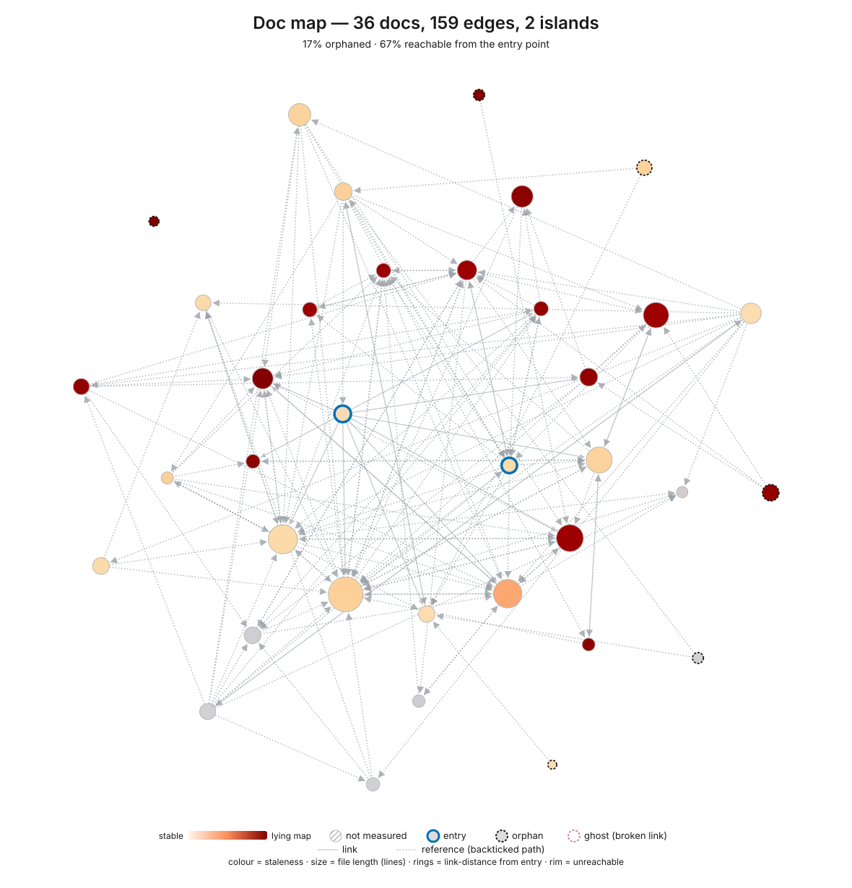

# Codebase Assessment: jet-fighters

_Generated 2026-09-20. Generated by `/assess` v1.87.1._

**Score: 5.0 / 8 - Solid** - a readiness snapshot, not a verdict · Keyhole: 12 structural concerns (3 hidden coupling, 2 lying map, 1 self-referential tests, 6 accretion ratchet), 0 safe zones.

This repo has built the rarest thing on the ladder and the most ordinary thing is what is missing. `scripts/contract/` freezes an acceptance contract at run entry, records its sha256, and re-hashes it at exit, so an agent that edits the contract mid-run aborts rather than certifies itself; four frozen contracts sit committed as evidence of repeated cycles. `src/viewer3d/dependency-boundary.test.ts` asserts that `three` stays inside `src/viewer3d/` *and* carries a second assertion that the guarded thing is actually used, which is an anti-vacuity check most architecture tests never bother with. `tools/probe/drives/drives-covered.test.ts` is a ratchet: a new drive fails the suite until it is either tested or excluded on the record with a reason. Then `main` turns out to have no branch protection and no rulesets, so all three of those gates - plus ESLint and 93 test files - are advisory at the merge boundary, and the last 30 merged PRs were 100% self-merged with 0% approval. The single next step is a ruleset on `main` requiring the `ci` check.

_Note: Mutation testing was not run. Layer 6 (Coverage) is capped at Partial and truth-pressure remains unproven._

> **Agents start here.** The prioritized Top 3 actions below are also machine-readable in `.assess/actions.json` (schema v2: every entry carries `rank`, `action`, `done_when`, and `scope_fence`, plus the lifecycle fields `status` / `claimed_by` / `completed_sha` and a derived execution `mode`). Read that file to pick up the work - even with a smaller model - without parsing this report's prose.

## Top 3 Actions

Action 1 is the deterministic core's single prescribed attention path (`tools/model/build_console.py`); Action 2 closes the unmeasured-coverage gap the core flagged; Action 3 closes the Layer 5 scorecard gap that makes every other gate advisory.

| # | Action | Layer | Effort | Command / First Step | Done when | Scope fence | Hotspot files this addresses | Issue |
|---|--------|-------|--------|---------------------|-----------|-------------|------------------------------|-------|
| 1 | Refactor down `tools/model/build_console.py` - characterization test first, then extract the passive-component builder into its own module | 3 | medium | Add `tools/model/test_build_console.py` pinning the current output of `build_passives`, then extract it to `tools/model/passives.py` | A characterization test asserts the current `build_passives` output byte-for-byte and passes; `build_console.py` drops below 800 LOC in the next `/assess` run's `complexity-stats.json` | Only `tools/model/`; do not change the generated console output, and do not touch `tools/model/measure.py` in the same change | `tools/model/build_console.py` (975 LOC, aggregate ccn 141, worst function `build_passives` ccn 12, 9 commits in window) | - |
| 2 | Generate a line-coverage report in CI and read it for the top hotspots first | 6 | small | Add `"coverage": { "reporter": ["text", "lcov"] }` to the `test` block in `vite.config.ts`, add `npm test -- --coverage` to `.github/workflows/ci.yml`, and commit `coverage/lcov.info` as a CI artifact | `.assess/run-context.json` `.coverage_report.available` is `true` on the next `/assess` run, and the three named files carry a reported line-coverage number | Report the number; do not add a failing threshold in this change, and do not edit any test file to raise it | `tools/probe/render-fidelity.test.ts`, `tools/probe/battleship-arrival.test.ts`, `tools/model/build_console.py` | - |
| 3 | Add a ruleset on `main` requiring the `ci` status check, so the lint, test and build gates block a merge | 5 | small | `gh api repos/bjcoombs/jet-fighters/rulesets --method POST` with a `required_status_checks` rule naming the `ci` check, or set it in Settings → Rules | `gh api repos/bjcoombs/jet-fighters/rulesets` returns a non-empty list and a PR with a red `ci` check cannot be merged | Only the repository ruleset; do not change `.github/workflows/ci.yml`, and do not add a required-approval rule in the same change (that is a separate decision about a solo repo) | - | - |

**Done when** is the action's exit criterion and it must be *checkable, not aspirational*. **Scope fence** names what the action must NOT touch.

Only one path was prescribed: `attention_low_signal` is true (no attention row scores above 1), so the ranking separates one file from the rest rather than ordering a field. Slots 2 and 3 are the coverage gap and a scorecard gap.

### Why these three?

Action 3 is the cheapest and arguably the highest-leverage item in the list, and it is third only because the deterministic ranking fills prescribed and gap slots first: one ruleset converts Layers 3, 4 and 5 from "runs" to "blocks", and without it the three architecture tests, the ESLint run and the 93-file suite are all things a merge can walk past. Action 1 addresses the one file the cross-layer scan singled out: `build_console.py` is the largest lintable source file at 975 LOC and its line count has only ever ratcheted upward across 9 commits with almost no deletion pressure - the fingerprint of a file appended to rather than reworked, and the classic shape of a file that is already legacy in Feathers' sense (complex, churning, untested: its `test_focus` signal is "unsupported"). The characterization test comes first because that is what makes the extraction safe, and it is what stops an agent reaching for the regenerate-from-intent instinct on a 975-line generator. Action 2 is the measurement that tells you whether the drive-level completeness gate in `drives-covered.test.ts` is actually tracking the code, or only tracking itself.

## Snapshots

### Complexity - riskiest to change

The risk sits almost entirely in `tools/probe/` - the probe harnesses, not the game - and per-function complexity is genuinely lean (p95 of 5.0 across 4,461 functions), so the hotspots are large test files rather than tangled logic.

### Doc navigability - can an agent find its way?

67% of docs are reachable from an entry point, but only 33% by links alone - half the wayfinding rests on backticked paths in `CLAUDE.md`, and the current v4 PRD and its acceptance contract are reachable by neither.

📈 Snapshot detail (commit, hotspots, navigability, lying maps)

#### Complexity profile

- **Measured at commit:** `4170e9ac3916` (2026-09-08)
- **Files scored:** 261 (208 by lizard, 53 by scc)
- **Churn window chosen:** commits (last 12mo)
- **Complexity profile:** per-function ccn p95 5.0 (max 102); file-aggregate ccn p95 112.0 (max 202.0); p95 est. tokens 12,303 (max 49,981; code 49,981, data 26,055); p95 LOC 645 (max 2,117; code 2,117, data 1,233).
- **Top hotspots** (composite `sqrt(ccn) × sqrt(1 + commits) × sqrt(est_tokens)` - a sub-linear blend of complexity, recent churn, and context-window size, so a file high on *multiple* axes - big AND complex AND churning - is the worst keyhole and leads; a frozen-but-complex file ranks below an equally-sized active one; a churny-but-trivial file can't top on churn alone; and a big-but-simple-stable file can't top on size alone). `est_tokens` is the char-based estimate (~chars/4), `ccn` here is the **file aggregate**; the worst single function per file is in parentheses:
  1. `tools/probe/render-fidelity.test.ts` - 12,303 est. tokens (576 LOC), aggregate ccn 103 (worst function `roving` 102 - see the caveat below), 8 commits in window
  2. `tools/probe/battleship-arrival.test.ts` - 13,682 est. tokens (542 LOC), aggregate ccn 116 (worst function `firstTransition` 46 - see the caveat below), 11 commits in window
  3. `tools/model/build_console.py` - 18,165 est. tokens (975 LOC), aggregate ccn 141 (worst function `build_passives` 12), 9 commits in window
  4. `tools/probe/scoring-ruler.test.ts` - 12,898 est. tokens (413 LOC), aggregate ccn 96 (worst function `aimedDrive` 20), 10 commits in window
  5. `tools/probe/launcher-lives.test.ts` - 12,431 est. tokens (429 LOC), aggregate ccn 131 (worst function `standStill` 15), 11 commits in window

> **Per-function figures for TypeScript in this repo are unreliable and must not be cited against a threshold.** `roving` (`tools/probe/render-fidelity.test.ts:266`) is a 7-line arrow function returning one object literal - its true complexity is ~1, not 102. `firstTransition` (`tools/probe/battleship-arrival.test.ts:776`) is a 9-line loop, ~5 rather than 46. Lizard is rolling module-scope complexity into the preceding named symbol on these files. The trustworthy figures are the distribution ones: p50 1.0, p95 5.0. The file-aggregate maxima (202 for `silkscreen.test.ts`, whose worst real function is 11) are sums across many small test assertions, not violations.

- **Per-function coverage:** no per-function data for Shell (scored at file level only).
- **Keyhole budget:** the repo is ~992,000 est. tokens; 0 individual files exceed the ~200k keyhole budget, but 2 top-level subtrees do: `tools` (~422,000) and `src` (~283,000). Neither subtree fits one context window whole, so an agent working here must be pointed at a directory, not handed a tree.

Size encodes estimated tokens (~chars/4 - the keyhole size unit; the familiar LOC is one hover away in the tooltip), colour encodes cyclomatic complexity (dark red = high), saturation encodes recent git churn (vivid = active). Tokens track what fills an agent's context window better than LOC, which undercounts dense/wide files and overcounts sparse code. Vivid red blocks are the migration risk.

No hatching visible - mutation analysis was not run. The hatching would mark covered-but-unpinned code (tests that execute without constraining). Run `/assess` and accept the mutation offer to enable it.

#### Where to focus testing

Coverage data: none found - test signals are heuristic-only.

| File | Risk | Test Signal | Suggested Action |
|------|------|-------------|------------------|
| `tools/model/build_console.py` | High | Unsupported (no report; no sibling or parallel-tree test found) | Measure coverage |
| `tools/probe/render-fidelity.test.ts` | High | Test file present, coverage unmeasured | Measure coverage |
| `tools/probe/battleship-arrival.test.ts` | High | Test file present, coverage unmeasured | Measure coverage |
| `tools/probe/scoring-ruler.test.ts` | Medium | Test file present, coverage unmeasured | Measure coverage |
| `tools/probe/launcher-lives.test.ts` | Medium | Test file present, coverage unmeasured | Measure coverage |
| `tools/probe/sweep-timing.test.ts` | Medium | Test file present, coverage unmeasured | Measure coverage |
| `tools/probe/tms1370-rom.test.ts` | Medium | Test file present, coverage unmeasured | Measure coverage |
| `tools/model/measure.py` | Low | Unsupported (no report; no sibling or parallel-tree test found) | Measure coverage |
| `src/machine/tube/atlas.test.ts` | Low | Test file present, coverage unmeasured | Measure coverage |
| `tools/probe/speaker-bands.test.ts` | Low | Test file present, coverage unmeasured | Measure coverage |

Both Python entries under `tools/model/` are the only files here with no test at all; the rest are test files whose own coverage is simply unmeasured. The mutation pass that would turn "covered" into "pinned" did not run this time - its scope computed empty, because every entry carrying test evidence is itself a `.test.ts` file.

#### Doc navigability

Of 36 docs, 67% are reachable from an entry point (`README.md` or `CLAUDE.md`) by following links and backticked doc paths; the remaining 12 are orphans (nothing links to or cites them) or sit in 2 disconnected islands. By links alone the figure drops to 33% - so **half of this repo's wayfinding rests on backticked citations in `CLAUDE.md` rather than on links between docs**. That is a real navigation channel (an agent follows a backticked path as readily as a link), but it means `CLAUDE.md` is carrying the map almost single-handedly, and anything it does not name is effectively uncurated.

The mechanical health is clean: 0 broken links, 0 dangling links, 0 missing cross-references, 0 ambiguous wikilinks. The gap is curation, not access - an agent can still `ls docs/` and open any file by path, so low reachability means the docs lack a navigable map, not that content is hidden. An index or MOC under `docs/` is the fix, and for a directory-organised tree like this one it is a wayfinding improvement rather than a blocker.

Named orphans: `docs/prd/jet-fighters-3d-v2.md`, `docs/research/comparison-surface.md`, `tools/model/README.md`, plus three directory READMEs under `assets/reference/case/` and `docs/evidence/`.

**The navigability finding that matters most is not in those numbers.** `CLAUDE.md` routes a cold-start agent to `docs/prd/jet-fighters-v3.md` as "PRD" and never mentions v4 exists, while `docs/prd/jet-fighters-v4.md` (self-described "Current for the `v4` tag") and `docs/contract/v4.contract.md` ("what the work is graded against") are reachable from nothing. `CLAUDE.md` has a whole section on contract gates that refers to `docs/contract/<run-id>.contract.md` generically but never points at the live one. An agent starting here is routed to the previous spec as the current one.

**Lying maps (stale docs of churning code).** Defining the terms: **stale** = days since the doc's last content change (bulk mechanical commits are skipped; the scan completed cleanly here with 0 bulk commits skipped and 0 creation-date fallbacks); **subject churn** = commits in the window to the code the doc describes; **centrality** = how many other docs point to it. A real lying map is old AND beside genuinely churning code.

The composite ranks `docs/prd/jet-fighters-v3.md` first (pagerank 0.081, 52 days stale, ratio 291), but **every stale-hub candidate in this repo carries `subject_method: repo-baseline` and `confidence: low`** - their "subject churn" is just the whole repo's 582 commits, far too coarse a proxy to call a lie. None of them is flagged here as a lying map on that evidence. The deterministic `lying_map` finding below names `README.md` and `tools/model/README.md` on a different basis (stale doc over complex code) and those are the two worth looking at.

Colour = staleness (vivid red = a frozen doc beside churning code = a lying map); structure = reachability (centre = entry, rim = unreachable, dashed ring = orphan; a solid edge is a link, a dotted edge a reference - a backticked path to an existing doc); size = file length. Hover a node in the SVG (opened on its own) for its path and stats.

#### What changed since last run

_No prior run to compare against - this is the first recorded snapshot._

📊 Full scorecard (per-layer evidence & gaps)

The two headline metrics measure **different things and are never combined.** The 0-8 score answers _"is the scaffolding in place to catch problems?"_ (a property of the contracts and enforcement layers). The Keyhole Readiness summary answers _"where is today's structural pain?"_ - a pure count of structural concerns and safe zones rolled up from the ten cross-layer findings. A repo can score 7/8 and still carry many structural concerns (great scaffolding over churning legacy), or 3/8 with zero concerns (small, calm codebase). Report both side by side in the headline; never average, rescale, or fold one into the other.

The **What it asks** column is the question that layer answers for an agent working here - read it first; the framework name is secondary. The **Band** orders them by dependency: a read-side blind spot makes the write-side scores mean less (you can't trust enforcement of a picture you can't see), and the meta band only matters once the rest works.

| Layer | What it asks | Band | Status | Evidence | Gap |
|-------|--------------|------|--------|----------|-----|
| 0: Agent Instructions & Navigability | Can I build a true map of this codebase before I touch it? | read | Partial | `CLAUDE.md` exists and grades A (85/100), lean at 213 lines with no bloat penalty. Doc graph is mechanically clean: 36 docs, 159 edges, 0 broken links. But `CLAUDE.md` names `docs/prd/jet-fighters-v3.md` as "PRD" and does not reference `jet-fighters-v4`, while `docs/prd/jet-fighters-v4.md` exists and is unreachable. No `.claude/skills` directory. | Route the entry point at the current PRD and `docs/contract/v4.contract.md`; add an index linking the 12 unreachable docs. |
| 1: Runtime Legibility / Liveness | Can I see which parts are live, which need attention, and which are dead weight? | read | Missing | Observability rung 0: no `OBSERVABILITY.md`, no `.mcp.json`, and `package.json` references no `opentelemetry`. ts-prune found 32 unused-export candidates, 12 of them the entire public surface of `src/input/index.ts` (`InputSystem` and siblings), none flagged anywhere. This is a static browser game with no deployed runtime, so liveness is read through complexity, churn and reachability rather than telemetry. | A committed console-probe skill, or a documented way for an agent to read the running page's state - the reachable rung here is not a metrics backend. |
| 2: Code Design | Will the type-checker catch my mistakes? | write | Present | `tsconfig.json` sets `"strict": true` and `"noImplicitReturns": true` alongside `noUnusedLocals`, `noUnusedParameters`, `noFallthroughCasesInSwitch`, `isolatedModules` and `verbatimModuleSyntax`. `package.json` runs `tsc --noEmit` in the build, so the typecheck is enforced rather than decorative. Domain types over primitives throughout (`Lane`, `SkillLevel`, `ColumnIndex`, `OperandKind`). No `pyproject.toml` and no `mypy.ini`, so the Python tooling under `tools/model/` is untyped. | Type-check the Python tooling, or state that it is deliberately out of scope. |
| 3: Linters | Are complexity and style bounds enforced, or will my code drift? | write | Partial | `eslint.config.js` exists and `.github/workflows/ci.yml` runs `npm run lint`, so the linter blocks the build step. The config references neither `complexity` nor `max-lines`: it is `js.configs.recommended` plus `tseslint.configs.recommended` and nothing else. No erosion: 18 suppressions with 0 stale, 5 TODOs with 0 stale and 0 agent-introduced. | Add size and complexity rules. Cite the per-function p95 of 5.0, not the unreliable TypeScript per-function maxima. |
| 4: Architecture Tests | Are the structural conventions executable, or just folklore? | write | Present | Three structural tests, all run by `npm test` in CI. `src/viewer3d/dependency-boundary.test.ts` asserts the `three` import boundary "is crossed by nothing outside src/viewer3d/" and adds an anti-vacuity assertion that the guarded thing is used. `tools/probe/drives/drives-covered.test.ts` ratchets: a new drive fails until tested or excluded on the record. `src/app/clock-owner.test.ts` enforces a third invariant. | No file-size or naming enforcement - already charged to Layer 3. |
| 5: CI Pipeline | Does something automatically catch a bad change before it merges? | write | Partial | `.github/workflows/ci.yml` exists and runs `npm test` and `npm run build`; deploy is gated on the build job. The pipeline content is strong. But `main` has no branch protection and no rulesets, so a red CI does not block a merge, and `review_reality` reports 100% self-merged across the last 30 merged PRs. No `coverage` reference anywhere under `.github/workflows`. | A ruleset requiring the `ci` check. Until then the pipeline reports rather than gates. |
| 6: Coverage Gates | Do the tests constrain behaviour, or just execute lines? | write | Partial - *truth-pressure unproven (mutation not run)* | No coverage measurement: no `codecov.yml`, no `vitest.config.ts`, and `vite.config.ts`'s test block is `environment: 'node'` with no `coverage` key. Not Missing, because a real bespoke completeness gate blocks in CI: `drives-covered.test.ts` fails until every drive is covered or excluded on the record. `mutation_not_run_cap.applies` is true, so Present was unavailable regardless. | Measure line coverage (Action 2), then consider mutation testing to prove the suite pins behaviour. |
| 7: Code Review Bots | Is there design-level feedback on every change? | write | Partial | CodeRabbit reviews every PR (`bot_review_share` 1.0), and `CLAUDE.md` references CodeRabbit explicitly, including the failure mode where a SUCCESS check hides a "review limit reached" comment. But every review is COMMENTED and never APPROVED: `approved_share` is 0.0 across 30 merged PRs. Nothing is configured in-repo - no `.coderabbit.yaml`, and no `coderabbit` reference under `.github/workflows`. | Design feedback arrives and is never a gate. A required-review rule would change that; on a solo repo it is a deliberate trade-off, not an oversight. |
| 8: AI Project Mgmt (capstone) | Do learnings feed back into the contracts, or evaporate? | meta | Present | `scripts/contract/start_gate.py` and `scripts/contract/freeze.py` are committed thin shims that fail closed when they cannot resolve the toolkit implementation; `CLAUDE.md` documents the "Acceptance contract gates" section they serve, and `docs/contract/v4.contract.md` is one of four frozen contracts committed as evidence of repeated cycles. The contract sha256 is recorded at freeze and re-hashed at exit. `CLAUDE.md` names `marathon-retros.md` with a read-before-spawn protocol, and `drives-covered.test.ts` documents the failure that recurred five times and the test that now prevents it. No `.claude/settings.json`, hooks or routines - noted, not charged. | `.taskmaster/` and the retro log live outside the repository by design, so a fresh clone receives the protocol but not the accumulated learnings. |

### Score derivation (worked)

Raw sum: Present = 1, Partial = 0.5, Missing = 0. Here: L2, L4, L8 Present (3.0) + L0, L3, L5, L6, L7 Partial (2.5) + L1 Missing (0.0) = **5.0 raw**, below the cap, so the displayed score is **5.0 / 8**.

The layered model has 9 layers (0-8); the display caps at "X / 8" so the headline matches the maturity band table. Compute the raw sum, then apply two rules:

1. **Raw sum**: Present = 1, Partial = 0.5, Missing = 0. With 9 layers, the maximum raw sum is 9.0.
2. **Cap at 8**: the displayed score is `min(raw_sum, 8.0)`. A 9.0 (every layer Present) caps at 8.0 = ceiling. This keeps the band table (0-2 / 3-4 / 5-6 / 7-8) consistent with the headline.

The archetype detector classified this as a **software** repo (heuristic; code-file ratio 0.853, runtime surface present), so all 9 layers apply and the denominator is 8. No layer scored N/A.

### Maturity Level

| Score | Level | Description |
|-------|-------|-------------|
| 0-2 | Not Ready | Agent will produce inconsistent, unvalidated code |
| 3-4 | Basic | Norms exist but aren't enforced. Agent works but drifts |
| 5-6 | Solid | Contracts catch most issues. Agent is productive |
| 7-8 | AI-Native | System self-improves. Agents work reliably at scale |

### What this score unlocks

The maturity band bounds how much agent **autonomy** this repo's contracts can safely absorb, in the vocabulary of the adoption ladder ([Steps of AI Adoption](https://www.threads.com/@boris_cherny/post/Da4CkQnEea-), B. Cherny, 2026): the per-step guardrails Cherny names are these layers (self-verification loops = L5/L6, automated review = L7, agent instructions = L0, encoded routines and permissions = L8).

| Band | Contracts support up to | Why |
|------|------------------------|-----|
| Not Ready | Step 1 (Assisted) - one supervised agent | No verification contracts; a human must review every change |
| Basic | Step 1-2 boundary | Parallel agents are risky until L5/L6 self-verification holds |
| Solid | Step 2 (Parallel) - ~10 agents, one orchestrator | Self-verification and review automation absorb parallel diffs |
| AI-Native | Step 3 (Supervised autonomy) - background routines | Contracts plus L8 orchestration can absorb autonomous loops |

**This is a bound, not a claim about how the team actually works.** Worth noting for this repo specifically: the Layer 8 contract machinery is Step-3 grade, while Layer 5's unprotected `main` holds the practical bound at Step 2. The orchestration is ahead of the enforcement.

🔎 Cross-layer findings & lying signals (keyhole detail)

### Lying Signals

These artefacts look true but aren't - the most dangerous failure mode for an agent navigating the codebase. Each row is something the repo presents as trustworthy that a scan flagged as hollow: a map of a place that moved, code that reads as live but is never called, a gate that reports "tested" without pinning behaviour.

| Layer | Signal Type | Instance | Why it lies |
|-------|-------------|----------|-------------|
| 1 | Dead-but-present | `vite.config.ts` - `default` (unused export), and 31 further candidates, 12 of them the whole public surface of `src/input/index.ts` | Compiles and reads as live, but nothing in *this* repo calls it - an agent extends or trusts a path that is never exercised |

Static reachability proves nothing in *this* repo references the symbol; it cannot prove no external consumer calls it. For a browser game with no external API surface, a barrel file whose every export is unreferenced is a strong retire candidate, but `vite.config.ts`'s default export is consumed by Vite itself and is a false positive - verify before deleting.

Four other lying-signal rows were checked and did not qualify. The stale-hub row is omitted because every candidate carries `confidence: low` (a `repo-baseline` subject, too coarse to call a lie). The false-instruction-claim row is omitted because the one failure the scanner raised - `CLAUDE.md:101` on `tools/probe/drives/missile-transit.ts` - was checked and is true: the script's sibling `.test.ts` runs under `npm test`, which CI runs, an indirect call the literal search cannot see. Config-drift found no entries, and the green-but-hollow row needs mutation data this run does not have.

## Cross-Layer Findings (Keyhole Readiness)

The layers above each measure one axis; these cross them. Two are worth reading closely here. `hidden_coupling` names `tools/`, `tools/model/` and `tools/video/` - the containment ratio for `tools/model/` is 0.0, meaning edits there never stay local, which is the seam to investigate before trusting that directory boundary. And `accretion_ratchet` names six files whose line counts only ever went up across multiple commits with almost no deletion pressure; the git history here is healthy enough for that signal to be reliable, so it is a real growth profile rather than an artifact of a squashed import.

### hidden_coupling

Action: investigate the seam

Paths:
- tools
- tools/model
- tools/video

### lying_map

Action: fix or delete the doc

Paths:
- README.md
- tools/model/README.md

### self_referential_tests

Action: request human review - tests verify internal consistency, not truth

Paths:
- tools/compare/harness.ts

### accretion_ratchet

Action: refactor down: extract, delete dead code, or split the file

Paths:
- src/machine/audio/driver.test.ts
- src/machine/tube/silkscreen.test.ts
- tools/model/build_console.py
- tools/model/measure.py
- tools/probe/speaker-bands.test.ts
- tools/probe/tms1370-rom.test.ts

### Attention List (Priority Order)

- tools/model/build_console.py (score 1): accretion_ratchet
- tools/probe/tms1370-rom.test.ts (score 1): accretion_ratchet
- tools/model/measure.py (score 1): accretion_ratchet
- tools/probe/speaker-bands.test.ts (score 1): accretion_ratchet
- tools/model (score 1): hidden_coupling

✅ Strengths & further opportunities

### Strengths

- **Acceptance contracts that cannot be edited mid-run.** `scripts/contract/freeze.py` records the contract's sha256 at run entry and `complete_gate.py` re-hashes it at exit, so an agent that rewrites its own success criteria aborts rather than certifies. Four frozen contracts are committed (`docs/contract/v2`, `v3`, `v3-entities`, `v4`), which is evidence of repeated cycles rather than a one-off. The shims fail closed when they cannot resolve the toolkit implementation.
- **Architecture tests with anti-vacuity checks.** `src/viewer3d/dependency-boundary.test.ts` asserts the `three` import boundary and then asserts that the guarded thing is actually used - a second assertion most boundary tests omit, and precisely what stops the test passing because the feature was deleted.
- **A coverage ratchet that classifies rather than counts.** `tools/probe/drives/drives-covered.test.ts` fails until every drive is either exercised by a named test or excluded on the record with a reason. A new drive cannot be quietly added untested.
- **A feedback loop traceable to incidents.** `CLAUDE.md`'s "Two things that have cost this project a red `main`" section, and the header on `drives-covered.test.ts` documenting a failure that recurred five times and the test that now prevents it. This is Layer 8 working as designed: a learning became a gate.
- **Type discipline that is enforced, not aspirational.** `tsconfig.json` runs `strict` plus five further checks, and `npm run build` is `tsc --noEmit && vite build` in CI, so the typecheck blocks. Domain types (`Lane`, `SkillLevel`, `ColumnIndex`, `OperandKind`) rather than bare primitives throughout.

### Additional Opportunities

- Route `CLAUDE.md` at `docs/prd/jet-fighters-v4.md` and `docs/contract/v4.contract.md`; today it names v3 as "PRD" and never mentions v4 exists.
- Investigate the `tools/model/` seam: containment ratio 0.0, so edits there never stay local.
- Retire the 12 unused exports in `src/input/index.ts` after confirming nothing outside the repo consumes them.
- Add an index or MOC linking the 12 unreachable docs; half the current wayfinding rests on backticked paths in `CLAUDE.md` alone.
- `tools/compare/harness.ts` was introduced in the same commit as its tests - worth a human read, since the suite may verify the author's mental model rather than independently-specified behaviour.
- Type-check the Python under `tools/model/`, or record that it is deliberately out of scope. There is no `pyproject.toml` or `mypy.ini` today.
- Consider committing the marathon retro log into the repo. It lives outside by design, so a fresh clone receives the protocol but not the learnings.

🧭 How to read this report (framing & method)

**What this is ultimately measuring.** When you hand work to an AI here, does it behave like a brand-new hire or like an engineer who has been in the org eighteen months? The difference isn't capability - it's *externalized context*: knowing where things live, which contracts are load-bearing, where the minefields are. An AI contributor is structurally always the new hire - it starts every session with an empty head, seeing one narrow slice through its context window - so this report scores how much of the tenured engineer's implicit map the codebase has made explicit and navigable. The aim is not an AI that comprehends what humans no longer can and is trusted blindly (that is the dangerous case); it is a codebase legible enough that the relevant slice fits one context window and the agent's answers stay anchored to code you can still verify. **Legibility you can trust, not omniscience you can't.** The same ethic points at the write side: when a contributor makes a mistake, the useful question is what made it possible and what would make it impossible next time - so the write-side layers below (linters, architecture tests, CI gates, coverage, review automation) read not as a leash on the agent but as the guardrails that protect any contributor, human or AI, from costly mistakes by design. A **Missing** there means the codebase asks the contributor to be careful where it could instead make the wrong move hard to make.

This is an improvement roadmap, not a verdict. It measures one thing: **is the codebase kept honest, not just scaffolded.** It pairs three views:

- **Where the codebase is today** - the complexity heatmap shows current complexity and churn. Vivid red = complex AND actively changing = the files most likely to bite an agent (or a human) next week.
- **Whether an agent can navigate it** - the doc graph shows the docs' link structure: how much is reachable from the entry point, and which docs are stale maps of churning code.
- **What keeps it from getting worse** - the AI Readiness score (0-8) across three bands: read-side foundation (can the agent form a true picture?), write-side enforcement (can it be trusted to produce good output?), and meta (does the system keep itself honest over time?).

A codebase can be 8/8 and still on fire (great scaffolding, legacy debt) - or 2/8 with a calm treemap (small codebase, no enforcement needed yet). The views matter together.

**Each layer is a sense the agent needs, not a box to tick - and this report is written to be understood without prior knowledge of the framework.** Every row in the scorecard names one thing an agent (or a newly-arrived human) must be able to *see or trust* before working safely here; it's phrased as the question that row answers. A **Missing** or **Partial** is not a mark against the codebase - it locates where someone working here is partly blind, and the Gap column says what would restore the view. One row matters most for cold readers, because it's the one most often misread: **Layer 1 (Runtime Legibility) is the agent's attention-sense - "which parts are actually live, which need attention, which are dead weight creating support burden?"** A running service answers that through telemetry (latency, errors, traffic); a repo with no deployed runtime answers it through complexity, churn, and reachability - so the complexity heatmap and the dead-code scan *are* its observability. A low telemetry score on such a repo means *look through those instruments instead*, *not* "the agent is flying blind." Observability, in this report, is whatever lets the agent see where to point effort - by whichever instrument fits the codebase.

**The legacy-transition lens - this is not a new problem.** The hard part of AI-assisted coding is the same one the industry has faced for 25 years: *what happens when the people who understood the code are gone, or the code outruns anyone's ability to understand it?* AI only changes the **velocity** - a codebase can now slide from modern to legacy in months rather than years, because agents can generate change faster than a team can keep comprehending it. So read this report through the accumulated discipline of legacy-code engineering, not as a novel AI concern. The grounded references below are deliberate: a reading agent already knows them, and they carry weight that "we think you should add tests" does not.

- **"Legacy code is code without tests."** - Michael Feathers, *Working Effectively with Legacy Code* (2004). A file that is **complex, churning, and untested is already legacy**, regardless of its age. The correct response is to write **characterization tests** (pin the code's *actual current behaviour*, since that is what callers depend on - not its intended spec) and find a **seam** (a place to change behaviour without editing the code) to get it under test, *then* refactor.
- **Don't rewrite - strangle.** The instinct under AI velocity is to throw a confusing module away and regenerate it. That is the oldest trap in the book (Joel Spolsky, *Things You Should Never Do*, 2000): a rewrite discards the undocumented behaviour and bug-fixes a working system has accreted. Prefer Martin Fowler's **Strangler Fig** - replace incrementally around the edges, behind tests. An agent's default ("regenerate from intent") is precisely the wrong move; say so where a hotspot invites it.
- **Hotspots and change-coupling are the map.** The complexity-×-churn heatmap and the coupling findings in this report *are* Adam Tornhill's (CodeScene) hotspot and change-coupling analyses - the modern, version-control-aware form of legacy comprehension. Treat the vivid-red hotspots and the `hidden_coupling` seams as the prioritized worklist, not trivia.
- **Decide per component (the 7 Rs).** Not every flagged unit should be refactored: retain, retire, rehost, replatform, refactor, re-architect, or rebuild. Dead weight → *retire*; complex-and-live → *characterize then refactor*; safe `refactor_boundary` zones → hand to an agent in isolation.

**How it's measured.** This is an AI-readiness review run almost entirely on *traditional* tooling - static analysis, git history, and graph metrics over the docs and code. The model only writes the prose around those numbers; it does no scanning itself. That keeps a full run fast and close to zero in model tokens, and makes the structural findings reproducible run-to-run.

🤖 Machine-readable data (for agents)

If you are an agent working in this repo, the `.assess/` directory is actionable feedback written for you - the first place to look when deciding where to point effort. It is a compounding, AI-readable record that an agent can ingest directly, without re-parsing this prose, and it grows with every run:

- `.assess/assess-report.md` - this report: the scorecard, the lying signals, and the Top 3 Actions with exact commands and file paths.
- `.assess/run-context.json` - the full data bus (findings, attention, keyhole summary, prescribed actions, stats, diff).
- `.assess/complexity-stats.json` - complexity / estimated-token / LOC percentiles, the keyhole-budget rollup (`est_tokens.budget`), plus the ranked file lists (`top_hotspots`, `top_complex`, `top_large`).
- `.assess/hotspots/<file>.md` - per-file briefings, each with a **Suggested actions** section. Read a file's briefing before you change it.
- `.assess/index.md` - the catalog of every hotspot ever flagged (current and graduated), so you can see what has and hasn't been addressed.
- `.assess/log.md` - append-only run history, so a hotspot's trajectory (regressing / persistent / improving) is visible across runs.

---

_Report generated by [`/ai-native-toolkit:assess`](https://github.com/bjcoombs/ai-native-toolkit). Install in any Claude Code session: `/plugin marketplace add https://github.com/bjcoombs/ai-native-toolkit` then `/plugin install ai-native-toolkit@ai-native-toolkit`._
