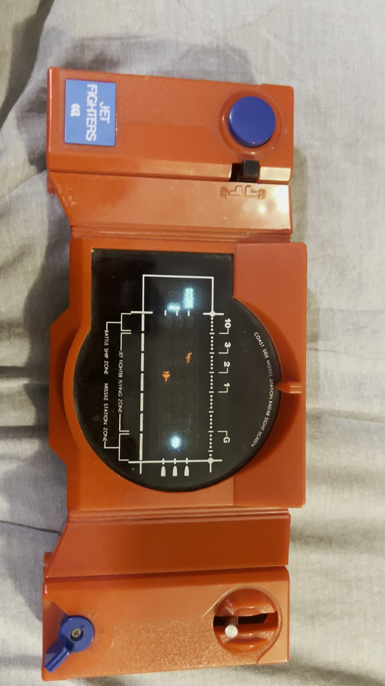

# Jet Fighters

Browser replica of the 1979 Gakken/CGL Jet Fighters tabletop VFD game.

**[Play it here](https://bjcoombs.github.io/jet-fighters/)**



> Screenshot placeholder: the reference photo of the original unit above will be
> replaced with a capture of the running game once the renderer lands.
> Path is relative to the repository root.

## Controls

| Action        | Keyboard              | On-case control                    |
| ------------- | --------------------- | ---------------------------------- |
| Move launcher | Arrow Up / Down, W / S | Launcher lever (3 lanes)           |
| Fire missile  | Space                 | Blue fire button                   |
| Skill level   | 1 / 2 / 3             | Rotary skill dial (1 / 2 / 3)      |
| Start / reset | -                     | Power ON/OFF slide switch          |

The original starts a new game by power-cycling the ON/OFF switch; the replica
mirrors that behaviour.

## Development

```bash
npm install && npm run dev
```

Other scripts:

- `npm run build` - type-check and produce a production build in `dist/`
- `npm test` - run the Vitest suite
- `npm run lint` - lint the sources
- `npm run preview` - preview the production build locally

## Credits

Original game by Gakken (model 81582, 1979), released in the UK by Computer Games
Limited (CGL). This project is an unaffiliated fan recreation and is not endorsed
by or associated with Gakken or CGL.

Licensed under the [MIT License](LICENSE).
