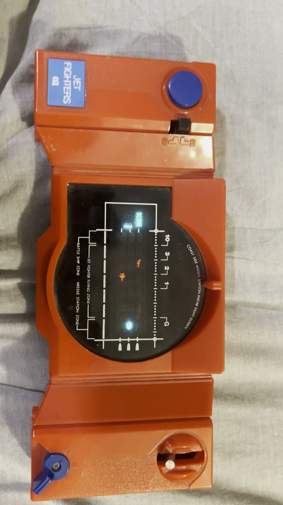
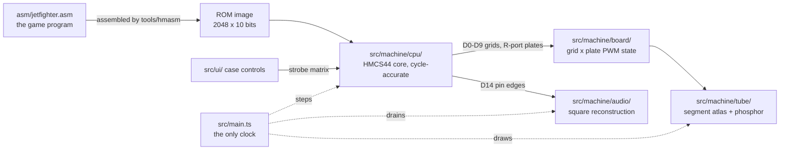

# Jet Fighters

An emulation of the 1979 Gakken/CGL Jet Fighters tabletop VFD game, running in a browser.

**[Play it here](https://bjcoombs.github.io/jet-fighters/)**



> The photo above is the original CGL unit. Paths in this file are relative to the
> repository root.

This is not a re-implementation of the game's rules. It is a cycle-accurate emulation of
the machine that played it: a Hitachi HMCS44 microcontroller executing a 2 KB program,
scanning a two-phosphor vacuum fluorescent tube one grid at a time, and making sound by
toggling a single pin. The rules live in `asm/jetfighter.asm` - assembly source in this
repository - and the timing, the display shimmer and the sound emerge from running it,
rather than being approximated. See `docs/prd/jet-fighters-v2.md` for the full rationale
and the hardware research behind it.

## Controls

| Action        | Keyboard                | On-case control               |
| ------------- | ----------------------- | ----------------------------- |
| Move launcher | Arrow Up / Down, W / S  | Launcher lever (3 lanes)      |
| Fire missile  | Space / Enter           | Blue fire button              |
| Skill level   | 1 / 2 / 3               | Rotary skill dial (1 / 2 / 3) |
| Power         | P                       | ON/OFF slide switch           |
| Mute          | M                       | Speaker button on the case    |

The lever and the fire button are held contacts: the machine reads them off its input
matrix on each display sweep, exactly as the real unit does.

**The power switch is the only reset.** Switching on resets the processor and brings RAM
up undefined, which the game program then clears; switching off halts it and the RAM
contents die with the supply. That is how the real unit starts a new game, and there is
deliberately no restart button here either.

Mute silences the browser's output, not the machine - the program keeps toggling the
speaker pin, like a real unit with its piezo disconnected.

## Architecture

Five layers, mirroring the physical machine. Data flows the way electricity did.


```mermaid
flowchart LR
    ASM[asm/jetfighter.asm<br/>the game program] -->|assembled by tools/hmasm| ROM[ROM image<br/>2048 x 10 bits]
    ROM --> CPU[src/machine/cpu/<br/>HMCS44 core, cycle-accurate]
    SW[src/ui/ case controls] -->|strobe matrix| CPU
    CPU -->|D0-D9 grids, R-port plates| BOARD[src/machine/board/<br/>grid x plate PWM state]
    CPU -->|D14 pin edges| SPK[src/machine/audio/<br/>square reconstruction]
    BOARD --> TUBE[src/machine/tube/<br/>segment atlas + phosphor]
    MAIN[src/main.ts<br/>the only clock] -.->|steps| CPU
    MAIN -.->|draws| TUBE
    MAIN -.->|drains| SPK
```

| Path                 | What lives there                                                                                                                     |
| -------------------- | ------------------------------------------------------------------------------------------------------------------------------------ |
| `asm/jetfighter.asm` | The game itself - every rule, cadence, sound and score, in HMCS44 assembly under the real 2048-word / 160-nibble limits.               |
| `tools/hmasm/`       | The assembler, its CLI, and the Vite plugin that makes an `.asm` file an importable module.                                            |
| `src/machine/cpu/`   | The HMCS44 core: 91 instructions, 4-bit ALU, 4-level stack, timer, R/D ports. Advances only when stepped.                              |
| `src/machine/board/` | The board: PWM display state, the input strobe matrix, D14 edge capture, and the power switch.                                         |
| `src/machine/tube/`  | The tube: the segment atlas (shape and (grid, plate) address of every phosphor segment) and the renderer's phosphor rise/decay curves. |
| `src/machine/audio/` | The speaker: cycle-stamped edges placed on a sample timeline and band-limited into a waveform.                                         |
| `src/ui/`            | The case shell - the moulded body, the scope window, and the four controls.                                                           |
| `src/input/`         | Keyboard and touch, translated into movements of those same four controls.                                                            |
| `src/main.ts`        | The frame driver, and the only clock in the program.                                                                                  |
| `tools/probe/`       | The headless machine probe: drives the board from a terminal and reports what the hardware did.                                        |

Two rules hold everything else in place:

- **Nothing owns a clock except `src/main.ts`.** The board advances only when stepped, so
  the same machine runs identically in a browser at 60 Hz and in Node as fast as it can.
- **`src/machine/` never touches the DOM.** That is what lets the probe and the spectral
  tests drive the real machine headlessly, and it is checked by the tests running under
  the `node` environment.

There is no game state outside the emulated RAM. The score, the jets, the lives and the
skill level are nibbles the program put there; a control movement reaches the game only by
closing a contact the program reads on its next sweep.

## Development

```bash
npm install && npm run dev
```

Scripts:

- `npm run build` - type-check and produce a production build in `dist/`
- `npm test` - run the Vitest suite
- `npm run lint` - lint the sources
- `npm run preview` - preview the production build locally

Zero runtime dependencies. Everything above ships as the application's own code.

### Changing the game

Game behaviour is changed by editing `asm/jetfighter.asm`, not by editing TypeScript. The
Vite plugin in `tools/hmasm/vite-plugin.ts` assembles it on import, so `npm run dev`
reassembles and reloads the moment the assembly changes - there is no generated ROM file
to go stale.

Assemble it yourself, with a listing showing address, opcode and source line:

```bash
npx vite-node tools/hmasm/cli.ts asm/jetfighter.asm --listing /tmp/jetfighter.lst
```

The assembler enforces the real ceilings: overflowing 2048 program words or 160 RAM
nibbles is an error, not a warning.

### Watching the machine run, without a browser

```bash
# 400k cycles (one emulated second): which grids were strobed, which segments
# lit and at what duty
npx vite-node tools/probe/machine-probe.ts --cycles 400000

# move the lever mid-run and compare the tube before and after
npx vite-node tools/probe/machine-probe.ts --cycles 400000 --input lever=up@200000

# capture the D14 transition stream for spectral analysis
npx vite-node tools/probe/machine-probe.ts --cycles 400000 --input fire@200000 --emit-edges
```

The probe writes one JSON object to stdout and reads everything off the board's own
observation surface, so what it reports is what the hardware did - not a summary a test
helper decided to keep.

In a dev build the running machine is also reachable from the browser console as
`window.jetFighters` (`board`, `renderer`, and the assembler's symbol table), which is how
you inspect RAM or step the core while debugging a ROM change.

## Credits

Original game by Gakken (model 81582, 1979), released in the UK by Computer Games
Limited (CGL). This project is an unaffiliated fan recreation and is not endorsed
by or associated with Gakken or CGL.

Licensed under the [MIT License](LICENSE).
