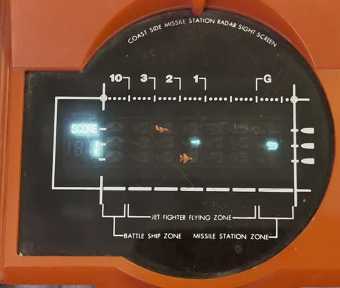
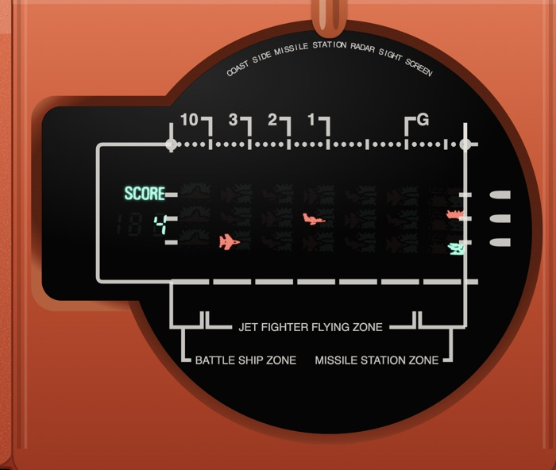
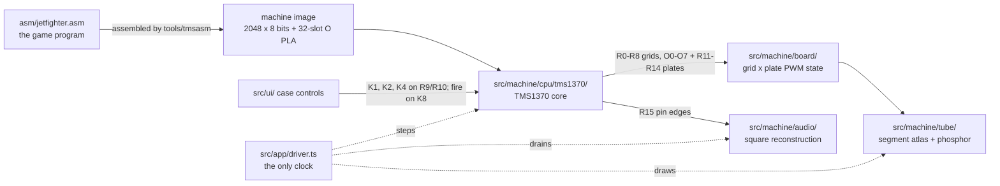

# Jet Fighters

A browser emulation of the 1979 Gakken/CGL Jet Fighters tabletop game.

**[Play it here](https://bjcoombs.github.io/jet-fighters/)** - and see the unit in three
dimensions, orbitable and taken apart, at [`3d.html`](https://bjcoombs.github.io/jet-fighters/3d.html)
(`docs/prd/jet-fighters-3d.md`; the model comes from `tools/model/`).

| The original 1979 CGL unit | This emulator |
| :---: | :---: |
|  |  |

This is not a re-implementation of the game's rules. It emulates the machine that played
them: a 4-bit microcontroller executing a small mask ROM, scanning a two-phosphor vacuum
fluorescent tube one grid at a time, and making sound by toggling a single pin.

The rules live in `asm/jetfighter.asm` - assembly source in this repository, written under
the real chip's program and RAM ceilings. The timing, the display shimmer and the sound are
not approximated; they fall out of running it. When the machine plays a note it stops
scanning the tube, because it has one core and no sound hardware - so on the real unit, and
on this one, **every beep is also a visible blink of the whole display**.

The processor is a **Texas Instruments TMS1370**, custom mask **MP2110** - legible in
[the teardown photograph](assets/reference/tube-teardown/), and named in MAME's own device
list as *"1980, Gakken Invader/Tandy Fire Away"*. So the unit runs the Gakken Invader
program behind Jet Fighters artwork, which is why its logic reads as Space Invaders. The
core in `src/machine/cpu/tms1370/` is that part: 9 display grids on R0-R8, 12 plates on
O0-O7 plus R11-R14, four input pins, one instruction per six oscillator pulses, and an
output PLA that gives the program 32 plate patterns and no thirty-third.

The instruction rate itself is **not measured**. It is MAME's fitted oscillator
approximation divided by the architectural divide-by-six, and it carries that figure's
stated tolerance; [`docs/research/mp2110-timing-measurement.md`](docs/research/mp2110-timing-measurement.md)
records what would replace it with a measurement, and every cadence constant derived from
it is marked provisional.
[`docs/evidence/open-questions.md`](docs/evidence/open-questions.md) records what else is
still unsettled, including the earlier misidentification and how it entered.

## What the teardown changed

Most of what this emulator knows about the tube, it learned late, and by being wrong first.

Until late on, every sprite came from photographs and video of the unit *playing* - which
means through a smoked filter, in sunlight, sampled slower than the tube refreshes. Then
the owner took the unit apart and photographed the bare glass, unpowered, at 46.7
megapixels. Every segment visible at once, no filter, no multiplexing to defeat.

Almost everything downstream of that turned out to be an assumption we had promoted to a
test:

- **Five score segments were phosphor the glass does not have.** The hundreds digit is not
  a seven-segment digit - it is two printed strokes, because the score caps at 199 and it
  only ever needs to draw a `1`. A conformance test had already flagged those five as
  never-driven, and had been given the wrong reason; the photograph supplied the right one.
- **The jets are fifteen distinct shapes**, one per lane per column, not one outline
  translated across the field. Within a single cell the top lane banks one way, the middle
  flies level with a forked twin tail, the bottom banks the other. The animation is printed
  on the glass; the program only chooses which area to light.
- **The sprite lattice had been derived from the sprites themselves**, which silently
  assumed they sit centred in their printed cells. They do not - they sit 16% left of
  centre. Every test passed, because "each jet is inside its own cell" is true of any
  self-consistent frame, right or wrong.
- **The "march beep" we had tuned the game's speed against was the player's own gun.** Its
  pulses fall in the gaps between the squadron's steps. The cadence floor had been anchored
  to it, so the game ran roughly twice as fast as the real one at every skill level.
- **The battleship's buzz was never missing** - it was playing at the right pitch, and every
  note reached the speaker. It was a tenth of its measured length, so three of them landed
  far enough apart to be indistinguishable from jet-march blips. The fault was in the
  spacing, and every single-layer test was green.

The tube had one more thing to give. Magnify the display and it resolves a dot screen in
the phosphor and a honeycomb in the dark field - and those turn out to be **the same
structure**: the control grid, an etched mesh in front of the anode, measured at a
10.83 px period on a 31 degree axis in the red phosphor, the cyan phosphor and the dark
field alike. One mesh, composited as a shadow, produces both appearances. Zoom in and you
can see it.

Everything asserted above is a measurement with its provenance recorded. Where the video
and the bare tube disagree, the teardown wins, and the disagreements are written down
rather than absorbed - see [`docs/evidence/`](docs/evidence/) for the audio bands, the tube's
refresh and persistence, the timing analysis, and an explicit list of what is still
unsettled.

## How this was built

Every line of this repository was written by Claude, working in Claude Code - Opus 5 and
Fable 5, across the days in the commit log. The owner supplied the machine, the
photographs, the recordings, and the judgement about what the real unit does.

That was the point of attempting it. This is a project I had wanted to try for a while and
had held off on, because agentic coding did not feel ready for something with this shape:
no reference implementation to copy, a correctness standard that lives in a physical object
on a desk, and thousands of small decisions that are each individually plausible and
collectively wrong if nobody checks them against the thing itself.

What made it work is not that the model got things right. The section above is a list of
things it got confidently, thoroughly wrong - and those are the ones that were caught.
What made it work is that it could be **held to evidence**: made to measure rather than
assert, made to record how it knows each thing, and made to say plainly what it could not
determine.

Some of that came from the model refusing instructions. Told to remap the sprite grid one
way, it measured, disagreed, and held its ground - obeying would have mirrored the
playfield and deleted three real segments. Told the battleship's pitch encoding was capped
and to redesign it, it measured, found the pitch already correct, and declined to build the
change. Told that a path-simplification step was throwing away sprite detail, it measured
that step at a tenth of the error and went looking elsewhere. Every one of those was a
lead-agent instruction that was simply wrong, and each would have shipped.

The rest came from method. Findings carry their provenance and the count of samples behind
them. Assertions are checked by mutation - break the thing on purpose and confirm the test
notices. Where two sources disagree, the disagreement is written down rather than averaged
away. And the two ways this project has repeatedly gone wrong are named in the notes so
they can be recognised on sight: **phantom segments**, phosphor the glass does not have,
found three times; and **beliefs promoted to constraints**, an assertion describing what we
decided rather than what the machine does, found four.

None of that is specific to emulation. It is what it takes to trust work you did not do by
hand.

## Controls

| Action        | Keyboard                | On-case control               |
| ------------- | ----------------------- | ----------------------------- |
| Move launcher | Arrow Up / Down, W / S  | Launcher lever (3 lanes)      |
| Fire missile  | Space / Enter           | Blue fire button              |
| Skill level   | 1 / 2 / 3               | Rotary skill dial (1 / 2 / 3) |
| Power         | P                       | ON/OFF slide switch           |
| Mute          | M                       | Speaker button on the case    |

The lever and the fire button are held contacts: the machine reads them off its input
matrix on each display sweep, exactly as the real unit does.

**The power switch is the only reset.** Switching on resets the processor and brings RAM
up undefined, which the game program then clears; switching off halts it and the RAM
contents die with the supply. That is how the real unit starts a new game, and there is
deliberately no restart button here either.

Mute silences the browser's output, not the machine - the program keeps toggling the
speaker pin, like a real unit with its piezo disconnected.

## The unit in three dimensions

[`3d.html`](https://bjcoombs.github.io/jet-fighters/3d.html) is the same machine behind the
glass of a model of the unit: orbit it, lift the red shell off, pull the board out with the
tube still lit, click the chip to be told what it is, and play - the fire cap, the power
slide, the launcher lever and the skill flag on the model close the same contacts the flat
page's controls do, and the keyboard works throughout.

One panel runs the page. **View** puts the camera on the front, the back, or inside with
the lid lifted (`F`, `B`, `I`); **Take apart** is a slider whose three detents are
assembled, lid off and exploded (`E` steps through them), with "Bare board" to take the
case off and leave the board and the lit tube to play, and "Show all" to bring it back;
**Parts** lists every labelled part in its group with a checkbox for whether it is shown,
lights a part up under the pointer, and opens its label and evidence when clicked (`H`
hides it, `Esc` lets go). Clicking a part on the model does the same. On a phone the panel
starts folded and the four controls are also a bar of buttons along the bottom (lane up
and down, fire held while touched, power, skill), because the modelled ones are a few
millimetres across; add `#touch` to the address to see the bar on a desktop.

**What it is built from.** No dimension was measured with a ruler; the owner has no further
access to the unit for that. Every figure is read off two photographs against the one
object of known size in them, the TMS1370's 2.54 mm pin pitch, and recorded with its source
in [`tools/model/dimensions.json`](tools/model/dimensions.json); a Blender script builds
every part from that file and exports the model with a label, its evidence and an explode
vector on each node. Nothing on the model is a photograph: the shells are
bevelled geometry in plastics whose colours are sampled from the front photograph, the
stipple is a generated normal map, and every printed or moulded word is a text mesh, so
zooming in finds edges rather than pixels. Renders from cameras matched to the photographs sit beside them in
[`docs/evidence/console-model-front.jpg`](docs/evidence/console-model-front.jpg) and
[`console-model-board.jpg`](docs/evidence/console-model-board.jpg), and
[`tools/model/compare.py`](tools/model/compare.py) reads both images with the same masks:
the front agrees to within 1.5% of the case width.

**What is estimated.** No photograph is edge-on, so every depth - the shells, the tube's
thickness, how high the board sits - is an estimate with a stated basis and bound, in
[`docs/evidence/console-dimensions.md`](docs/evidence/console-dimensions.md). The assembled
unit comes out at about 340 x 145 x 58 mm, with the last figure the least certain thing in
the model. The launcher lever's mechanism and one toothed black disc on the board are
labelled unidentified, because the photographs do not say.

**Regenerating it.** `npm run model` rebuilds `public/models/console.glb` headless (Blender
4.2+, found automatically on macOS or via `BLENDER`); two runs are byte-identical, so a
change in geometry shows as a real diff. `python3 tools/model/measure.py --overlay
docs/evidence --doc docs/evidence/console-dimensions.md` re-derives the dimensions from the
pixel reads and rewrites the document's tables. The one runtime dependency the site has,
`three`, is confined to the 3D page by a test that reads the import graph.

## Architecture

Five layers, mirroring the physical machine. Data flows the way electricity did.


```mermaid
flowchart LR
    ASM[asm/jetfighter.asm<br/>the game program] -->|assembled by tools/tmsasm| ROM[machine image<br/>2048 x 8 bits + 32-slot O PLA]
    ROM --> CPU[src/machine/cpu/tms1370/<br/>TMS1370 core]
    SW[src/ui/ case controls] -->|K1, K2, K4 on R9/R10; fire on K8| CPU
    CPU -->|R0-R8 grids, O0-O7 + R11-R14 plates| BOARD[src/machine/board/<br/>grid x plate PWM state]
    CPU -->|R15 pin edges| SPK[src/machine/audio/<br/>square reconstruction]
    BOARD --> TUBE[src/machine/tube/<br/>segment atlas + phosphor]
    MAIN[src/app/driver.ts<br/>the only clock] -.->|steps| CPU
    MAIN -.->|draws| TUBE
    MAIN -.->|drains| SPK
```

| Path                 | What lives there                                                                                                                     |
| -------------------- | ------------------------------------------------------------------------------------------------------------------------------------ |
| `asm/jetfighter.asm` | The game itself - every rule, cadence, sound and score, in TMS1000-family assembly under the chip's 2048-word program and 128-nibble RAM ceilings. |
| `tools/tmsasm/`      | The assembler, its CLI, its five static analyses, and the Vite plugin that makes an `.asm` file an importable module.                  |
| `src/machine/cpu/tms1370/` | The CPU core: 4-bit ALU, LFSR program counter, one-level stack, R/O/K ports, output PLA. Advances only when stepped.             |
| `src/machine/board/` | The board: PWM display state, the K input matrix, R15 edge capture, and the power switch.                                             |
| `src/machine/tube/`  | The tube: the segment atlas (shape and (grid, plate) address of every phosphor segment) and the renderer's phosphor rise/decay curves. |
| `src/machine/audio/` | The speaker: cycle-stamped edges placed on a sample timeline and band-limited into a waveform.                                         |
| `src/ui/`            | The case shell - the moulded body, the scope window, and the four controls.                                                           |
| `src/input/`         | Keyboard and touch, translated into movements of those same four controls.                                                            |
| `src/app/`           | The frame driver - the only clock in the program - plus canvas sizing and the mute toggle, shared by both pages.                     |
| `src/main.ts`        | The flat page: builds the case and hands the driver a renderer.                                                                       |
| `src/viewer3d/`      | The 3D page: the model from `tools/model/` orbited, taken apart and played, with the renderer's canvas as the tube's texture.         |
| `tools/model/`       | The unit's dimensions from the photographs, the Blender script that builds the model from them, and the comparison against the photographs. |
| `tools/probe/`       | The headless machine probe: drives the board from a terminal and reports what the hardware did.                                        |

Two rules hold everything else in place:

- **Nothing owns a clock except `src/main.ts`.** The board advances only when stepped, so
  the same machine runs identically in a browser at 60 Hz and in Node as fast as it can.
- **`src/machine/` never touches the DOM.** That is what lets the probe and the spectral
  tests drive the real machine headlessly, and it is checked by the tests running under
  the `node` environment.

There is no game state outside the emulated RAM. The score, the jets, the lives and the
skill level are nibbles the program put there; a control movement reaches the game only by
closing a contact the program reads on its next sweep.

## Development

```bash
npm install && npm run dev
```

Scripts:

- `npm run build` - type-check and produce a production build in `dist/`
- `npm test` - run the Vitest suite
- `npm run lint` - lint the sources
- `npm run preview` - preview the production build locally

Zero runtime dependencies. Everything above ships as the application's own code.

### Changing the game

Game behaviour is changed by editing `asm/jetfighter.asm`, not by editing TypeScript. The
Vite plugin in `tools/tmsasm/vite-plugin.ts` assembles it on import, so `npm run dev`
reassembles and reloads the moment the assembly changes - there is no generated ROM file
to go stale.

Assemble it yourself, with a listing showing address, opcode and source line:

```bash
npx vite-node tools/tmsasm/cli.ts asm/jetfighter.asm --listing /tmp/jetfighter.lst
```

The assembler enforces the real ceilings: overflowing 2048 program words or 128 RAM
nibbles is an error, not a warning. It also rejects five silent-failure classes this
architecture makes easy to write - a page-crossing branch inside a subroutine, a call
reachable from inside one, `SETR`/`RSTR` with X out of range, an instruction between a
status-setting test and its branch, and code laid down in address order rather than in the
program counter's LFSR order.

### Watching the machine run, without a browser

```bash
# 250k cycles, a little over four emulated seconds: which grids were strobed,
# which segments lit and at what duty
npx vite-node tools/probe/machine-probe.ts --cycles 250000

# move the lever mid-run and compare the tube before and after
npx vite-node tools/probe/machine-probe.ts --cycles 250000 --input lever=up@120000

# capture the R15 transition stream for spectral analysis
npx vite-node tools/probe/machine-probe.ts --cycles 250000 --input fire@120000 --emit-edges
```

The probe writes one JSON object to stdout and reads everything off the board's own
observation surface, so what it reports is what the hardware did - not a summary a test
helper decided to keep.

In a dev build the running machine is also reachable from the browser console as
`window.jetFighters` (`board`, `renderer`, and the assembler's symbol table), which is how
you inspect RAM or step the core while debugging a ROM change.

## Evidence

Nothing in the machine layer is tuned by eye. Each of these records what was measured, how,
and what it does *not* establish:

| Document | What it pins down |
| --- | --- |
| [`docs/evidence/audio-reference.md`](docs/evidence/audio-reference.md) | Every sound's frequency band, measured from recordings of the real unit, with the one figure that turned out to be a note name substituted for a reading |
| [`docs/evidence/vfd-appearance.md`](docs/evidence/vfd-appearance.md) | The tube's refresh rate, phosphor persistence per colour, brightness under load, and the blanking that fires with every sound |
| [`docs/evidence/tube-mesh.md`](docs/evidence/tube-mesh.md) | The control grid's period and angle, and why the dot screen and the honeycomb are one structure |
| [`docs/evidence/timing-analysis.md`](docs/evidence/timing-analysis.md) | Squadron cadence and battleship crossings, measured frame by frame |
| [`assets/reference/sprites/README.md`](assets/reference/sprites/README.md) | Every sprite on the glass, its size, its cell and its lanes |
| [`src/machine/tube/ATLAS-COORDINATES.md`](src/machine/tube/ATLAS-COORDINATES.md) | The tracing method, the five approaches that failed, and the two ways this atlas has gone wrong |
| [`docs/evidence/console-dimensions.md`](docs/evidence/console-dimensions.md) | The unit's dimensions from the photographs against the chip's pin pitch: what is measured, what is estimated, and how far the flat page's drawing disagrees |
| [`docs/evidence/open-questions.md`](docs/evidence/open-questions.md) | What is still unsettled, and what would settle it |

## Credits

Original game by Gakken (model 81582, 1979), released in the UK by Computer Games
Limited (CGL). This project is an unaffiliated fan recreation and is not endorsed
by or associated with Gakken or CGL.

Licensed under the [MIT License](LICENSE).
