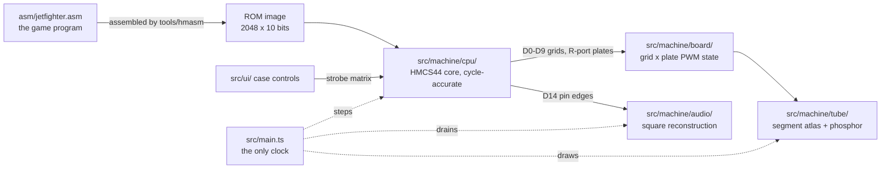

# Jet Fighters

A browser emulation of the 1979 Gakken/CGL Jet Fighters tabletop game.

**[Play it here](https://bjcoombs.github.io/jet-fighters/)**

| The original 1979 CGL unit | This emulator |
| :---: | :---: |
|  |  |

This is not a re-implementation of the game's rules. It is a cycle-accurate emulation of
the machine that played it: a Hitachi HMCS44 microcontroller executing a 2 KB program,
scanning a two-phosphor vacuum fluorescent tube one grid at a time, and making sound by
toggling a single pin.

The rules live in `asm/jetfighter.asm` - HMCS44 assembly source in this repository, under
the real chip's 2048-word program and 160-nibble RAM ceilings. The timing, the display
shimmer and the sound are not approximated; they fall out of running it. When the machine
plays a note it stops scanning the tube, because it has one core and no sound hardware -
so on the real unit, and on this one, **every beep is also a visible blink of the whole
display**.

## What the teardown changed

Most of what this emulator knows about the tube, it learned late, and by being wrong first.

Until late on, every sprite came from photographs and video of the unit *playing* - which
means through a smoked filter, in sunlight, sampled slower than the tube refreshes. Then
the owner took the unit apart and photographed the bare glass, unpowered, at 46.7
megapixels. Every segment visible at once, no filter, no multiplexing to defeat.

Almost everything downstream of that turned out to be an assumption we had promoted to a
test:

- **Five score segments were phosphor the glass does not have.** The hundreds digit is not
  a seven-segment digit - it is two printed strokes, because the score caps at 199 and it
  only ever needs to draw a `1`. A conformance test had already flagged those five as
  never-driven, and had been given the wrong reason; the photograph supplied the right one.
- **The jets are fifteen distinct shapes**, one per lane per column, not one outline
  translated across the field. Within a single cell the top lane banks one way, the middle
  flies level with a forked twin tail, the bottom banks the other. The animation is printed
  on the glass; the program only chooses which area to light.
- **The sprite lattice had been derived from the sprites themselves**, which silently
  assumed they sit centred in their printed cells. They do not - they sit 16% left of
  centre. Every test passed, because "each jet is inside its own cell" is true of any
  self-consistent frame, right or wrong.
- **The "march beep" we had tuned the game's speed against was the player's own gun.** Its
  pulses fall in the gaps between the squadron's steps. The cadence floor had been anchored
  to it, so the game ran roughly twice as fast as the real one at every skill level.
- **The battleship's buzz was never missing** - it was playing at the right pitch, and every
  note reached the speaker. It was a tenth of its measured length, so three of them landed
  far enough apart to be indistinguishable from jet-march blips. The fault was in the
  spacing, and every single-layer test was green.

The tube had one more thing to give. Magnify the display and it resolves a dot screen in
the phosphor and a honeycomb in the dark field - and those turn out to be **the same
structure**: the control grid, an etched mesh in front of the anode, measured at a
10.83 px period on a 31 degree axis in the red phosphor, the cyan phosphor and the dark
field alike. One mesh, composited as a shadow, produces both appearances. Zoom in and you
can see it.

Everything asserted above is a measurement with its provenance recorded. Where the video
and the bare tube disagree, the teardown wins, and the disagreements are written down
rather than absorbed - see [`docs/evidence/`](docs/evidence/) for the audio bands, the tube's
refresh and persistence, the timing analysis, and an explicit list of what is still
unsettled.

## Controls

| Action        | Keyboard                | On-case control               |
| ------------- | ----------------------- | ----------------------------- |
| Move launcher | Arrow Up / Down, W / S  | Launcher lever (3 lanes)      |
| Fire missile  | Space / Enter           | Blue fire button              |
| Skill level   | 1 / 2 / 3               | Rotary skill dial (1 / 2 / 3) |
| Power         | P                       | ON/OFF slide switch           |
| Mute          | M                       | Speaker button on the case    |

The lever and the fire button are held contacts: the machine reads them off its input
matrix on each display sweep, exactly as the real unit does.

**The power switch is the only reset.** Switching on resets the processor and brings RAM
up undefined, which the game program then clears; switching off halts it and the RAM
contents die with the supply. That is how the real unit starts a new game, and there is
deliberately no restart button here either.

Mute silences the browser's output, not the machine - the program keeps toggling the
speaker pin, like a real unit with its piezo disconnected.

## Architecture

Five layers, mirroring the physical machine. Data flows the way electricity did.


```mermaid
flowchart LR
    ASM[asm/jetfighter.asm<br/>the game program] -->|assembled by tools/hmasm| ROM[ROM image<br/>2048 x 10 bits]
    ROM --> CPU[src/machine/cpu/<br/>HMCS44 core, cycle-accurate]
    SW[src/ui/ case controls] -->|strobe matrix| CPU
    CPU -->|D0-D9 grids, R-port plates| BOARD[src/machine/board/<br/>grid x plate PWM state]
    CPU -->|D14 pin edges| SPK[src/machine/audio/<br/>square reconstruction]
    BOARD --> TUBE[src/machine/tube/<br/>segment atlas + phosphor]
    MAIN[src/main.ts<br/>the only clock] -.->|steps| CPU
    MAIN -.->|draws| TUBE
    MAIN -.->|drains| SPK
```

| Path                 | What lives there                                                                                                                     |
| -------------------- | ------------------------------------------------------------------------------------------------------------------------------------ |
| `asm/jetfighter.asm` | The game itself - every rule, cadence, sound and score, in HMCS44 assembly under the real 2048-word / 160-nibble limits.               |
| `tools/hmasm/`       | The assembler, its CLI, and the Vite plugin that makes an `.asm` file an importable module.                                            |
| `src/machine/cpu/`   | The HMCS44 core: 91 instructions, 4-bit ALU, 4-level stack, timer, R/D ports. Advances only when stepped.                              |
| `src/machine/board/` | The board: PWM display state, the input strobe matrix, D14 edge capture, and the power switch.                                         |
| `src/machine/tube/`  | The tube: the segment atlas (shape and (grid, plate) address of every phosphor segment) and the renderer's phosphor rise/decay curves. |
| `src/machine/audio/` | The speaker: cycle-stamped edges placed on a sample timeline and band-limited into a waveform.                                         |
| `src/ui/`            | The case shell - the moulded body, the scope window, and the four controls.                                                           |
| `src/input/`         | Keyboard and touch, translated into movements of those same four controls.                                                            |
| `src/main.ts`        | The frame driver, and the only clock in the program.                                                                                  |
| `tools/probe/`       | The headless machine probe: drives the board from a terminal and reports what the hardware did.                                        |

Two rules hold everything else in place:

- **Nothing owns a clock except `src/main.ts`.** The board advances only when stepped, so
  the same machine runs identically in a browser at 60 Hz and in Node as fast as it can.
- **`src/machine/` never touches the DOM.** That is what lets the probe and the spectral
  tests drive the real machine headlessly, and it is checked by the tests running under
  the `node` environment.

There is no game state outside the emulated RAM. The score, the jets, the lives and the
skill level are nibbles the program put there; a control movement reaches the game only by
closing a contact the program reads on its next sweep.

## Development

```bash
npm install && npm run dev
```

Scripts:

- `npm run build` - type-check and produce a production build in `dist/`
- `npm test` - run the Vitest suite
- `npm run lint` - lint the sources
- `npm run preview` - preview the production build locally

Zero runtime dependencies. Everything above ships as the application's own code.

### Changing the game

Game behaviour is changed by editing `asm/jetfighter.asm`, not by editing TypeScript. The
Vite plugin in `tools/hmasm/vite-plugin.ts` assembles it on import, so `npm run dev`
reassembles and reloads the moment the assembly changes - there is no generated ROM file
to go stale.

Assemble it yourself, with a listing showing address, opcode and source line:

```bash
npx vite-node tools/hmasm/cli.ts asm/jetfighter.asm --listing /tmp/jetfighter.lst
```

The assembler enforces the real ceilings: overflowing 2048 program words or 160 RAM
nibbles is an error, not a warning.

### Watching the machine run, without a browser

```bash
# 400k cycles (one emulated second): which grids were strobed, which segments
# lit and at what duty
npx vite-node tools/probe/machine-probe.ts --cycles 400000

# move the lever mid-run and compare the tube before and after
npx vite-node tools/probe/machine-probe.ts --cycles 400000 --input lever=up@200000

# capture the D14 transition stream for spectral analysis
npx vite-node tools/probe/machine-probe.ts --cycles 400000 --input fire@200000 --emit-edges
```

The probe writes one JSON object to stdout and reads everything off the board's own
observation surface, so what it reports is what the hardware did - not a summary a test
helper decided to keep.

In a dev build the running machine is also reachable from the browser console as
`window.jetFighters` (`board`, `renderer`, and the assembler's symbol table), which is how
you inspect RAM or step the core while debugging a ROM change.

## Evidence

Nothing in the machine layer is tuned by eye. Each of these records what was measured, how,
and what it does *not* establish:

| Document | What it pins down |
| --- | --- |
| [`docs/evidence/audio-reference.md`](docs/evidence/audio-reference.md) | Every sound's frequency band, measured from recordings of the real unit, with the one figure that turned out to be a note name substituted for a reading |
| [`docs/evidence/vfd-appearance.md`](docs/evidence/vfd-appearance.md) | The tube's refresh rate, phosphor persistence per colour, brightness under load, and the blanking that fires with every sound |
| [`docs/evidence/tube-mesh.md`](docs/evidence/tube-mesh.md) | The control grid's period and angle, and why the dot screen and the honeycomb are one structure |
| [`docs/evidence/timing-analysis.md`](docs/evidence/timing-analysis.md) | Squadron cadence and battleship crossings, measured frame by frame |
| [`assets/reference/sprites/README.md`](assets/reference/sprites/README.md) | Every sprite on the glass, its size, its cell and its lanes |
| [`src/machine/tube/ATLAS-COORDINATES.md`](src/machine/tube/ATLAS-COORDINATES.md) | The tracing method, the five approaches that failed, and the two ways this atlas has gone wrong |
| [`docs/evidence/open-questions.md`](docs/evidence/open-questions.md) | What is still unsettled, and what would settle it |

Two failure modes recur often enough to be named in the notes. **Phantom segments** -
phosphor the glass does not have, found three times. And **beliefs promoted to
constraints** - an assertion describing what we decided rather than what the machine does,
found four times, including one that had frozen a sprite in a position chosen because it
"should" look right.

## Credits

Original game by Gakken (model 81582, 1979), released in the UK by Computer Games
Limited (CGL). This project is an unaffiliated fan recreation and is not endorsed
by or associated with Gakken or CGL.

Licensed under the [MIT License](LICENSE).
