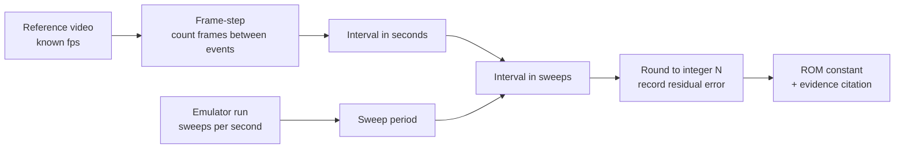

# Timing analysis

How the v2 ROM's cadence constants will be derived from the reference video, and
what is currently blocked.

**Status: one figure is derived from audio; T2-T10 remain unmeasured.** The march
beep in `gameplay-audio.m4a` has now been measured, which bounds the *floor* of the
jet step cadence (row `T1-audio` in the [measured timings](#output-format) table).
Nothing else in this document has a measurement behind it, and the per-skill
gameplay video that T2-T10 need still does not exist. Read the
[Evidence gap](#evidence-gap) section before using any number from this document.

## Why sweep counts, not milliseconds

The HMCS44 ROM has no timer interrupt. Its master loop strobes the next display grid,
outputs that grid's plate pattern, samples inputs, and runs one slice of game logic -
then repeats. **The display sweep is the machine's only timebase** (PRD
`docs/prd/jet-fighters-v2.md` R3). Every cadence in the game is therefore an integer
count of sweeps: "the squadron steps every N sweeps", never "every N milliseconds".

That means a measurement in seconds is an intermediate value, not the deliverable.
The pipeline is:



The sweep rate is a property of the ROM's own master loop - how many machine cycles
one pass costs at the ~400 kHz oscillator - so it is read out of the emulated machine,
not out of the video. Both halves of the conversion must exist before an integer
sweep count can be claimed. Neither is available yet.

## Measurements to perform

Once the per-skill gameplay video arrives, measure each of the following. Every row
gets its own measurement at **each of skill 1, 2, and 3** unless marked otherwise.

| # | Quantity | What to count | Notes |
| --- | --- | --- | --- |
| T1 | Jet step cadence, fresh squadron | Frames between two consecutive squadron steps, with all 6 jets alive | The headline number. Measure early in a wave before any kills. |
| T2 | Thin-out speed-up curve | Step cadence again at 5, 4, 3, 2, 1 jets remaining | Yields the per-dead-jet decrement. Do not assume it is linear - plot the five points and fit only what the data supports. |
| T3 | Wave respawn speed-up | Fresh-squadron cadence on wave 2, wave 3 | Isolates the per-wave decrement from the thin-out decrement. |
| T4 | Cadence floor | Fastest observed step interval at skill 3, last jet, deep wave | The clamp the ROM needs so the cadence cannot reach zero. |
| T5 | Battleship crossing duration | Frames from the battleship first appearing at one edge of the far zone to it leaving at the other | Also note whether it crosses in discrete column steps or continuously. |
| T6 | Battleship crossing interval | Frames between the end of one crossing and the start of the next, over as many crossings as the footage contains | Expect this to be random. Record every observed interval, then characterise the distribution - do not report a single mean as if it were fixed. |
| T7 | Missile travel time | Frames from fire to the missile reaching the far zone, and per-column dwell | Skill-independent if the missile speed is fixed; verify that against all three levels rather than assuming it. |
| T8 | Rocket travel time | Frames from a jet firing to the rocket reaching the launcher row, and per-column dwell | Same skill-independence check as T7. |
| T9 | Rocket fire rate | Frames between successive rocket launches, per skill level | Random like T6; record the observed intervals. |
| T10 | Warning-beep to playable | Frames from a launcher hit to the player regaining control | Video-only. `audio-reference.md` measures the warning beeps themselves (count, duration, gaps) but not the recovery interval that follows them, so it cannot supply this figure. |

### Method

1. **Establish fps.** Read the container's frame rate from the video file
   (`ffprobe -show_streams`); do not trust the nominal rate on the recording device.
   Record the exact rational fps (for example 30000/1001, not "30").
2. **Frame-step, do not scrub.** Step frame by frame through the event
   (`ffmpeg -vf select` to extract a numbered frame sequence, or a frame-accurate
   player). Record the integer frame index of each event onset.
3. **Define the onset consistently.** For a stepping sprite, the onset is the first
   frame in which the sprite occupies its new column. The VFD's persistence and the
   camera's rolling shutter can smear a step across two frames - when ambiguous,
   record both indices and carry the ambiguity as an error bar rather than picking one.
4. **Average over many events.** A single step interval measured at 30 fps has a
   +/- 33 ms quantisation error. Measure across at least 10 consecutive steps and
   divide, which divides the error by 10 as well.
5. **Convert to sweeps.** Divide the measured interval by the emulated machine's
   sweep period. Round to the nearest integer and **record the pre-rounding value and
   the residual**. A residual above a few percent means either the fps is wrong, the
   sweep rate is wrong, or the ROM's master loop does not cost what it is assumed to.
6. **Cross-check against audio - T1 only.** The jet march beep fires once per
   squadron step, and `gameplay-audio.m4a` is a 130 s recording with an audible
   march. The beep onsets in that recording give an independent read on T1 for
   whichever skill level was being played, at audio sample resolution rather than
   frame resolution. Use it to validate the video-derived figure. It cannot replace
   the video, because the recording's skill level is not documented and it covers one
   level only.

   **This is the only row the audio can cross-check.** The recordings capture sounds,
   not game state, so they cannot time anything whose boundaries are visual - a
   battleship entering or leaving the far zone (T5, T6), a missile or rocket
   traversing columns (T7, T8), or control returning to the player after a hit (T10).
   `audio-reference.md` measures the warning-beep sequence itself - pitch, count,
   duration, gaps - and nothing about the interval that follows it. Video is the sole
   source for T2-T10.

### Output format

Each measured row lands in the table below and is cited from the ROM source:

| ID | Quantity | Skill | Measured (s) | fps / frames | Sweeps (pre-round) | **Sweeps (ROM)** | Residual | Source clip / timestamp |
| --- | --- | --- | --- | --- | --- | --- | --- | --- |
| T1-audio | Squadron step rate, fastest observed | unknown | 0.205 +/- 0.022 | n/a - audio, 22050 Hz | 13.2 | **13** (`PAT_STEP` entry 15, the floor) | -1.5% | `gameplay-audio.m4a`, 55-121 s |
| T1-video | One aircraft advancing one cell | unknown | 1.4 (range 1.2-1.9) | 30 fps, 42 frames (36-56) | see below | not yet mapped | - | `IMG_6113.mov`, whole file, n=12 |
| T5-video | Missile step, one cell | unknown | 0.500 | 30 fps, 15 frames | see below | not yet mapped | - | `IMG_6113.mov`, whole file, n=744 |
| T-march | March beep interval | unknown | 0.71 median | n/a - audio, 22050 Hz | - | - | - | `IMG_6113.mov`, t=180-270 s, n=111 |

*(The audio row is a cross-check of T1, not a video measurement of it, and it constrains
the ladder's floor only - see [What the audio row does and does not
say](#what-the-audio-row-does-and-does-not-say). The three video rows are the first
measurements from the owner's gameplay recording; see [What the gameplay video
supplies](#what-the-gameplay-video-supplies) below for what they do and do not settle.
T2, T3, T4 and T6-T10 are still empty. See [Evidence gap](#evidence-gap).)*

### The T1 audio cross-check, as performed

Method 6 above, carried out. Reproducible from the repository as it stands:

1. Decode to mono PCM: `ffmpeg -i assets/reference/gameplay-audio.m4a -ac 1 -ar
   22050 -c:a pcm_s16le gameplay.wav`.
2. Take a Hann-windowed short-time transform (512-sample window, 64-sample hop =
   2.90 ms resolution) and sum magnitude across 585-660 Hz - the `jetMarch` band
   from `audio-reference.md`.
3. Peak-pick that envelope with a fixed threshold and a 120 ms refractory window
   (the march note is ~70 ms, so 120 ms cannot split one note into two onsets).
   153 onsets over 55-121 s.
4. **Classify each onset by its own dominant bin**, not by the band it was found
   in. Leakage from the missile blip (1480-1632 Hz) survives step 3 and would
   otherwise be counted: 54 of the 153 onsets are missile fire and one run of
   eight "beeps" at ~170 ms turned out to be entirely missile blips at ~1460 Hz.
   99 onsets have a dominant bin in 520-700 Hz and are march steps.
5. Keep only runs of four or more consecutive march onsets with no gap longer
   than 400 ms, so a measured interval is always between two beeps of the same
   uninterrupted march rather than across a pause.

Result: five such runs, 21 intervals.

| Run start (s) | Beeps | Intervals (ms) | Mean (ms) |
| --- | --- | --- | --- |
| 58.497 | 5 | 209, 206, 206, 200 | 205 |
| 62.877 | 5 | 197, 194, 197, 203 | 198 |
| 68.403 | 5 | 232, 223, 151, 180 | 197 |
| 79.993 | 7 | 247, 223, 206, 253, 186, 189 | 217 |
| 117.566 | 4 | 189, 215, 200 | 201 |

Pooled: **mean 205.1 ms, median 203.2 ms, sd 22.1 ms, n = 21**, min 151, max 253.
The first-half and second-half means are 206.9 and 203.4 ms, so there is no drift
across the recording that would suggest the level changed mid-take.

At the emulated machine's measured nominal sweep period of 13.46 ms (below), 205 ms
is 15.2 sweeps; the ROM stores 15, the closest integer under it, a residual of
-1.5%. It stored 13 while the nominal sweep was 15.46 ms, which was the same 201 ms
by the same rule; the count moved when the sweep rate did.

### What the audio row does and does not say

**Says:** the real unit's squadron was never observed to step faster than ~205 ms,
across 65 s of one recording. The march beep fires once per sweep in which any jet
stepped, so the beep rate *is* the squadron step rate, whatever the skill was.

**Does not say** anything about the per-jet step period. Jets step one at a time on
a common period at different phases, so a squadron rate of 205 ms is one jet at 205
ms, or two at 410, or three at 615. Recovering the per-jet figure needs a count of
how many jets were flying, which is visual and therefore video-only. The steadiness
of the runs (sd 22 ms over 21 intervals, and 197-217 ms across five runs recorded
59 s apart) argues against several independently-phased jets, but arguing is not
measuring and this document does not record it as one.

**Does not say** which skill level was being played. `audio-reference.md` records
that the recording's skill setting is undocumented. So the figure cannot be
attached to a skill row; it is used as the floor under all three, which is the one
claim it supports regardless of which level it came from.

The ROM cites the ID:

```text
; Squadron step cadence, skill 1: docs/evidence/timing-analysis.md T1
; (measured 0.000 s over N steps at F fps -> M sweeps, residual R%).
SKILL1_STEP_SWEEPS: .word 0
```

## What the gameplay video supplies

A single owner recording of real play now exists - `IMG_6113.mov`, 12,237 frames at
**30 fps real time**, 407.9 s. It is not committed (580 MB) and is referenced by path.
The frame rate is settled in `docs/evidence/vfd-appearance.md` section 1 and again in
`assets/reference/sprites/README.md` from the win jingle's pitch *and* note lengths.
Sprite positions, cells and lanes are catalogued in that README; the cadence figures
are here.

**Says:** on the real unit, at the skill this recording was played on,

- **one aircraft advances one cell every 1.2 to 1.9 s, median 1.4 s** (42 frames). From
  12 consecutive same-aircraft steps found across the whole file by tracking the leading
  jet's cell per lane. Three further readings of 10 to 22 frames are almost certainly two
  jets being confused for one and are excluded.
- **the missile steps one cell every 500 ms** (15 frames), from 744 adjacent leftward
  steps. Zero rightward steps. This is the most solid number in the video by a wide
  margin.
- **the march beep sounds every 0.71 s median** (n = 111, 590-740 Hz band, t = 180-270 s),
  measured from this file's own audio, independently of the picture.

**The interesting part is the ratio.** One aircraft steps about **twice as slowly as the
march beep sounds**. Either the beep pulses twice per squadron step, or the beep is a
per-aircraft rate and two aircraft alternate phase. The video cannot separate those, and
it matters: the note above, "the march beep fires once per sweep in which any jet
stepped, so the beep rate *is* the squadron step rate", is an assumption the ROM
inherits, and this is the first evidence bearing on it. It is not enough to overturn it,
and it is enough that nobody should treat the beep rate as the per-aircraft rate without
checking.

**Says, about the cadence ladder:** `PAT_STEP` runs 48 sweeps (743 ms) for a fresh
squadron at skill 1, 36 (558 ms) at skill 2, 27 (372 ms) at skill 3, descending to 13
(201 ms). A march beep interval of 0.71 s sits near the **top** of that ladder, and a
per-aircraft step of 1.4 s sits above it. The 205 ms audio row is the ladder's floor.
Both figures are points on one ramp, and they were briefly and wrongly read as a
contradiction - the record of that is in the sprite README.

**Does not say:**

- which skill level this recording was played on. Unknown, exactly as for the audio row.
- how many jets were flying at each measured step, so the per-jet against per-squadron
  question above stays open.
- anything about the thin-out curve, the wave respawn speed-up or the floor. Those need
  the per-skill clips, which are still outstanding.
- the battleship crossing interval. The battleship was seen 17 times and **never left its
  cell**, so the video gives its dwell (2.5 s median, 5.9 s longest) but no crossing
  duration, and does not establish that it crosses at all.

## Evidence gap

**Still blocked on: the owner-supplied per-skill gameplay video, 15-20 s per skill
level.** PRD R7 lists it as pending. `IMG_6113.mov` is one recording at one unknown
skill, which supplies the rows above but not a per-skill ladder.

Consequently the following **cannot be stated** and must not be written into the ROM
as if measured:

- Jet step cadence **at a known skill level** (T1). The audio row bounds how fast the
  squadron was ever seen to step and the video row gives one aircraft's step at one
  unknown skill; neither gives a per-skill cadence, and `PAT_STEP` entries 0-14 are still
  v1 approximations.
- The thin-out speed-up curve, including whether it is linear (T2)
- The wave respawn speed-up (T3)
- The cadence floor (T4)
- Battleship crossing duration and interval distribution (T5, T6). The video adds that
  the battleship's **traversal is not established at all** - 17 sightings, never outside
  its own cell.
- Rocket travel time and fire rate (T8, T9). The attackers' colon is now traced as a
  shape but never as a moving object.
- Post-hit recovery time (T10)

A second, smaller gap, now closed: converting seconds to sweeps needs the emulated
machine's sweep rate, which did not exist until the ROM's master loop was written.
It exists now and is measured below. Recording the seconds figure and the conversion
separately still matters, so a measurement is not invalidated if the loop is later
restructured.

Until the rest of the gap closes, the honest statement in a review or a commit
message is "not yet measured", not a number.

## The machine's sweep period, measured

Read off the emulated board (`Board.runFrames(1)` in a loop, cycle-stamped; the same
machine `tools/probe/machine-probe.ts` drives):

The sweep is not periodic, so there is no single number. Three populations, all
taken over the sweeps that carry no sound (see below for why those are separated
out):

| Population | Cycles per sweep | Period | Rate |
| --- | --- | --- | --- |
| Nothing on the tube - after game over, or before the first jet | 5383 | 13.46 ms | 74.3 Hz |
| Unattended game, power-on to game over (n = 133) | 5564 | 13.91 ms | 71.9 Hz |
| **Game being played, controls worked throughout (n = 318)** | **5598** | **14.00 ms** | **71.5 Hz** |

Oscillator: 400 kHz (`src/machine/cpu/cpu.ts`, `OSCILLATOR_HZ`).

**Which one is which.** The played-game figure is the one D4 of
`docs/evidence/vfd-appearance.md` constrains - the video is of a game being played,
and the interval it admits brackets the mean refresh rate of a tube being watched.
`tools/probe/sweep-timing.test.ts` asserts on that population. The 13.46 ms nominal
is the deterministic figure the ROM's own dwell arithmetic produces with nothing
drawn, and it is what every sweeps-to-milliseconds conversion in this document and
in the ROM's cadence block converts through, as the old 15.46 ms did before it.
Both are measurements of the emulator, not of the unit.

It was 6183 cycles, 15.46 ms nominal and 62.9 Hz on a played game, until D4
excluded that rate: sampled by a 30 fps camera a 64.5 Hz sweep beats at 4.5 Hz, and
the video measures the beat at 10.6-12.5 Hz. `DWELL_OUTER`/`DWELL_INNER` moved from
15/15 to 14/13, with one NOP added inside the dwell's outer pass because the two
nibbles alone cannot reach the interval's middle, to put the played-game mean at
71.5 Hz. Every sweep-denominated constant in the ROM moved with it, so the
milliseconds each one stands for are unchanged.

**Why the sound-free sweeps are separated out.** The ROM does not strobe the tube
at all while a note plays, so a sweep with a note in it runs the length of the note
longer - a 70 ms march note gives a 5383 + 28,000 cycle sweep. Those are the blanks
D1 of `vfd-appearance.md` measures, and `vfd-appearance.md` excludes blanked frames
from its own refresh figures for the same reason. Over the played game above they
are 38 sweeps in 356.

**A sweep count is not wall clock.** Because of those blanks, any cadence with a
note inside it lands longer than `sweeps * 13.46 ms`. Measured off the tube at
skill 1, a fresh squadron's nominal 740 ms step (55 sweeps) arrives every 1064 ms
median. Quote both, or quote which.

## Wall-clock pace of the current ROM, measured

Taken off the tube (`Board.getLitSegments()` per completed frame, tracking the jet
and rocket dots by grid and plate), power-on to game over, no player input. Nominal
= sweeps x 13.46 ms; measured = median wall clock between column changes.

| Quantity | Sweeps | Nominal | Measured (median) |
| --- | --- | --- | --- |
| Jet step, skill 1 fresh squadron | 55 | 740 ms | 1064 ms |
| Jet step, skill 2 fresh squadron | 41 | 552 ms | 864 ms |
| Jet step, skill 3 fresh squadron | 28 | 377 ms | 614 ms |
| Jet step, ladder floor (`PAT_STEP` 15) | 15 | 202 ms | not re-measured |
| Rocket, per column | 7 | 94 ms | 112 ms (range 111-254) |
| Rocket, full-board flight | 42 | 565 ms | not re-measured |

The measured column runs long against the nominal for the reason the section above
gives: every march step fires a 70 ms note, and the tube is not swept while it
plays, so a cadence counted in sweeps lands about 1.4x its nominal in wall clock.

The two "not re-measured" rows need a run that descends the cadence ladder (six
kills and cleared waves) or that lets a rocket cross the whole board unobstructed;
the no-input run this table is taken from reaches neither, and nothing in this
change makes them cheaper to reach. Their previous measured values - 365 ms and
284-549 ms, taken when the sweep was 15.46 ms - are not carried forward, because a
figure measured on a different sweep rate is not a figure for this one.

These are the figures after the pacing fix, re-measured at the 13.46 ms sweep. What
they replaced, measured the same way on the same machine at the old 15.46 ms sweep:

| Quantity | Was | Measured (median) | Now |
| --- | --- | --- | --- |
| Jet step, ladder floor | 5 sweeps, 77 ms nominal | 238 ms | 15 sweeps, 202 ms nominal |
| Rocket, per column | 2 sweeps, 31 ms nominal | 48 ms | 7 sweeps, 112 ms |
| Rocket, full-board flight | 12 sweeps | 235 ms mean, max 387 | 42 sweeps, 565 ms nominal |
| Rocket fire interval, skill 3 | 11 sweeps, 171 ms nominal | - | 46 sweeps, 619 ms nominal |

The old rocket flight is why the game could not be played: the only defence against
a rocket is moving the lever out of its lane, and a 235 ms mean flight is at or
below the ~250 ms floor for a simple human reaction, let alone the 300-500 ms a
see-decide-move response costs. At skill 3 the fire interval (171 ms) was also
shorter than the flight, so a lane never cleared between rockets.

**None of the reaction-time reasoning is a measurement of the unit.** It is a
constraint on what a person can play, used to pick a provisional number where no
measurement exists. When the video arrives, T7-T9 replace it.

## Current unverified working values

The v1 browser game shipped cadence constants in `src/game/constants.ts`. They are
recorded here so the v2 ROM has a starting point and so nobody re-derives them by
guessing a second time.

**These are v1 behavioural approximations, not measurements of the real unit.** They
were tuned until v1 felt right against the owner's description; no frame analysis
backed them. They carry no evidence citation and satisfy no acceptance criterion.
Task 11 deletes the module they live in, so this table is their only surviving record.

v1 ran logic on a fixed 60 Hz timestep (`LOGIC_TICKS_PER_SECOND = 60` in
`src/integration/loop.ts`), so its tick counts convert to wall-clock as
`ticks / 60` seconds:

| v1 constant | Value | At 60 Hz | Governs |
| --- | --- | --- | --- |
| `SKILL_CONFIG[1].baseTicksPerStep` | 45 ticks | 750 ms per step | Squadron cadence, skill 1 |
| `SKILL_CONFIG[2].baseTicksPerStep` | 30 ticks | 500 ms per step | Squadron cadence, skill 2 |
| `SKILL_CONFIG[3].baseTicksPerStep` | 18 ticks | 300 ms per step | Squadron cadence, skill 3 |
| `THINOUT_SPEEDUP` | 4 ticks per dead jet | 66.7 ms faster per kill | Thin-out curve (linear in v1) |
| `WAVE_SPEEDUP` | 4 ticks per wave | 66.7 ms faster per wave | Wave respawn speed-up |
| `MIN_TICKS_PER_STEP` | 5 ticks | 83.3 ms | Cadence floor |
| `BATTLESHIP_CROSSING_TICKS` | 24 ticks | 400 ms | Crossing duration |
| `BATTLESHIP_SPAWN_CHANCE` | 0.02 per tick | mean ~50 ticks (~833 ms) between crossings | Crossing interval |
| `MISSILE_SPEED` | 1 column per tick | 16.7 ms per column | Missile travel |
| `ROCKET_SPEED` | 1 column per tick | 16.7 ms per column | Rocket travel |
| `SKILL_CONFIG[1].rocketFireChance` | 0.03 per tick | mean ~33 ticks (~556 ms) | Rocket fire rate, skill 1 |
| `SKILL_CONFIG[2].rocketFireChance` | 0.06 per tick | mean ~17 ticks (~278 ms) | Rocket fire rate, skill 2 |
| `SKILL_CONFIG[3].rocketFireChance` | 0.1 per tick | mean ~10 ticks (~167 ms) | Rocket fire rate, skill 3 |

Grid context for the travel-time rows: v1 used `GRID_COLUMNS = 6` (column 0 the
battleship zone, column 5 the G / capture line) and `LANE_COUNT = 3`, so a missile
crossed the board in ~5 ticks (~83 ms). The real unit's column count is itself
unconfirmed - the v1 PRD expected 5-7 and picked 6 - so these per-column figures do
not transfer without also confirming the geometry from `screen-closeup-gameplay.jpg`
and the pending video.

Two structural assumptions are baked into the table above and are equally unverified:
that the thin-out speed-up is **linear** in kills, and that battleship crossings and
rocket fire are **memoryless per-tick coin flips**. The real unit may step through a
fixed table of cadences, and may schedule crossings on a counter rather than at
random. T2 and T6 exist to settle both questions; neither is settled now.

## Related evidence

- `audio-reference.md` - sound bands and envelopes, fully measured. The march beep is
  the audio-side cross-check for T1, and has now been performed - see
  [the measured-timings table](#output-format). Its `jetMarch.dominantHzRange`
  (600-650 Hz) is the band the onset detector runs in, and its
  `missileFire.dominantHzRange` (1480-1632 Hz) is what the per-onset
  classification step exists to reject.
- `README.md` - the full reference catalogue and what else is outstanding.
