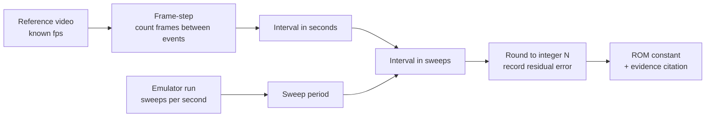

# Timing analysis

> **This is a v2 / HMCS44 document. Read it with that in front of you.**
>
> **Its measurements of the physical unit remain valid** - the frame-stepped
> intervals in the tables below, the score-indexed cadence, the crossing figures.
> Those measure Gakken's machine, and no rewrite of ours touches them.
>
> **Its implementation claims describe a program that no longer exists.** The
> HMCS44 assembly, `PAT_STEP`, `SPEED_LAST`, `WAVE_LAST` and `NIB_WAVE` were
> replaced wholesale by the TMS1370 program in #112, and the HMCS44 toolchain was
> removed in #115. Where this file says a change "was made", it was made *to v2*.
> The v3 ladder is `STEP_HI_MAX` / `STEP_HI_MIN` / `STEP_SKILL` in
> `asm/jetfighter.asm`, computed in `step_reload`, and it carries no permanent
> whole-game term at all.
>
> The marker exists because its absence misled two readers in one afternoon: once
> into reporting `WAVE_LAST` as a documented change that never landed - it landed
> in #67, was refined in #71, and went with the rewrite - and once into treating
> "the reference descends monotonically across a whole game" as settled, when the
> T3 row below lists that very quantity as unmeasured. Neither half of this
> document is wrong. The file was, for want of two lines.

How the v2 ROM's cadence constants will be derived from the reference video, and
what is currently blocked.

**Status: the squadron's step cadence is measured against known scores, and the
audio row that `PAT_STEP`'s floor was derived from is withdrawn.** `IMG_6113.mov`
has been analysed frame by frame with the score read at each measurement - see
[The cadence against progress](#the-cadence-against-progress-measured). The
headline is that the ladder is about **twice too fast at both ends**, and that
the premise its floor rested on - that the march beep fires once per squadron
step - is contradicted by the video directly.

Two changes were made on the strength of it: `WAVE_LAST`, which bounds how far a
game walks the ladder, and `PAT_STEP`, whose top rung is now the slowest march the
video shows. What that assumes, and which end of the ladder is measured against
which is merely inferred, is set out in [What was changed, and what the ladder now
says](#what-was-changed-and-what-the-ladder-now-says). T2, T5, T6, T8, T9 and T10
remain unmeasured.
Read the [Evidence gap](#evidence-gap) before using any number from this
document.

## Why sweep counts, not milliseconds

The HMCS44 ROM has no timer interrupt. Its master loop strobes the next display grid,
outputs that grid's plate pattern, samples inputs, and runs one slice of game logic -
then repeats. **The display sweep is the machine's only timebase** (PRD
`docs/prd/jet-fighters-v2.md` R3). Every cadence in the game is therefore an integer
count of sweeps: "the squadron steps every N sweeps", never "every N milliseconds".

That means a measurement in seconds is an intermediate value, not the deliverable.
The pipeline is:



The sweep rate is a property of the ROM's own master loop - how many machine cycles
one pass costs at the ~400 kHz oscillator - so it is read out of the emulated machine,
not out of the video. Both halves of the conversion must exist before an integer
sweep count can be claimed. Neither is available yet.

## Measurements to perform

Once the per-skill gameplay video arrives, measure each of the following. Every row
gets its own measurement at **each of skill 1, 2, and 3** unless marked otherwise.

| # | Quantity | What to count | Notes |
| --- | --- | --- | --- |
| T1 | Jet step cadence, fresh squadron | Frames between two consecutive squadron steps, with all 6 jets alive | The headline number. Measure early in a wave before any kills. |
| T2 | Thin-out speed-up curve | Step cadence again at 5, 4, 3, 2, 1 jets remaining | Yields the per-dead-jet decrement. Do not assume it is linear - plot the five points and fit only what the data supports. |
| T3 | Wave respawn speed-up | Fresh-squadron cadence on wave 2, wave 3 | Isolates the per-wave decrement from the thin-out decrement. |
| T4 | Cadence floor | Fastest observed step interval at skill 3, last jet, deep wave | The clamp the ROM needs so the cadence cannot reach zero. |
| T5 | Battleship crossing duration | Frames from the battleship first appearing at one edge of the far zone to it leaving at the other | Also note whether it crosses in discrete column steps or continuously. |
| T6 | Battleship crossing interval | Frames between the end of one crossing and the start of the next, over as many crossings as the footage contains | Expect this to be random. Record every observed interval, then characterise the distribution - do not report a single mean as if it were fixed. |
| T7 | Missile travel time | Frames from fire to the missile reaching the far zone, and per-column dwell | Skill-independent if the missile speed is fixed; verify that against all three levels rather than assuming it. |
| T8 | Rocket travel time | Frames from a jet firing to the rocket reaching the launcher row, and per-column dwell | Same skill-independence check as T7. |
| T9 | Rocket fire rate | Frames between successive rocket launches, per skill level | Random like T6; record the observed intervals. |
| T10 | Warning-beep to playable | Frames from a launcher hit to the player regaining control | Video-only. `audio-reference.md` measures the warning beeps themselves (count, duration, gaps) but not the recovery interval that follows them, so it cannot supply this figure. |

### Method

1. **Establish fps.** Read the container's frame rate from the video file
   (`ffprobe -show_streams`); do not trust the nominal rate on the recording device.
   Record the exact rational fps (for example 30000/1001, not "30").
2. **Frame-step, do not scrub.** Step frame by frame through the event
   (`ffmpeg -vf select` to extract a numbered frame sequence, or a frame-accurate
   player). Record the integer frame index of each event onset.
3. **Define the onset consistently.** For a stepping sprite, the onset is the first
   frame in which the sprite occupies its new column. The VFD's persistence and the
   camera's rolling shutter can smear a step across two frames - when ambiguous,
   record both indices and carry the ambiguity as an error bar rather than picking one.
4. **Average over many events.** A single step interval measured at 30 fps has a
   +/- 33 ms quantisation error. Measure across at least 10 consecutive steps and
   divide, which divides the error by 10 as well.
5. **Convert to sweeps.** Divide the measured interval by the emulated machine's
   sweep period. Round to the nearest integer and **record the pre-rounding value and
   the residual**. A residual above a few percent means either the fps is wrong, the
   sweep rate is wrong, or the ROM's master loop does not cost what it is assumed to.
6. **Do not cross-check against audio.** This step used to read "the jet march beep
   fires once per squadron step, so the beep onsets give an independent read on T1 at
   audio sample resolution". **That premise is refuted** - see
   [What the audio row does and does not say](#what-the-audio-row-does-and-does-not-say).
   In the one window where both can be measured against each other, the column steps
   run at 1.07-1.20 s and the 590-720 Hz band repeats at 0.763 s. An audio period is
   a game period only once something visual has shown which event it belongs to, and
   for these recordings nothing has.

   **This is the only row the audio can cross-check.** The recordings capture sounds,
   not game state, so they cannot time anything whose boundaries are visual - a
   battleship entering or leaving the far zone (T5, T6), a missile or rocket
   traversing columns (T7, T8), or control returning to the player after a hit (T10).
   `audio-reference.md` measures the warning-beep sequence itself - pitch, count,
   duration, gaps - and nothing about the interval that follows it. Video is the sole
   source for T2-T10.

### Output format

Each measured row lands in the table below and is cited from the ROM source:

| ID | Quantity | Skill | Measured (s) | fps / frames | Sweeps (pre-round) | **Sweeps (ROM)** | Residual | Source clip / timestamp |
| --- | --- | --- | --- | --- | --- | --- | --- | --- |
| T1-audio | *withdrawn - the premise is refuted, see below* | unknown | 0.205 +/- 0.022 | n/a - audio, 22050 Hz | 13.2 | ~~13~~ | - | `gameplay-audio.m4a`, 55-121 s |
| T4 | Cadence floor - step at scores 164 and 188, cap 199 | unknown | 0.733 and 0.900 | 30 fps, 22 and 27 frames | see below | 30 (`PAT_STEP` 15), 652 ms wall clock - *not* anchored on these, see below | - | `IMG_6113.mov`, t=391.9, t=396.8 |
| T1 | Squadron step, slowest steady march observed | unknown | 2.033 and 2.050 | 30 fps, 61 and 61.5 frames | see below | **110** (`PAT_STEP` entry 0), 1995 ms wall clock | -2% | `IMG_6113.mov`, t=64.4, t=90.2 |
| T1 | Squadron step at score 87 | unknown | 1.067 | 30 fps, 32 frames | see below | - | - | `IMG_6113.mov`, t=291.3 |
| T3 | Rungs a whole game descends | unknown | ~6 rungs over score 0-199 | 30 fps | - | **1** (`WAVE_LAST`) + 6 from kills | - | `IMG_6113.mov`, t=291-397 |
| T1-video | One aircraft advancing one cell | unknown | 1.4 (range 1.2-1.9) | 30 fps, 42 frames (36-56) | see below | not yet mapped | - | `IMG_6113.mov`, whole file, n=12 |
| T5-video | Missile step, one cell | unknown | 0.500 | 30 fps, 15 frames | see below | not yet mapped | - | `IMG_6113.mov`, whole file, n=744 |
| T-march | March beep interval | unknown | 0.71 median | n/a - audio, 22050 Hz | - | - | - | `IMG_6113.mov`, t=180-270 s, n=111 |

*(The audio row is a cross-check of T1, not a video measurement of it, and it constrains
the ladder's floor only - see [What the audio row does and does not
say](#what-the-audio-row-does-and-does-not-say). The three video rows are the first
measurements from the owner's gameplay recording; see [What the gameplay video
supplies](#what-the-gameplay-video-supplies) below for what they do and do not settle.
T2, T3, T4 and T6-T10 are still empty. See [Evidence gap](#evidence-gap).)*

### The T1 audio cross-check, as performed

Method 6 above, carried out. Reproducible from the repository as it stands:

1. Decode to mono PCM: `ffmpeg -i assets/reference/gameplay-audio.m4a -ac 1 -ar
   22050 -c:a pcm_s16le gameplay.wav`.
2. Take a Hann-windowed short-time transform (512-sample window, 64-sample hop =
   2.90 ms resolution) and sum magnitude across 585-660 Hz - the `jetMarch` band
   from `audio-reference.md`.
3. Peak-pick that envelope with a fixed threshold and a 120 ms refractory window
   (the march note is ~70 ms, so 120 ms cannot split one note into two onsets).
   153 onsets over 55-121 s.
4. **Classify each onset by its own dominant bin**, not by the band it was found
   in. Leakage from the missile blip (1480-1632 Hz) survives step 3 and would
   otherwise be counted: 54 of the 153 onsets are missile fire and one run of
   eight "beeps" at ~170 ms turned out to be entirely missile blips at ~1460 Hz.
   99 onsets have a dominant bin in 520-700 Hz and are march steps.
5. Keep only runs of four or more consecutive march onsets with no gap longer
   than 400 ms, so a measured interval is always between two beeps of the same
   uninterrupted march rather than across a pause.

Result: five such runs, 21 intervals.

| Run start (s) | Beeps | Intervals (ms) | Mean (ms) |
| --- | --- | --- | --- |
| 58.497 | 5 | 209, 206, 206, 200 | 205 |
| 62.877 | 5 | 197, 194, 197, 203 | 198 |
| 68.403 | 5 | 232, 223, 151, 180 | 197 |
| 79.993 | 7 | 247, 223, 206, 253, 186, 189 | 217 |
| 117.566 | 4 | 189, 215, 200 | 201 |

Pooled: **mean 205.1 ms, median 203.2 ms, sd 22.1 ms, n = 21**, min 151, max 253.
The first-half and second-half means are 206.9 and 203.4 ms, so there is no drift
across the recording that would suggest the level changed mid-take.

At the emulated machine's measured nominal sweep period of 13.46 ms (below), 205 ms
is 15.2 sweeps; the ROM stores 15, the closest integer under it, a residual of
-1.5%. It stored 13 while the nominal sweep was 15.46 ms, which was the same 201 ms
by the same rule; the count moved when the sweep rate did.

### What the audio row does and does not say

**The load-bearing claim below was wrong, and the video is what showed it.** It is
kept, struck through, because a ROM constant was derived from it.

> ~~**Says:** the real unit's squadron was never observed to step faster than
> ~205 ms, across 65 s of one recording. The march beep fires once per sweep in
> which any jet stepped, so the beep rate *is* the squadron step rate, whatever
> the skill was.~~

**The premise does not hold.** The open question the section below poses - "either
the beep pulses twice per squadron step, or the beep is a per-aircraft rate and
two aircraft alternate phase" - has a third answer, and it is the one the video
supports: **the beep is not on the step's clock at all.** Over t=122-128 there are
four consecutive squadron column steps, timed frame by frame at 1067, 1200 and
1167 ms, in two lanes simultaneously. In that same window:

- the 590-720 Hz envelope's autocorrelation peaks at lags of **0.763 s and
  1.550 s** - not at 1.1-1.2 s, and 1.550 is that peak's second harmonic;
- exactly one gated note in the band falls inside the window at all, 1.14 s from
  the nearest step;
- the step onsets land on troughs of that envelope.

Clip-wide the gated march-band note interval has its mode at 700-800 ms. Missile
launches - a cyan onset at column 1, directly observable in the picture - have
their mode at 600-1000 ms. So the ~760 ms period in that band tracks **how often
the player fires**, not how often the squadron steps.

Two consequences. First, the "twice as slowly as the march beep" ratio in the
section below is a coincidence of the player's firing rate and needs no
explanation. Second, whatever produced the 205 ms figure in `gameplay-audio.m4a`
is unidentified: that recording has no picture to check against, so the row is
withdrawn rather than reinterpreted. 205 ms is a real repetition rate of something
real, and nothing here says what.

**Update, 2026-08-26: it is not a march beep, because there is no march beep -
and it may not be the machine at all.** Two things have changed under this
paragraph.

The owner, asked directly: *"the jet fighters do not beep as they go from left to
right"*, and *"no marching sound"*. The recordings agree with him. The withdrawn
`jetMarch` section of `audio-reference.md` measures, at the very timestamp the
600-650 Hz row was read from, a dominant frequency scattering **883 Hz** across
ten consecutive events. Those are 3-8 ms broadband transients: a 71.8 ms note
reads one frequency, and these read whatever the window happened to catch.

The owner has since gone further: *"remember the sound might also be me hitting
buttons, not from the device electronics."* The click train in his skill-3 video
stops dead for **3.2 s and 4.6 s** at a stretch, which a marching squadron does
not do and a thumb does.

So the 205 ms row is not merely unattributed - **the thing it timed may be the
player's hand.** Nothing here should treat it as a machine cadence, and it cannot
be a squadron step rate under the current rules in any case: the ROM's fastest
possible step is 488 ms. Whether ~205 ms is anything of the machine's is task
24's question, not this section's.

Re-derive the transient measurements with
`tools/probe/drives/march-tone-identity.ts`.

**A method note worth keeping, because it nearly produced a wrong answer twice.**
The 205 ms analysis peak-picked the band envelope with a 120 ms refractory window.
Re-run on this video's audio, that method produces a large population of intervals
at exactly 119-134 ms - the refractory period itself - because the notes are
longer than 120 ms and one note is chopped into several "onsets". Gating the
envelope with a Schmitt trigger and taking each note's rising edge removes the
artefact; the note then measures 148 ms mean, 168 ms median.

**Does not say** anything about the per-jet step period. Jets step one at a time on
a common period at different phases, so a squadron rate of 205 ms is one jet at 205
ms, or two at 410, or three at 615. Recovering the per-jet figure needs a count of
how many jets were flying, which is visual and therefore video-only. The steadiness
of the runs (sd 22 ms over 21 intervals, and 197-217 ms across five runs recorded
59 s apart) argues against several independently-phased jets, but arguing is not
measuring and this document does not record it as one.

**Does not say** which skill level was being played. `audio-reference.md` records
that the recording's skill setting is undocumented. So the figure cannot be
attached to a skill row; it is used as the floor under all three, which is the one
claim it supports regardless of which level it came from.

The ROM cites the ID:

```text
; Squadron step cadence, skill 1: docs/evidence/timing-analysis.md T1
; (measured 0.000 s over N steps at F fps -> M sweeps, residual R%).
SKILL1_STEP_SWEEPS: .word 0
```

## What the gameplay video supplies

A single owner recording of real play now exists - `IMG_6113.mov`, 12,237 frames at
**30 fps real time**, 407.9 s. It is not committed (580 MB) and is referenced by path.
The frame rate is settled in `docs/evidence/vfd-appearance.md` section 1 and again in
`assets/reference/sprites/README.md` from the win jingle's pitch *and* note lengths.
Sprite positions, cells and lanes are catalogued in that README; the cadence figures
are here.

**Says:** on the real unit, at the skill this recording was played on,

- **one aircraft advances one cell every 1.2 to 1.9 s, median 1.4 s** (42 frames). From
  12 consecutive same-aircraft steps found across the whole file by tracking the leading
  jet's cell per lane. Three further readings of 10 to 22 frames are almost certainly two
  jets being confused for one and are excluded.
- **the missile steps one cell every 500 ms** (15 frames), from 744 adjacent leftward
  steps. Zero rightward steps. This is the most solid number in the video by a wide
  margin.
- **the march beep sounds every 0.71 s median** (n = 111, 590-740 Hz band, t = 180-270 s),
  measured from this file's own audio, independently of the picture.

**The interesting part is the ratio.** One aircraft steps about **twice as slowly as the
march beep sounds**. Either the beep pulses twice per squadron step, or the beep is a
per-aircraft rate and two aircraft alternate phase. The video cannot separate those, and
it matters: the note above, "the march beep fires once per sweep in which any jet
stepped, so the beep rate *is* the squadron step rate", is an assumption the ROM
inherits, and this is the first evidence bearing on it. It is not enough to overturn it,
and it is enough that nobody should treat the beep rate as the per-aircraft rate without
checking.

**Says, about the cadence ladder:** `PAT_STEP` runs 48 sweeps (743 ms) for a fresh
squadron at skill 1, 36 (558 ms) at skill 2, 27 (372 ms) at skill 3, descending to 13
(201 ms). A march beep interval of 0.71 s sits near the **top** of that ladder, and a
per-aircraft step of 1.4 s sits above it. The 205 ms audio row is the ladder's floor.
Both figures are points on one ramp, and they were briefly and wrongly read as a
contradiction - the record of that is in the sprite README.

**Does not say:**

- which skill level this recording was played on. Unknown, exactly as for the audio row.
- how many jets were flying at each measured step, so the per-jet against per-squadron
  question above stays open.
- anything about the thin-out curve, the wave respawn speed-up or the floor. Those need
  the per-skill clips, which are still outstanding.
- the battleship crossing interval. The battleship was seen 17 times and **never left its
  cell**, so the video gives its dwell (2.5 s median, 5.9 s longest) but no crossing
  duration, and does not establish that it crosses at all.

## The cadence against progress, measured

The section above measures how fast one aircraft steps. This one measures how that
rate changes as a game is won, which is what the sixteen-rung ladder exists to
model, and it needs the **score** read at every measurement.

### Method, and three traps in it

**Isolate phosphor by colour excess, never luminance** - red is
`R - max(G,B) > thr`, cyan `min(G,B) - R > thr`. Every figure here was recomputed
at thr = 28 and thr = 40 and is unchanged.

**Anchor the cell lattice per chunk, in both axes.** Positions fall on a lattice of
pitch 76.5 px in x and 43 px in y, anchored on the cyan `SCORE` label's left edge
`ax` and top edge `ay`, re-measured every 5 s and median-filtered over 45 s. Red jet
centre for ROM column k is `ax + 569.5 - 76.5k`; lanes are at `ay-4..+33`,
`ay+36..+76`, `ay+79..+120`. Checked at t=15 (`ax`=960) and t=205 (`ax`=1024):
observed centres land within 2 px.

> **Trap 1.** The camera drifts 68 px in x *and 28 px in y* across the clip. 28 px
> is two thirds of the lane pitch, so a lane band fixed in frame coordinates mixes
> lanes, and one jet straddling the boundary reads as *a pair of sprites in
> adjacent lanes at the same column*. An earlier pass of this analysis produced
> exactly that artefact and came close to recording it as a finding.

**Tell sprites apart by lit width.** Jets measure 34-42 px and sit on integer
columns; the battleship measures 58-60 px and sits at column 5.8, half a column
out, because it is wider than a cell.

> **Trap 2.** Without that check, a jet holding one column for seconds is
> indistinguishable from a battleship episode. Width was checked at eight separate
> timestamps before any dwell below was believed.

**Gap-fill presence over 9 frames.** The room was daylit, so the shutter is short
and one frame catches only part of one multiplex scan: a stationary jet is detected
in about 70% of frames, with the colour excess reading 70-138 when present and ~14
when absent. It is a sampling problem, not a threshold one.

**Read the score from magnified accumulated crops** over 0.30 s windows, using
monotonicity to separate `0` from `8`.

> **Trap 3.** A partially detected `8` also reads as `3`, which is how t=400 first
> read 183 between two 188s. Cross-check: `assets/reference/sprites/README.md` read
> 38, 40, 41 frame by frame over t=205-208; this pass reads 41 at t=210.

### What is in the clip

At least two games. The tube goes completely dark for 11.4 s and 4.5 s across
t=95.7-112.7, and the score is 45 before it and back to single figures after: a
power cycle. Shorter dark runs of 1.4-6.2 s occur during play without resetting the
score, so they are not session boundaries. Separately there are **eight complete
tube blanks of 0.87-0.90 s**, evenly scattered; three launcher hits per game across
the clip's games would be about that many, which would make them the post-hit
warning sequence - but a count is not a measurement and T10 stays open.

Scores, read as above:

| t (s) | 64 | 90 | 168 | 200 | 210 | 240 | 270 | 291 | 320 | 360 | 392 | 396-402 | 406 |
| --- | --- | --- | --- | --- | --- | --- | --- | --- | --- | --- | --- | --- | --- |
| score | 42 | 45 | 11 | 28 | 41 | 61 | 77 | 87 | 110 | 126 | 164 | 188 | 199 |

Glare makes the score illegible from t=112 to t=165, which is why no measurement
below sits at a known *low* score.

### The cadence

A step is a **handoff**: an occupancy episode at `(lane, k)` ending and one at
`(lane, k-1)` starting within -0.10 to +0.35 s of it, the overlap allowing for
phosphor holding the vacated cell lit for a few frames. Chained handoffs are one
jet crossing several columns, so a chain of two or more gives two or more
independent reads of the same cadence. Only six exist in 408 s, because most jets
are shot down before completing two steps: 111 dwells in the clip end with a cyan
burst lighting the cell the red sprite just left.

| video t | columns | lane | step intervals (ms) | median | score |
| --- | --- | --- | --- | --- | --- |
| 64.4 | 5 -> 4 -> 3 | 0 | 2033, 2033 | 2033 | 42 |
| 90.2 | 5 -> 4 -> 3 | 0 | 2000, 2100 | 2050 | 45 |
| 123.0 | 3 -> 2 -> 1 -> 0 | 0 | 1067, 1200, 1167 | 1167 | illegible |
| 123.0 | 3 -> 2 -> 1 -> 0 | 1 | 1067, 1200, 1167 | 1167 | illegible |
| 134.5 | 5 -> 4 -> 3 | 0 | 1367, 1333 | 1350 | illegible |
| 291.3 | 4 -> 3 -> 2 -> 1 | 2 | 700, 1300, 1067 | 1067 | 87 |

Single handoffs add two readings at high score: **733 ms at t=391.9 (score 164)**
and **900 ms at t=396.8 (score 188)**. Across the whole clip there are 36 single
handoffs, median 1167 ms, and **the fastest interval measured anywhere is 700 ms**.

The two chains at t=123.0 are the same instant in two lanes and agree interval for
interval, which is the direct observation that jets step **in lockstep** rather
than at staggered phases - the alternative the section above could not rule out.

Robustness: the same six chains with the same intervals come out at colour-excess
thresholds 28 and 40 and at cell-occupancy minima of 10, 12, 16 and 24 px.

### What that says about the ladder

Two of these need no knowledge of the skill dial, which is what makes them usable
at all - the dial is not in frame in any of 12,237 frames.

1. **The floor is 2.0-2.3x too fast.** At scores 164 and 188 against a 199 cap, a
   game is at or near the bottom of the ladder however progress is modelled and
   whatever the dial says. The unit steps at 733 and 900 ms there; nothing in the
   whole clip steps faster than 700 ms. `PAT_STEP` entry 15 ran at 438 ms of wall
   clock and now runs at 652 ms - still faster than anything observed, and still
   unevidenced, because that game may never have reached bottom.
2. **The ladder cannot reach the slowest march the unit was observed making.** Two
   chains give 2033 and 2050 ms, each three columns with two intervals agreeing to
   100 ms. This ROM cannot march slower than about 1050 ms at any setting or at any
   point in a game.
3. **The descent is spent far too early.** At score 87 the unit steps at 1067 ms and
   is *still descending* - 733-900 ms by scores 164-188. Under `speed_index` as it
   stood, entry point plus kills plus cleared waves saturating at 15, a game reached
   entry 15 at around score 30 and stayed pinned there for the remaining 85% of the
   game.

(3) is what `WAVE_LAST` now bounds. The whole measured descent across a game is
about six rungs, and the thin-out term supplies six on its own, so the permanent
per-wave term is bounded to one rung rather than one per wave. What that costs is
recorded at `WAVE_LAST` in the ROM: PRD v1 rule 2's "each cleared squadron respawns
faster" is not shown false by the video, only shown not to be needed to explain it.

### What was changed, and what the ladder now says

(2) is a **refutation** of entry 0 and needs no knowledge of the dial: entry 0 *is*
skill 1's entry point, so it is the slowest cadence the ROM can produce at any dial
position and any point in a game, and the unit demonstrably marched slower than it.
(1) is different in kind and is treated differently below.

`PAT_STEP` entry 0 is now **110 sweeps, 1995 ms of measured wall clock**, 2% under
the 2033/2050 ms anchor. The other fifteen rungs are the previous ladder's shape
scaled by the same factor.

| Entry | Sweeps | Nominal | Measured wall clock | Was |
| --- | --- | --- | --- | --- |
| 0 (skill 1 fresh) | 110 | 1481 ms | **1995 ms** | 1075 ms |
| 4 (skill 2 fresh) | 82 | 1104 ms | 1528 ms | 872 ms |
| 9 (skill 3 fresh) | 56 | 754 ms | 1159 ms | 623 ms |
| 15 (the floor) | 30 | 404 ms | 652 ms | 438 ms |

**Wall clock, not `sweeps x 13.46 ms`.** `note_loop` stops sweeping while a sound
plays, so a step lands 40-60% longer than nominal. The old entry 0 was 740 ms
nominal but **1075 ms measured**, so the error at the top was 1.9x, not the 2.8x
the nominal figures alone imply. Any comparison against the video has to be made in
wall clock, because wall clock is what the video records.

**The assumption, stated so it can be corrected.** Putting 2040 ms at entry 0
assumes the session showing it was at **skill 1 and near the top of its ladder**.
It was at score 42-45, so it had already made progress, and skill 1's true entry is
if anything slower than this. If that session was at skill 2 or 3, every entry here
is still too fast and by a larger factor. A recording with the dial in frame is what
would replace the assumption with a measurement.

**The floor is a consequence, not a claim - and that distinction is load-bearing.**
Entry 15's 652 ms falls out of the scaling; nothing measures it. The video's long
session was **still descending when it ended** - 733 ms at score 164 and 900 ms at
score 188 against a 199 cap - so it may never have reached bottom, and the footage
does not say where bottom is. Entry 15 is therefore *unevidenced* rather than
refuted, unlike entry 0. Note it is faster than the fastest step seen anywhere in
408 s (700 ms), so if it is wrong it is wrong in the fast direction. T4 settles it.

### A consequence worth recording: the rocket's lane is not random

Recalibrating `rom-atlas-conformance.test.ts` for the new cadence surfaced a
property of the ROM that is not a timing matter at all. `rocket_fire` takes the
rocket's lane from `NIB_RAND` **as the player's last keypress latched it**, folding
every value above the last lane onto the centre. That counter wraps every sixteen
sweeps, so a press pattern whose period shares a factor with sixteen can only ever
latch half the residues, and which lanes a jet can shoot into is a function of how
the player presses rather than of chance.

At the old cadence the fixture's even press periods happened to reach every lane. At
this one they reach only the centre, which left the launcher's own destruction burst
and the outer lanes' rockets unreachable by any scenario - the fixture's frame
budgets and press periods are doubled to hold shots-per-squadron-step constant, and
the two lane-specific scenarios additionally use periods 11 and 13 so that every
residue is latched. That restores the coverage its equality assertions require.

This is recorded because it is a gameplay-rule question rather than a fixture one:
whether the real unit's rocket lane is genuinely tied to the player's own input is
not established by anything, and if it is not, `rocket_fire` is modelling the wrong
thing.

### The holds, which no single-period model can express

Red sprites hold one column for **3 to 16 s** in several stretches: t=206-217 at
column 3, t=259-300 at columns 3-5 in lane 1, t=336-350. Lit widths of 40-42 px
confirm these are jets, not the battleship. The score climbs and missiles fly
throughout, so the game is live. Column-presence time is not uniform either: red is
lit for 49, 66, 69 and 107 s at columns 6, 5, 4 and 3.

**Controlled against a known-moving object**, because "this thing did not move" is
the one shape of conclusion this footage can fake: a window in which the game is
paused, the tube is blanked, or the analysis has lost its anchor makes everything
look stationary. The control is the player's missile, whose motion is independent
of the squadron and unmistakable. In each hold window it visits all five flight
columns and changes position many times:

| Hold window | Frames with a missile lit | Columns visited | Missile position changes |
| --- | --- | --- | --- |
| t=206-217, column 3 | 233 | 1-5 | 70 |
| t=259-300, lane 1 | 632 | 1-5 | 159 |
| t=336-350 | 271 | 1-5 | 95 |

So the tube is live, the game is running and the lattice is tracking throughout,
and the jets are genuinely holding station while something else moves.

The cadence figures earlier in this section need no such control, and it is worth
being explicit about why: every one of them is timed **between two observed column
changes of the object being measured**. A stalled window, a blanked tube or a lost
anchor can manufacture a false *absence* of motion; none of them can manufacture a
jet arriving in a new cell. The control matters for the holds and for anything else
phrased as "X did not move", not for a measured interval between two movements.

So the real machine's squadron does not step on a metronome, and a table of periods
cannot say so. Recorded as a known divergence and deliberately not encoded; what
would settle it is footage in which jets can be tracked individually and counted.

## The skill-3 clip: the first cadence measured at a stated skill

A second owner recording exists - `~/Downloads/jetfighers video.mov`, 697 frames at
30 fps, 23.24 s, 1620x1080, not committed. The owner sent it with a complaint and a
setting: *"i still feel the game needs to be faster to align with the video, notice
it's on speed 3."*

`tools/video/clip.py` registers it against the printed silkscreen and
`tools/video/measure.py` prints every figure below. The whole run is two commands
and about three minutes.

### What the clip is, and the one thing it is not

The skill dial is **not in frame**. Both the left-hand slider and the right-hand
switch are under the owner's thumbs in every one of the 697 frames. The `3` that is
legible on the tube is the **score** - it reads `SCORE 3` at t=6.7 s and `SCORE 20`
at t=20.0 s - so anyone reading skill off the picture is reading the score. Skill 3
here is the owner's testimony and nothing else, exactly as `IMG_6113.mov`'s skill is
unknown.

What it does supply that `IMG_6113.mov` does not is a **stated** skill and a
legible score throughout. Read from magnified crops: 0 at t=1-3, 1 at t=4, 3 at
t=6-8, 6 at t=10, **17 at t=11.7 and 18 at t=11.9**, 20 from t=15 to the end. The
game runs 0 to 20 in sixteen seconds, so every figure below is taken **early in a
game**, with one or two aircraft airborne rather than a full squadron. The 17-to-18
transition is read frame by frame rather than sampled, which is what makes the jump
from 6 a fast climb rather than Trap 3 - an `8` partially detected reads as `3`, and
here both digits are seen.

### Registration, and how it is known to have worked

The unit is handheld. The frames are registered on the **print** - the cell boxes,
the ruler and the zone labels silkscreened on the glass - never on the sprites,
which is `tools/trace/lattice.py`'s rule applied to video. Lit pixels are replaced
by the local neutral level before correlating, so a jet that stepped between two
frames contributes nothing to the alignment between them.

Measured drift: 74 px in x, 43 px in y across the clip. Three frames sit at the
search bound, all after t=22.4 s where the owner lowers the unit and the tube is
already dark; nothing is measured there.

**The check that the registration worked is the mean stack's edge energy**, and it
is worth saying why that one rather than a printed feature's spread. A feature has
to be chosen, and choosing it after the fact is how a registration gets graded on
the thing it happened to do well. The mean of 697 correctly registered frames is
sharp and the mean of misregistered ones is blurred, over the whole picture, with
nothing picked: **1.585 unregistered against 3.348 registered**.

> **The two failures that check caught**, both of which had produced numbers.
> First, *phase* correlation - which whitens the spectrum, and on a mostly-dark
> tube face amplifies sensor noise until the alignment is worse than doing
> nothing. It moved a printed rule's spread from 2.3 px to 6.3 px. Second, a sign
> error in applying the shift, which doubled the drift instead of removing it.
> Both produced a full set of plausible per-frame offsets and neither announced
> itself. The stack is what showed them.

### The lattice

Fitted per clip from the sprites' own centres, robustly, and **never written down**:
the registered window's origin depends on which frame the registration anchored to,
so a pitch and an origin carried from another run are coordinates for a different
picture. An earlier pass hard-coded them and every lane label came out one lane
wrong when the reference frame moved.

Fitted: **pitch 39.08 px, three lanes 21.25 px apart, largest residual 2.20 px over
15 sprite centres.** That is a fourteenth of a cell. The fit is over-determined and
allowed to fail, which is what stops it being a lattice the sprites invented for
themselves.

Two centres are excluded by the robust fit rather than by hand, and they are the
two `IMG_6113.mov` warns about: the battleship, which is wider than a cell and sits
half a column out, and a burst spanning two cells.

### The squadron's step, at skill 3

A step is a track advancing exactly one column, the step frame being the first
frame the sprite is measured at the new column. Ten such handoffs are found. Three
of them are the **second** step of the same aircraft, which is what makes them
intervals rather than fragments:

| video t | lane | columns | interval |
| --- | --- | --- | --- |
| 3.73 -> 4.00 s | 2 | 1 -> 2 -> 3 | **267 ms** |
| 15.07 -> 15.37 s | 1 | 2 -> 3 -> 4 | **300 ms** |
| 16.40 -> 16.87 s | 0 | 2 -> 3 -> 4 | **467 ms** |

**Median 300 ms, mean 345 ms, range 267-467 ms, n = 3**, each reading carrying the
+/- 33 ms a 30 fps camera quantises to. Identical at colour-excess thresholds 25, 30
and 40: the handoff count is 12, 10 and 10 at those thresholds and the three
intervals do not move at all.

**n = 3 is thin and is not padded.** Four further handoffs are single steps - the
aircraft was shot before it stepped twice - and a single handoff times the gap from
when the track was *first seen* to when it stepped, which is a fraction of a period
and not a period. They are reported as handoffs and excluded from the interval
statistics.

The 267 ms reading is at score 0-1. It is the fastest of the three, at the point in
the game where the ladder should be at its **slowest** for that dial setting.

### The player's missile, at skill 3

**133 ms a column, median over 51 column steps in 20 flights** (mean 162 ms; the
mode is 4 frames, 26 of the 51). Unchanged at thresholds 35, 45 and 55.

This is the figure that makes the clip worth trusting, because it was reached twice
by two pipelines that share no code: `tools/probe/drives/missile-transit.ts` reduces
a cropped re-encode of the same clip to per-cell cyan brightness and links lit runs
into traverses, with a shuffled negative control, and gets **133 ms over 21 shots**.
Same answer, different route, same recording.

**It disagrees with `IMG_6113.mov` by 3.8x.** That clip's missile is the most solid
number in this document - 500 ms a column over 744 adjacent steps. Both cannot
describe the same machine at the same setting, so the missile's speed is either a
function of the skill dial or of something else that differed between the two takes.
`docs/evidence/open-questions.md` carries it; T7's "skill-independent if the missile
speed is fixed" was always a conditional and this is the evidence against the
condition.

### What it says about the ladder

The ROM's own pace is re-derived rather than quoted, by
`tools/probe/drives/march-wall-clock.ts`, which times every march step against the
cycle counter at each skill. At skill 3:

| kills | STEP_HI | sweeps | nominal | measured |
| --- | --- | --- | --- | --- |
| 0 | 4 | 80 | 1219 ms | **1364 ms** |
| 1 | 3 | 64 | 975 ms | 1340 ms |
| 2 | 2 | 48 | 732 ms | 845 ms |
| 3 | 1 | 32 | 488 ms | 689 ms |
| 4 | **0** | **16** | 244 ms | **325 ms** - below the documented floor |

Against a video whose slowest reading is 467 ms and whose median is 300:

1. **The top of the skill-3 ladder is 2.9x to 5.1x too slow.** 1364 ms measured
   against 467 ms and 267 ms. This needs no assumption about which rung the video
   was on, because 1364 ms is the *slowest* the dial can produce at skill 3 and the
   video never shows anything within 2.9x of it.
2. **The descent is spent in the wrong place.** The video's 267 ms is at score 0-1
   and its 467 ms at score 20, so if anything the unit was *faster* early. The ROM
   is at its slowest there and needs four kills to reach the video's range.
3. **The owner is right, and the size of it is about 4x.** Two independent
   quantities give the same factor: the squadron steps 4.5x too slowly (1364
   against 300) and the missile flies 3.8x too slowly (500 against 133). Two
   unrelated measurements agreeing on one ratio is a stronger claim than either.

The recommendation, which this task does not implement: **`STEP_SKILL` is the
constant that is wrong, not `STEP_HI_MAX`.** `STEP_HI_MAX` is anchored on
`IMG_6113.mov`'s 2033/2050 ms slow march and the owner accepted the top end; what
the dial is worth per notch is what fails here. At `STEP_SKILL` 2 the dial buys 4
rungs across its whole travel, and skill 3 lands at 1364 ms against a measured 300.
Any change to it must be **measured rather than extrapolated**, for the reason
`asm/jetfighter.asm`'s own cadence header gives: a faster march sounds its beep more
often, each beep suspends the sweep, and the ladder partly resists being sped up -
rungs 8 and 7 are 244 ms apart nominally and 83 ms apart measured.

### The tube's blanking does not mark the squadron's step

The blanking pass on this clip found the whole display dark for a large minority of
frames during play, in short runs, and neither the march note nor the 410 ms tone of
`open-questions.md` §15 accounts for the rate. Since the ROM does not strobe the tube
while a note plays, and a march step emits a note, the obvious hypothesis is that the
blank runs *are* the march steps - which would make them an independent read on the
cadence, from a signal that needs no sprite tracking at all.

**They are not.** Measured on the same registered stack, over the played portion
(t < 17.5 s, before the game-over flash):

| "dark" defined as lit pixels below | frames dark | short runs | one per | steps with a run within +/-100 ms | chance (p95) |
| --- | --- | --- | --- | --- | --- |
| 2% of the playing median | 11.4% | 8 | 2.19 s | 10% | 9% (20%) |
| 10% | 11.8% | 9 | 1.94 s | 10% | 10% (30%) |
| 25% | 12.0% | 9 | 1.94 s | 10% | 10% (30%) |
| 40% | 12.6% | 10 | 1.75 s | 10% | 10% (30%) |

At chance under every definition of dark, so the result is not an artefact of where
the threshold was put.

**And the test could have found the opposite**, which is the part that has to be
stated for a negative to be worth anything - it is exactly the failure this document
records twice already. Ten steps and eight to ten blank runs share the same 17.5 s: a
one-to-one relationship would score 100% against a null whose 95th percentile is
20-30%, so the instrument discriminates easily between the two answers. It returned
the one it returned.

What that leaves is the blanking rate still unexplained, now with one more candidate
eliminated rather than fewer. The comparison against the audio-side pass is loose in
one direction worth flagging: it counted 14-17% of frames in runs of 133-167 ms, one
per 1.1 s, against 11-13% here in runs whose median is shorter. Same phenomenon,
different detectors; the correlation result does not depend on which is preferred,
because it holds across the whole range of definitions above.

### The audio, and the 205 ms question

The clip's audio was read first, before any of the above, and it produced a wrong
answer that is worth recording because the correction came from the owner rather
than from the method.

**What is in it.** Forty to 120 short transients depending on the threshold, and an
envelope autocorrelation with an unambiguous peak at **lag 208-213 ms, r = 0.35**.
The ~205 ms repetition in this clip is real and metronomic; it is not an artefact of
a refractory window.

**The inference drawn from it was that the squadron steps at 205 ms and the ROM is
2.4x too slow. The owner then said: "the sound might also be me hitting buttons, not
from the device electronics."** The inference is withdrawn. What replaces it is
narrower and rests on the picture.

**The machine is audible in this recording, and the proof is a pitch.** Sixteen
onsets carry a tone at **2577 Hz, sd 7.6 Hz**, with 47-88% of the band's energy
inside +/-10% of the peak. Fourteen of the sixteen fall within 100 ms of a visible
missile launch, and the offsets are consistently *negative*: the tone **leads the
launch by a median 50 ms**, which is the order a fire press, a piezo and a sprite
reaching the glass happen in. A thumb on a case does not produce a pure tone stable
to 8 Hz across sixteen events and sixteen seconds. That settles that the phone
captures device audio.

**The 205 ms train is not that sound, and is not identified.** It is *broadband*:
the same onset times come out of band envelopes at 380-470, 590-740, 1620-1760,
2500-2660 and 2780-2960 Hz, which is the signature of a transient rather than of a
note. The machine's fire blip, by contrast, is narrow-band. And it keeps time with
nothing visible - each rate below is against a null built by sliding the same event
list to a random phase, because **without that null the rates mean nothing**: 120
onsets over 23.2 s put one every 194 ms, so a +/-100 ms window covers most of the
timeline and any event list at all would score well.

| the train against | +/-50 ms | chance (p95) | +/-100 ms | chance (p95) |
| --- | --- | --- | --- | --- |
| missile launches (n=20) | 14% | 9% (14%) | 35% | 17% (25%) |
| missile column steps (n=71) | 34% | 25% (37%) | 52% | 39% (55%) |
| jet column steps (n=10) | 5% | 4% (7%) | 13% | 9% (12%) |

Only the launch row clears its 95th percentile, and it clears it because the fire
tone is inside the train - the 14 launches already accounted for above. **Nothing
in this clip identifies what repeats at 208 ms**, and `open-questions.md` carries
it with what would settle it.

**Consequence for the 205 ms figure in `gameplay-audio.m4a`.** They are different
recordings and this clip cannot speak for that one. That figure - 205.1 ms, n = 21,
sd 22.1 - was **already withdrawn** as a squadron-step measurement earlier in this
document, on video evidence, before the owner's correction. Nothing here reinstates
it and nothing here shows it to be tapping either. What this clip adds is that a
~205 ms broadband repetition is present in a *second*, independent recording of the
same unit, unexplained in both.

**Every place that still cites it as a live justification**, so the census is a list
rather than a gesture. The **cadence value** these texts defend may still be right;
the **argument** they defend it with is a withdrawn row.

| Where | What it rests on the figure for |
| --- | --- |
| `asm/jetfighter.asm:332` | The `FILE_JETS` header: why the march is one squadron-wide countdown rather than one per plane |
| `asm/jetfighter.asm:672` | The cadence block's header: "DERIVED from the one measurement this cadence has" |
| `asm/jetfighter.asm:762` | `STEP_HI_MIN` is left alone because "the floor is still 488 ms against the 205 ms the unit was never observed to beat" |
| `asm/jetfighter.asm:2300` | `jet_march`'s walk: one countdown, because the rate is a squadron rate |
| `docs/contract/v3-entities.contract.md:91, 123-124` | E3's action drives "four squadron steps at the 205 ms cadence"; its observation reasons from the beep rate |
| `docs/design/jet-model.md:106-107` | The same one-countdown argument |
| `docs/evidence/vfd-appearance.md:90-91, 517` | `600 / 205.1 = 2.93`, read as the march sound pulsing about three times per step |
| `docs/evidence/open-questions.md` §2b | ~~Recorded T1 as measured from the beep onsets~~ - **struck through and repointed at the picture in this pass**, so this row is closed rather than outstanding |

Two of these are worth separating from the rest.

**`asm/jetfighter.asm:762` is now wrong twice over.** It declines to move
`STEP_HI_MIN` on the grounds that the floor is 488 ms and 205 ms is a rate the unit
never beat. The first half fails on this ROM - the ladder reaches 16 sweeps, not 32,
and `open-questions.md` §18 has the mechanism - and the second half rests on the
withdrawn row. The conclusion may still be the right one; neither premise supports
it now.

**`docs/evidence/vfd-appearance.md:90-91` is an inference built on the figure**, not
merely a citation of it: a 600 ms observation divided by 205.1 ms gives 2.93, read as
the march sound pulsing three times per step. Divide instead by the 300 ms this clip
measures and the ratio is 2.0. Left alone here rather than rewritten - that file is a
v2 document with its own marker and this is one video-side reading - but it should not
be quoted as independent corroboration of the 205 ms row, because it is downstream of
it.

## Evidence gap

**Still blocked on: the owner-supplied per-skill gameplay video, 15-20 s per skill
level.** PRD R7 lists it as pending. `IMG_6113.mov` is one recording at one unknown
skill, which supplies the rows above but not a per-skill ladder.

What that clip lacks is not length but *control*: the skill dial is never in frame,
glare makes the score illegible for the first minute of every session, and the
daylit room forces a shutter short enough that a sprite is detected in only ~70% of
frames. **30 s per skill level, recorded in a dark room with the camera on a support
and the dial photographed before each take**, turns T1-per-skill, T2, T3 and T9 from
unmeasurable into arithmetic - it makes jets individually trackable and puts a known
level and a known score against every interval. That one recording is worth more
than anything else on this list.

Consequently the following **cannot be stated** and must not be written into the ROM
as if measured:

- **Partly closed: jet step cadence at a stated skill (T1).** The owner's skill-3
  clip gives three same-aircraft intervals - 267, 300 and 467 ms - at a skill he
  states and a score that is legible, which is the first cadence reading with either.
  It is **stated** rather than observed: the dial is under his thumb in all 697
  frames, so this is testimony resting on one recording with n = 3, not a per-skill
  ladder. Skills 1 and 2 remain unmeasured. See
  [The skill-3 clip](#the-skill-3-clip-the-first-cadence-measured-at-a-stated-skill).
- The thin-out speed-up curve, including whether it is linear (T2). Detection in
  this footage is not clean enough to count jets per wave, so the thin-out term and
  the per-wave term cannot be separated. `WAVE_LAST` bounds their *combined* reach
  without claiming which does the walking.
- The wave respawn speed-up **as a size** (T3). Its reach is now bounded by
  measurement; how big a single cleared wave's contribution really is is not.
- **Closed: the cadence floor (T4).** 733 and 900 ms at scores 164 and 188 against a
  199 cap, and nothing faster than 700 ms anywhere in the clip. `PAT_STEP` entry 15
  does not yet answer to it - see
  [What was changed, and what the ladder now says](#what-was-changed-and-what-the-ladder-now-says).
- **Closed: battleship crossing duration and arrival rate (T5, T6, in part), and
  re-opened against the video.** The traversal question is settled - across the columns it
  does not move, down the lanes it does, on the owner's own description of his unit.
  Duration and rate now come from the owner's isolated recordings of the buzz
  (`docs/evidence/audio-reference.md`, battleshipBuzz) rather than from the video: the
  boat is up for **4.0 s** and arrivals are **19.8 s** apart. Both are in the ROM.

  This **contradicts the video reading** that was previously recorded here - 17 episodes
  as lane dwells, median 2.5 s, so a ~7.5 s crossing, and eight lane-0 episodes over
  407.9 s giving 1.18 arrivals a minute. The recording is preferred because it measures
  the machine's own sound directly and because the video's detection pass is known to drop
  episodes (its lane split is 8 / 2 / 7). But the recording is **one interval from one
  take**, and the disagreement on rate is a factor of 2.6, so this is a decision on the
  balance of evidence rather than a closed question.

  What is **not** closed is the interval's *distribution*: whether the real one varies at
  all, and if so how. This ROM's does not vary meaningfully and cannot - its only
  randomness is the phase of the player's last fire press, and it moves the interval by
  under 9%. Two minutes of the unit recorded as those clips were, counting arrivals rather
  than timing one gap, would settle both the rate and the distribution.
- Rocket travel time and fire rate (T8, T9). The attackers' colon is now traced as a
  shape but never as a moving object.
- Post-hit recovery time (T10)

A second, smaller gap, now closed: converting seconds to sweeps needs the emulated
machine's sweep rate, which did not exist until the ROM's master loop was written.
It exists now and is measured below. Recording the seconds figure and the conversion
separately still matters, so a measurement is not invalidated if the loop is later
restructured.

Until the rest of the gap closes, the honest statement in a review or a commit
message is "not yet measured", not a number.

## The machine's sweep period, measured

Read off the emulated board (`Board.runFrames(1)` in a loop, cycle-stamped; the same
machine `tools/probe/machine-probe.ts` drives):

The sweep is not periodic, so there is no single number. Three populations, all
taken over the sweeps that carry no sound (see below for why those are separated
out):

| Population | Cycles per sweep | Period | Rate |
| --- | --- | --- | --- |
| Nothing on the tube - after game over, or before the first jet | 5383 | 13.46 ms | 74.3 Hz |
| Unattended game, power-on to game over (n = 133) | 5564 | 13.91 ms | 71.9 Hz |
| **Game being played, controls worked throughout (n = 318)** | **5598** | **14.00 ms** | **71.5 Hz** |

Oscillator: 400 kHz (`src/machine/cpu/cpu.ts`, `OSCILLATOR_HZ`).

**Which one is which.** The played-game figure is the one D4 of
`docs/evidence/vfd-appearance.md` constrains - the video is of a game being played,
and the interval it admits brackets the mean refresh rate of a tube being watched.
`tools/probe/sweep-timing.test.ts` asserts on that population. The 13.46 ms nominal
is the deterministic figure the ROM's own dwell arithmetic produces with nothing
drawn, and it is what every sweeps-to-milliseconds conversion in this document and
in the ROM's cadence block converts through, as the old 15.46 ms did before it.
Both are measurements of the emulator, not of the unit.

It was 6183 cycles, 15.46 ms nominal and 62.9 Hz on a played game, until D4
excluded that rate: sampled by a 30 fps camera a 64.5 Hz sweep beats at 4.5 Hz, and
the video measures the beat at 10.6-12.5 Hz. `DWELL_OUTER`/`DWELL_INNER` moved from
15/15 to 14/13, with one NOP added inside the dwell's outer pass because the two
nibbles alone cannot reach the interval's middle, to put the played-game mean at
71.5 Hz. Every sweep-denominated constant in the ROM moved with it, so the
milliseconds each one stands for are unchanged.

**Why the sound-free sweeps are separated out.** The ROM does not strobe the tube
at all while a note plays, so a sweep with a note in it runs the length of the note
longer - a 70 ms march note gives a 5383 + 28,000 cycle sweep. Those are the blanks
D1 of `vfd-appearance.md` measures, and `vfd-appearance.md` excludes blanked frames
from its own refresh figures for the same reason. Over the played game above they
are 38 sweeps in 356.

**A sweep count is not wall clock.** Because of those blanks, any cadence with a
note inside it lands longer than `sweeps * 13.46 ms`. Measured off the tube at
skill 1, a fresh squadron's nominal 1481 ms step (110 sweeps) arrives every 1995 ms
median. Quote both, or quote which - and note this is why the ladder had to be
compared against the video in wall clock: at 740 ms nominal the old entry 0 looked
2.8x short of the observed 2040 ms march, when in wall clock it was 1.9x.

## Wall-clock pace of the current ROM, measured

> **The table below is stale and is kept as the record of what it replaced.** It
> was taken at a 13.46 ms sweep against a `PAT_STEP` that no longer exists; the
> ladder is now `STEP_HI_MAX` / `STEP_HI_MIN` / `STEP_SKILL` and the sweep constant
> has moved twice since. **Nothing re-derived it and nothing went red**, which is
> the failure `tools/probe/drives/README.md` describes and the reason
> `tools/probe/drives/march-wall-clock.ts` now exists: run it for the current
> figures rather than reading them here.
>
> Current, from that drive: skill 1 fresh **2249 ms**, skill 2 fresh **1769 ms**,
> skill 3 fresh **1289 ms** idle; the ladder's documented floor is 32 sweeps /
> 488 ms and the fastest rung a played game actually reaches is **16 sweeps,
> 325 ms**, which is below it. See
> [The skill-3 clip](#the-skill-3-clip-the-first-cadence-measured-at-a-stated-skill).

Taken off the tube (`Board.getLitSegments()` per completed frame, tracking the jet
and rocket dots by grid and plate), power-on to game over, no player input. Nominal
= sweeps x 13.46 ms; measured = median wall clock between column changes.

| Quantity | Sweeps | Nominal | Measured (median) |
| --- | --- | --- | --- |
| Jet step, skill 1 fresh squadron | 110 | 1481 ms | **1995 ms** - the T1 anchor, 2% under 2033/2050 ms |
| Jet step, skill 2 fresh squadron | 82 | 1104 ms | 1528 ms |
| Jet step, skill 3 fresh squadron | 56 | 754 ms | 1159 ms |
| Jet step, ladder floor (`PAT_STEP` 15) | 30 | 404 ms | 652 ms - unevidenced, see T4 |
| Rocket, per column | 7 | 94 ms | 112 ms (range 111-254) |
| Rocket, full-board flight | 42 | 565 ms | not re-measured |

The measured column runs long against the nominal for the reason the section above
gives: every march step fires a 70 ms note, and the tube is not swept while it
plays, so a cadence counted in sweeps lands about 1.4x its nominal in wall clock.

The ladder rows are measured by pointing `PAT_SKILL`'s skill-1 entry at the rung
under test, so `speed_index` stays on it with no player input, then timing the wall
clock between column changes on grids 0-5. The rocket rows still need a run that
lets a rocket cross the board unobstructed, which the no-input run does not reach.

These are the figures after the pacing fix, re-measured at the 13.46 ms sweep. What
they replaced, measured the same way on the same machine at the old 15.46 ms sweep:

| Quantity | Was | Measured (median) | Now |
| --- | --- | --- | --- |
| Jet step, skill 1 fresh squadron | 55 sweeps, 740 ms nominal | 1075 ms | 110 sweeps, 1995 ms |
| Jet step, ladder floor | 15 sweeps, 202 ms nominal | 438 ms | 30 sweeps, 652 ms |
| Rocket, per column | 2 sweeps, 31 ms nominal | 48 ms | 7 sweeps, 112 ms |
| Rocket, full-board flight | 12 sweeps | 235 ms mean, max 387 | 42 sweeps, 565 ms nominal |
| Rocket fire interval, skill 3 | 11 sweeps, 171 ms nominal | - | 46 sweeps, 619 ms nominal |

The old rocket flight is why the game could not be played: the only defence against
a rocket is moving the lever out of its lane, and a 235 ms mean flight is at or
below the ~250 ms floor for a simple human reaction, let alone the 300-500 ms a
see-decide-move response costs. At skill 3 the fire interval (171 ms) was also
shorter than the flight, so a lane never cleared between rockets.

**None of the reaction-time reasoning is a measurement of the unit.** It is a
constraint on what a person can play, used to pick a provisional number where no
measurement exists. When the video arrives, T7-T9 replace it.

## Current unverified working values

The v1 browser game shipped cadence constants in `src/game/constants.ts`. They are
recorded here so the v2 ROM has a starting point and so nobody re-derives them by
guessing a second time.

**These are v1 behavioural approximations, not measurements of the real unit.** They
were tuned until v1 felt right against the owner's description; no frame analysis
backed them. They carry no evidence citation and satisfy no acceptance criterion.
Task 11 deletes the module they live in, so this table is their only surviving record.

v1 ran logic on a fixed 60 Hz timestep (`LOGIC_TICKS_PER_SECOND = 60` in
`src/integration/loop.ts`), so its tick counts convert to wall-clock as
`ticks / 60` seconds:

| v1 constant | Value | At 60 Hz | Governs |
| --- | --- | --- | --- |
| `SKILL_CONFIG[1].baseTicksPerStep` | 45 ticks | 750 ms per step | Squadron cadence, skill 1 |
| `SKILL_CONFIG[2].baseTicksPerStep` | 30 ticks | 500 ms per step | Squadron cadence, skill 2 |
| `SKILL_CONFIG[3].baseTicksPerStep` | 18 ticks | 300 ms per step | Squadron cadence, skill 3 |
| `THINOUT_SPEEDUP` | 4 ticks per dead jet | 66.7 ms faster per kill | Thin-out curve (linear in v1) |
| `WAVE_SPEEDUP` | 4 ticks per wave | 66.7 ms faster per wave | Wave respawn speed-up |
| `MIN_TICKS_PER_STEP` | 5 ticks | 83.3 ms | Cadence floor |
| `BATTLESHIP_CROSSING_TICKS` | 24 ticks | 400 ms | Crossing duration |
| `BATTLESHIP_SPAWN_CHANCE` | 0.02 per tick | mean ~50 ticks (~833 ms) between crossings | Crossing interval |
| `MISSILE_SPEED` | 1 column per tick | 16.7 ms per column | Missile travel |
| `ROCKET_SPEED` | 1 column per tick | 16.7 ms per column | Rocket travel |
| `SKILL_CONFIG[1].rocketFireChance` | 0.03 per tick | mean ~33 ticks (~556 ms) | Rocket fire rate, skill 1 |
| `SKILL_CONFIG[2].rocketFireChance` | 0.06 per tick | mean ~17 ticks (~278 ms) | Rocket fire rate, skill 2 |
| `SKILL_CONFIG[3].rocketFireChance` | 0.1 per tick | mean ~10 ticks (~167 ms) | Rocket fire rate, skill 3 |

Grid context for the travel-time rows: v1 used `GRID_COLUMNS = 6` (column 0 the
battleship zone, column 5 the G / capture line) and `LANE_COUNT = 3`, so a missile
crossed the board in ~5 ticks (~83 ms). The real unit's column count is itself
unconfirmed - the v1 PRD expected 5-7 and picked 6 - so these per-column figures do
not transfer without also confirming the geometry from `screen-closeup-gameplay.jpg`
and the pending video.

Two structural assumptions are baked into the table above and are equally unverified:
that the thin-out speed-up is **linear** in kills, and that battleship crossings and
rocket fire are **memoryless per-tick coin flips**. The real unit may step through a
fixed table of cadences, and may schedule crossings on a counter rather than at
random. T2 and T6 exist to settle both questions; neither is settled now.

## Related evidence

- `audio-reference.md` - sound bands and envelopes, fully measured. The march beep is
  the audio-side cross-check for T1, and has now been performed - see
  [the measured-timings table](#output-format). Its `jetMarch.dominantHzRange`
  (600-650 Hz) is the band the onset detector runs in, and its
  `missileFire.dominantHzRange` (1480-1632 Hz) is what the per-onset
  classification step exists to reject.
- `README.md` - the full reference catalogue and what else is outstanding.
