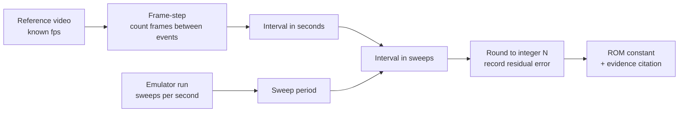

# Timing analysis

How the v2 ROM's cadence constants will be derived from the reference video, and
what is currently blocked.

**Status: no timings have been measured.** The measured-timings table below is empty
on purpose. Read the [Evidence gap](#evidence-gap) section before using any number
from this document.

## Why sweep counts, not milliseconds

The HMCS44 ROM has no timer interrupt. Its master loop strobes the next display grid,
outputs that grid's plate pattern, samples inputs, and runs one slice of game logic -
then repeats. **The display sweep is the machine's only timebase** (PRD
`docs/prd/jet-fighters-v2.md` R3). Every cadence in the game is therefore an integer
count of sweeps: "the squadron steps every N sweeps", never "every N milliseconds".

That means a measurement in seconds is an intermediate value, not the deliverable.
The pipeline is:



The sweep rate is a property of the ROM's own master loop - how many machine cycles
one pass costs at the ~400 kHz oscillator - so it is read out of the emulated machine,
not out of the video. Both halves of the conversion must exist before an integer
sweep count can be claimed. Neither is available yet.

## Measurements to perform

Once the per-skill gameplay video arrives, measure each of the following. Every row
gets its own measurement at **each of skill 1, 2, and 3** unless marked otherwise.

| # | Quantity | What to count | Notes |
| --- | --- | --- | --- |
| T1 | Jet step cadence, fresh squadron | Frames between two consecutive squadron steps, with all 6 jets alive | The headline number. Measure early in a wave before any kills. |
| T2 | Thin-out speed-up curve | Step cadence again at 5, 4, 3, 2, 1 jets remaining | Yields the per-dead-jet decrement. Do not assume it is linear - plot the five points and fit only what the data supports. |
| T3 | Wave respawn speed-up | Fresh-squadron cadence on wave 2, wave 3 | Isolates the per-wave decrement from the thin-out decrement. |
| T4 | Cadence floor | Fastest observed step interval at skill 3, last jet, deep wave | The clamp the ROM needs so the cadence cannot reach zero. |
| T5 | Battleship crossing duration | Frames from the battleship first appearing at one edge of the far zone to it leaving at the other | Also note whether it crosses in discrete column steps or continuously. |
| T6 | Battleship crossing interval | Frames between the end of one crossing and the start of the next, over as many crossings as the footage contains | Expect this to be random. Record every observed interval, then characterise the distribution - do not report a single mean as if it were fixed. |
| T7 | Missile travel time | Frames from fire to the missile reaching the far zone, and per-column dwell | Skill-independent if the missile speed is fixed; verify that against all three levels rather than assuming it. |
| T8 | Rocket travel time | Frames from a jet firing to the rocket reaching the launcher row, and per-column dwell | Same skill-independence check as T7. |
| T9 | Rocket fire rate | Frames between successive rocket launches, per skill level | Random like T6; record the observed intervals. |
| T10 | Warning-beep to playable | Frames from a launcher hit to the player regaining control | Video-only. `audio-reference.md` measures the warning beeps themselves (count, duration, gaps) but not the recovery interval that follows them, so it cannot supply this figure. |

### Method

1. **Establish fps.** Read the container's frame rate from the video file
   (`ffprobe -show_streams`); do not trust the nominal rate on the recording device.
   Record the exact rational fps (for example 30000/1001, not "30").
2. **Frame-step, do not scrub.** Step frame by frame through the event
   (`ffmpeg -vf select` to extract a numbered frame sequence, or a frame-accurate
   player). Record the integer frame index of each event onset.
3. **Define the onset consistently.** For a stepping sprite, the onset is the first
   frame in which the sprite occupies its new column. The VFD's persistence and the
   camera's rolling shutter can smear a step across two frames - when ambiguous,
   record both indices and carry the ambiguity as an error bar rather than picking one.
4. **Average over many events.** A single step interval measured at 30 fps has a
   +/- 33 ms quantisation error. Measure across at least 10 consecutive steps and
   divide, which divides the error by 10 as well.
5. **Convert to sweeps.** Divide the measured interval by the emulated machine's
   sweep period. Round to the nearest integer and **record the pre-rounding value and
   the residual**. A residual above a few percent means either the fps is wrong, the
   sweep rate is wrong, or the ROM's master loop does not cost what it is assumed to.
6. **Cross-check against audio.** The jet march beep fires once per squadron step,
   and `gameplay-audio.m4a` is a 130 s recording with an audible march. The beep
   onsets in that recording give an independent read on T1 for whichever skill level
   was being played, at audio sample resolution rather than frame resolution. Use it
   to validate the video-derived figure. It cannot replace the video, because the
   recording's skill level is not documented and it covers one level only.

### Output format

Each measured row lands in the table below and is cited from the ROM source:

| ID | Quantity | Skill | Measured (s) | fps / frames | Sweeps (pre-round) | **Sweeps (ROM)** | Residual | Source clip / timestamp |
| --- | --- | --- | --- | --- | --- | --- | --- | --- |
| - | - | - | - | - | - | - | - | - |

*(Empty: no gameplay video exists. See [Evidence gap](#evidence-gap).)*

The ROM cites the ID:

```text
; Squadron step cadence, skill 1: docs/evidence/timing-analysis.md T1
; (measured 0.000 s over N steps at F fps -> M sweeps, residual R%).
SKILL1_STEP_SWEEPS: .word 0
```

## Evidence gap

**Blocked on: the owner-supplied gameplay video, 15-20 s per skill level.** PRD R7
lists it as pending. `assets/reference/` contains two audio recordings and five
photographs - no video file. There is no frame data in this repository to analyse.

Consequently the following **cannot be stated** and must not be written into the ROM
as if measured:

- Jet step cadence at any skill level (T1)
- The thin-out speed-up curve, including whether it is linear (T2)
- The wave respawn speed-up (T3)
- The cadence floor (T4)
- Battleship crossing duration and interval distribution (T5, T6)
- Missile and rocket travel times (T7, T8)
- Rocket fire rate (T9)
- Post-hit recovery time (T10)

A second, smaller gap: even with the video, converting seconds to sweeps needs the
emulated machine's sweep rate, which does not exist until the ROM's master loop is
written. T1-T10 can be measured in seconds as soon as the video arrives; they become
sweep counts only after the loop exists. Recording the seconds figure and the
conversion separately keeps the measurement from being invalidated if the loop is
later restructured.

Until the gap closes, the honest statement in a review or a commit message is "not
yet measured", not a number.

## Current unverified working values

The v1 browser game shipped cadence constants in `src/game/constants.ts`. They are
recorded here so the v2 ROM has a starting point and so nobody re-derives them by
guessing a second time.

**These are v1 behavioural approximations, not measurements of the real unit.** They
were tuned until v1 felt right against the owner's description; no frame analysis
backed them. They carry no evidence citation and satisfy no acceptance criterion.
Task 11 deletes the module they live in, so this table is their only surviving record.

v1 ran logic on a fixed 60 Hz timestep (`LOGIC_TICKS_PER_SECOND = 60` in
`src/integration/loop.ts`), so its tick counts convert to wall-clock as
`ticks / 60` seconds:

| v1 constant | Value | At 60 Hz | Governs |
| --- | --- | --- | --- |
| `SKILL_CONFIG[1].baseTicksPerStep` | 45 ticks | 750 ms per step | Squadron cadence, skill 1 |
| `SKILL_CONFIG[2].baseTicksPerStep` | 30 ticks | 500 ms per step | Squadron cadence, skill 2 |
| `SKILL_CONFIG[3].baseTicksPerStep` | 18 ticks | 300 ms per step | Squadron cadence, skill 3 |
| `THINOUT_SPEEDUP` | 4 ticks per dead jet | 66.7 ms faster per kill | Thin-out curve (linear in v1) |
| `WAVE_SPEEDUP` | 4 ticks per wave | 66.7 ms faster per wave | Wave respawn speed-up |
| `MIN_TICKS_PER_STEP` | 5 ticks | 83.3 ms | Cadence floor |
| `BATTLESHIP_CROSSING_TICKS` | 24 ticks | 400 ms | Crossing duration |
| `BATTLESHIP_SPAWN_CHANCE` | 0.02 per tick | mean ~50 ticks (~833 ms) between crossings | Crossing interval |
| `MISSILE_SPEED` | 1 column per tick | 16.7 ms per column | Missile travel |
| `ROCKET_SPEED` | 1 column per tick | 16.7 ms per column | Rocket travel |
| `SKILL_CONFIG[1].rocketFireChance` | 0.03 per tick | mean ~33 ticks (~556 ms) | Rocket fire rate, skill 1 |
| `SKILL_CONFIG[2].rocketFireChance` | 0.06 per tick | mean ~17 ticks (~278 ms) | Rocket fire rate, skill 2 |
| `SKILL_CONFIG[3].rocketFireChance` | 0.1 per tick | mean ~10 ticks (~167 ms) | Rocket fire rate, skill 3 |

Grid context for the travel-time rows: v1 used `GRID_COLUMNS = 6` (column 0 the
battleship zone, column 5 the G / capture line) and `LANE_COUNT = 3`, so a missile
crossed the board in ~5 ticks (~83 ms). The real unit's column count is itself
unconfirmed - the v1 PRD expected 5-7 and picked 6 - so these per-column figures do
not transfer without also confirming the geometry from `screen-closeup-gameplay.jpg`
and the pending video.

Two structural assumptions are baked into the table above and are equally unverified:
that the thin-out speed-up is **linear** in kills, and that battleship crossings and
rocket fire are **memoryless per-tick coin flips**. The real unit may step through a
fixed table of cadences, and may schedule crossings on a counter rather than at
random. T2 and T6 exist to settle both questions; neither is settled now.

## Related evidence

- `audio-reference.md` - sound bands and envelopes, fully measured. The march beep in
  particular is the audio-side cross-check for T1.
- `README.md` - the full reference catalogue and what else is outstanding.
