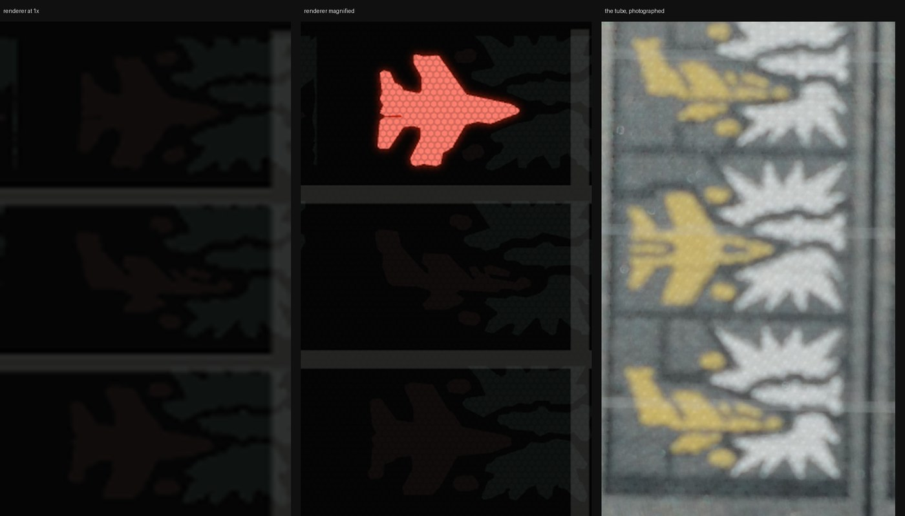

# The tube's control-grid mesh

What magnifying the display should reveal, measured off the teardown photographs rather
than invented. The renderer draws this in `src/machine/tube/mesh.ts`; every constant
there cites a figure from here.

Paths in this file are relative to the repo root.

## The question, and the surprise in the answer

The owner asked for a display that plays correctly at normal size but resolves into the
real tube's structure when magnified, describing what he sees on the physical unit as
"almost a honey comb lattice". Two structures were expected: a **dot screen** in the
printed phosphor, and a **honeycomb** in the dark field between glyphs.

**They are one structure.** The same modulation - a 10.83 px period on a 31 degree axis
in `assets/reference/tube-teardown/tube-unlit-full.jpg` - is present in all four places
it was looked for:

| Where | Anisotropic excess at 8-12 px, on the 31 / 91 deg axes |
| --- | --- |
| Red (yellow-pigment) phosphor, 841 windows | 2.6x / 2.9x |
| Cyan (white-pigment) phosphor, 101 windows | 3.2x / 2.8x |
| Dark field between glyphs, 1206 windows | 1.3x / 1.4x |
| Cell 6's loose stipple | present at the same period and angle |

Same period, same angle, different backings. That is one thing in front of everything,
not a property of either pigment - which is what a VFD's control grid is: a fine etched
mesh between the cathode and the anode, spanning the whole face. What reads as a dot
screen inside a glyph is the mesh silhouetted against emitting phosphor; what reads as a
honeycomb in the dark field is the same mesh with almost nothing behind it to shadow,
which is why its contrast there is a third of what it is over phosphor.

This also closes a loose end in `src/machine/tube/ATLAS-COORDINATES.md`, which recorded
that cell 6's stipple could not be thresholded apart from the solid bursts because it is
"the same phosphor, printed as a texture rather than as an area". The stipple carries the
mesh signature at the same period and angle as the solid bursts beside it, so the fine
texture in it is not a sparser print - it is the grid, and whatever makes the stipple a
stipple is a coarser feature drawn on top.

## What it looks like

One cell of the playfield, all three panels resampled to the same 17.2 px per atlas unit
so the textures are directly comparable. Left, the renderer at the size the case shell
gives the tube - 2.2 device px per atlas unit, smooth shapes, no structure, and no mesh
pass run at all. Centre, the same renderer at 7.9 device px per atlas unit, which is what
a browser zoom hands it. Right, `assets/reference/tube-teardown/cell2.jpg`.

## Method

Two independent measurements, because the first attempt - a row-wise autocorrelation -
was swamped by the glyph outlines.

**Spectral.** 48 px windows on a 8 px stride across the playfield, each classified as
red phosphor, cyan phosphor or dark field by colour and taken only where a 5 px erosion
of that mask covers the whole window. High-passed at sigma 4, Hann-windowed, and
accumulated as power over all windows of a class. The accumulated spectrum is then
divided by its own azimuthal average at each radius, so what remains is *anisotropy* -
excess over the isotropic noise at the same frequency - rather than the falling 1/f
envelope, which is what defeated the earlier attempts. The +-3 degree bands along the
axes are excluded, because JPEG's 8 px blocking lives there.

**Least-squares.** The 60 best-focused 64 px windows inside each phosphor, projected
onto a two-plane-wave basis over a grid of frequency and angle, taking the maximum. This
does not share the spectral method's whitening step or its windowing, and it agrees.

## Results

| Quantity | Value | How |
| --- | --- | --- |
| Modulation period | **10.83 +- 0.27 px** | Least-squares fit, 29 windows in the red phosphor |
| Modulation axis | **31.0 +- 0.7 deg** | Same fit |
| Second axis | **91 deg** | Spectral, both phosphors |
| Axis separation | **60.0 deg** | 91 - 31 |
| Modulation depth | ~2% of local level | Band-passed amplitude over the phosphor masks |

The angular profile of the spectral ring is unambiguous about the separation: two peaks,
at the 30-35 and 90-95 degree bins, in both phosphors independently, with the bins
between them at or below the mean. **60 degrees apart, not 90** - so the mesh is a
hexagonal weave and not a square one, which is what the owner's "honeycomb" says too.

### Converting to atlas units

A playfield cell measures **529 px**: the printed sub-cell borders in
`tube-unlit-full.jpg` sit on a 264.7 px pitch (least-squares over 12 intervals from
x 2227 to x 5403) and there are two sub-cells to a cell. Against `src/machine/tube/
layout.ts` `CELL.width` of 31.114 atlas units that is **17.0 px per atlas unit**
horizontally. Vertically the printed lane borders fall at y 946, 1270, 1579 and 1880 - a
305 px pitch against the same file's 17.68-unit lane pitch, so **17.3 px per unit**. The
small anisotropy is the photograph's, not the tube's; 17.2 is used.

| In atlas units | |
| --- | --- |
| Row spacing (the modulation period) | **0.63** |
| Hole centre to hole centre | **0.73** (= 0.63 / cos 30) |
| Rows run at | 1, 61 and 121 degrees |

### The independent check

The tube face is roughly 60 mm across 272 atlas units, so 0.73 units is about **160 um**.
That is the ordinary pitch of a photo-etched VFD control grid. Nothing in the derivation
appealed to that figure, so it is a genuine check that what was measured is the grid.

### Where the mesh is

Asked directly: the ratio of spectral power on the 31 and 91 degree axes at the 10.83 px
radius to the rest of that ring, swept across the photograph in 64 px windows. It clears
the surrounding noise between **y 820 and y 2010** and between **x 850 and x 5450**.

Registered through the lane borders above, that is atlas **y 106.6 to 174.2** and
**x 44.7 to 315.1**. The printed frame is x 41.4 to 313.6 and y 85.2 to 187.2, so the
mesh spans the frame's full width and about two thirds of its height, sitting a little
below the cell band with dark glass above and below it. `MESH_BOX` is that rectangle.

## What is not measured

Stated plainly, because these are the numbers a later contributor should feel free to
improve rather than defend:

- **The web width** - how much of the mesh is metal. At 10.8 px per cycle the lens and
  sensor have already smeared the webs into a sinusoid; the period survives that, the
  duty cycle does not. `MESH_WEB_FRACTION` is set to a plausible 0.3 and the appearance
  is carried by `MESH_DEPTH`.
- **The shadow's depth on a lit tube.** The 2% measured here is a photograph of ambient
  light scattered off an *unpowered* tube, where the mesh has little to shadow. On a
  powered tube the webs are opaque metal in front of a glowing anode. `MESH_DEPTH` is
  tuned against the lit close-ups at matched magnification, not from the 2%.
- **The standoff between grid and phosphor**, which sets how soft the shadow's edge is.
  The tube is photographed face on, so nothing here measures it.
- **The third reciprocal axis.** A triangular lattice should show three, 60 degrees
  apart. Two are strong and consistent; the third, at 151 degrees, is at the noise floor
  in both phosphors. The renderer draws the full three-fold honeycomb on the strength of
  the 60 degree separation and the physics of an etched grid, not on having seen it.

## Reproducing

The analysis was run against `assets/reference/tube-teardown/tube-unlit-full.jpg` with
NumPy, SciPy and Pillow. It is not committed as a script: it is a one-off measurement of
a fixed photograph, and its output is the table above. The method is described in enough
detail to redo it, and the constants it produced are asserted in
`src/machine/tube/mesh.test.ts` so a later change to them has to argue with the
measurement rather than quietly replace it.
