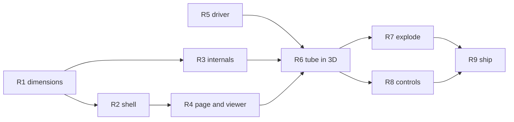

# Jet Fighters 3D - The Console in the Round PRD

> **Current for the `3d` tag.** This PRD adds a second page to the site: the physical
> unit as a 3D model that can be turned in the hand, taken apart down to the tube and the
> chip, and played in every one of those states. It changes nothing about the machine.
> `jet-fighters-v3.md` remains the PRD for the emulation itself.
>
> Paths in this file are relative to the repo root (`jet-fighters-main/`).

## Problem Statement

The site shows the unit as a flat drawing: an SVG case with a canvas set into it. That
drawing has been measured against the photographs and is faithful in plan, but it is a
plan. It cannot show that the scope module stands proud of the wings, that the launcher
lever sits in a countersunk well, that the tube is a glass envelope on a brown phenolic
board a centimetre behind the smoked window, or that the whole game is one 40-pin chip and
a row of resistors.

The owner's teardown photographs show all of that, and the emulation already reproduces
the tube's light. The gap is spatial. This work closes it: a browser-rendered model of the
console, derived from the photographs and the owner's video, that the visitor can orbit,
open, and play - the tube still glowing while the red shell is lifted off it.

## Source material, and what it does and does not settle

Everything the model is built from is already in the repo or on the owner's machine. No
further photographs are available, and that constraint is accepted: where a dimension
cannot be measured it is stated as an estimate with its basis, not silently invented.

| Source | What it settles |
| --- | --- |
| `assets/reference/tube-teardown/board-L1001568.jpg` | Plan of the front shell from the inside, the board, every component, and the scale bar |
| `assets/reference/tube-teardown/board-L1001567.jpg` | The same at higher magnification; pin count and pitch of the chip |
| `assets/reference/device-front-lit.jpg`, `device-front-gameplay.jpg` | Plan of the front face: wing/module proportions, control positions, sticker |
| `assets/reference/back-instructions-label.jpg` | The back: diagonal moulded ribs and the instruction label's recess |
| `assets/reference/screen-overlay-closeup.jpg` | The 12 o'clock tab that overlaps the glass |
| `~/Downloads/clip.mov`, `~/Downloads/jetfighers video.mov` (owner's machine, not committed) | The step between wing and module, the ribbed channel between them, how the unit is held and how the controls are operated |
| `src/ui/geometry.ts`, `src/machine/tube/layout.ts` | The scope window and the tube's segment layout, already measured; the model reuses these rather than re-measuring |

**The scale bar is the chip.** The TMS1370 in `board-L1001567.jpg` has 20 pins a side
(counted by profile across the pin row: 20 dark peaks at a median 42 px pitch), so it is a
40-pin 0.6-inch DIP, and DIP pin pitch is 2.54 mm. In `board-L1001568.jpg`, the frame that
holds the whole front shell, the same pitch measures 23 px, which puts that photograph at
about 0.110 mm/px at the board plane. Read against that, the front shell is about 3040 px
edge to edge, or 335 mm, before perspective. The shell rim is nearer the camera than the
board, so the true figure is a few per cent smaller; the derivation task (R1) states the
correction and its bound. Everything else - the tube envelope at about 1200 px, the battery
box, the wells for the controls - is read against the same bar.

**What no source gives:** the depth of the case, the profile of the back shell, and the
underside of the board. Depth is derived from the standoff posts and the tube envelope in
the teardown photographs and stated as an estimate. The back shell's rib pattern comes from
the label photograph; its outline is the front shell's, because a two-part clamshell is what
the standoffs and screw bosses show. The board's underside is a plain copper-side plane.

## Decisions taken in this PRD

These are settled here so that no task re-opens them.

1. **Three.js is added as the site's first runtime dependency, and it is confined to the
   3D page.** `CLAUDE.md` says zero runtime dependencies, and that rule stays true of the
   machine: nothing under `src/machine/`, `src/input/`, `src/ui/` or `src/main.ts` may
   import it. A WebGL renderer, glTF loader, orbit camera and raycaster written by hand
   would be several thousand lines that exist only to reproduce a library, and the page
   would be worse for it. The rule in `CLAUDE.md` is amended to say exactly this.
2. **The geometry is authored in Blender, headless, from a dimensions file.**
   `tools/model/build_console.py` runs under `Blender --background --python` and builds
   every part parametrically from `tools/model/dimensions.json`, then exports one glTF
   binary. The `.glb` is committed so a clean checkout builds without Blender; the script
   is what changes it. This mirrors how `tools/trace/` produces the segment atlas: the tool
   is the source, the artefact is generated, and neither is edited by hand.
3. **The 3D page is a second Vite entry, `3d.html`, not a mode of `index.html`.** The
   existing page is untouched apart from a link to the new one. Blast radius: a broken
   viewer cannot break the game.
4. **One clock.** `CLAUDE.md` says nothing owns a clock except `src/main.ts`. Two entry
   points would mean two clocks, so the frame driver - the elapsed-time budget, the cycle
   debt, the speaker pump, the draw - moves out of `src/main.ts` into a module both pages
   call, and the rule is reworded to name that module. `src/main.ts` becomes the flat
   page's wiring only.
5. **The tube face is the existing renderer's canvas, used as a texture.** No second
   drawing of the segments exists. The renderer already takes a canvas it is handed;
   the 3D page hands it an offscreen one and uploads it to the GPU each frame.
6. **Controls in 3D are the real contacts.** Clicking the modelled fire button, sliding
   the modelled switch or lever, or turning the skill flag produces the same `MachineInput`
   the flat page produces, through the same `apply`. The keyboard works unchanged. There is
   no other path into the machine.

## Requirements

Sizing is by complexity in story points, per the Fibonacci scale.

### R1 - Derive the dimensions (5 points)

`tools/model/measure.py` takes a JSON of named pixel coordinates read off the reference
photographs and a scale-bar definition, and writes `tools/model/dimensions.json` in
millimetres. `docs/evidence/console-dimensions.md` records every figure with the photograph,
the pixel coordinates and the bar it was read against, in the style of
`docs/evidence/timing-analysis.md`.

Acceptance:

- The scale bar is the chip's pin pitch as described above, and the document states the
  measured pitch in each photograph it is used in, the pin count that identifies the
  package, and the perspective correction applied to the shell rim.
- Every dimension the Blender script consumes is in `dimensions.json`, and every entry in
  `dimensions.json` is either measured (with its source) or estimated (with its basis and
  a bound). A reviewer can tell which by reading the file.
- The front-face plan is cross-checked against `src/ui/geometry.ts`: the scope circle and
  rectangle, the wing and module widths, in the 896 x 440 box. Where the photographs
  disagree with the SVG the document says so; the model follows the photographs and the SVG
  is left alone.
- `python3 tools/model/measure.py` regenerates `dimensions.json` byte-for-byte from the
  committed pixel file.

### R2 - The shell, in Blender (8 points)

`tools/model/build_console.py` builds the exterior from `dimensions.json` and exports
`public/models/console.glb`. `npm run model` runs it.

Parts, each a separately named mesh:

- **Front shell**: the two wings and the taller central module as one moulding, the scope
  window cut as the union of circle and rectangle from `geometry.ts`, the moulded 12
  o'clock tab, the ribbed channels between wing and module, the countersunk wells for the
  fire button, the launcher lever and the skill lever, the slot for the power switch.
- **Smoked window**: a dark transmissive plate set into the scope opening, with the printed
  silkscreen on its inner face.
- **Back shell**: the front outline mirrored, with the diagonal rib pattern from the label
  photograph, the instruction-label recess, the battery-door opening and the speaker grille.
- **Battery door** with its `OPEN` arrow.
- **Sticker**: the blue `JET FIGHTERS` / `CGL` plate.
- **Fire button**, **power switch thumb**, **launcher lever knob**, **skill flag** with its
  hub and screw.

Acceptance:

- A Blender render from a camera matched to `device-front-lit.jpg` (position and focal
  length stated in the script) is committed as `docs/evidence/console-model-front.jpg`
  beside a crop of the photograph, and the wing, module, window and control positions
  coincide to within 3% of the case width. That comparison is the evidence the model is
  the unit and not a generic red box.
- Every part carries glTF `extras` with `label` (what it is), `evidence` (which photograph
  shows it) and `explode` (a unit vector and distance, mm), which R7 consumes.
- The exporter is deterministic: running `npm run model` twice yields the same `.glb`
  byte-for-byte, so a PR that changes geometry shows a real diff.
- The `.glb` is under 3 MB.

### R3 - The internals, in Blender (8 points)

The same script builds what the teardown shows, on a board at the depth R1 derived:

- **Board**: brown phenolic, outline as photographed, `JET FIGHTER` silkscreen, the
  standoff holes.
- **Tube**: the glass envelope with its black end caps, the plate leads along its bottom
  edge and the grid pins along the top, and the **display face** as a separate mesh sized
  to `layout.ts`'s viewbox, because R5 textures it.
- **TMS1370**: a 40-pin DIP at the measured position, `MP2110` on its top.
- **Passives**: the row of resistors along the top edge, the discrete resistors and diodes
  elsewhere, the electrolytics with their printed values, the disc capacitors, the lamp.
- **Piezo/speaker**, **DC jack**, **power switch body**, **fire button switch**,
  **battery box** with its two contacts, the **standoffs** and **screws**.

Acceptance:

- A render from a camera matched to `board-L1001568.jpg` is committed as
  `docs/evidence/console-model-board.jpg` beside the photograph, and the board outline,
  tube, chip and battery box coincide to within 3% of the board's length.
- Each internal part's `extras.label` says what it does in the machine in one sentence,
  sourced from `docs/research/tms1370-io.md` and `assets/reference/tube-teardown/README.md`
  where they say it, and marked "unidentified" where they do not.
- Nothing in the script asserts anything about what the program does.

### R4 - The page and the viewer (5 points)

`3d.html` and `src/viewer3d/` load the `.glb`, light it, and let the visitor orbit, pan
and zoom with mouse and touch. `three` is added to `package.json` as a dependency;
`vite.config.ts` gains the second entry.

Acceptance:

- `npm run build` emits both pages and `npm run lint`, `npm test` and the `ci` workflow
  stay green. Nothing under `src/machine/`, `src/input/`, `src/ui/` or `src/main.ts`
  imports `three` - a test asserts this by reading the import graph.
- The page renders at 60 fps on a 2020 laptop integrated GPU with the case assembled.
- The camera starts where `device-front-lit.jpg` was taken from, so the first frame is the
  photograph.
- Resize, device pixel ratio and pinch-zoom are handled the way `src/main.ts` handles them
  for the canvas.
- A link to the page is added to the flat page's help overlay and to `README.md`.

### R5 - The frame driver, shared (3 points)

`src/app/driver.ts` holds what `src/main.ts` currently does between "read how long the
last frame took" and "hand the drained R15 edges to the speaker": the board, the speaker's
lazy construction, `apply`, `setPower`, the cycle debt and the `requestAnimationFrame`
loop. `src/main.ts` builds the case and calls it. `src/viewer3d/main.ts` builds the scene
and calls the same thing.

Acceptance:

- `src/main.ts` after the change contains no `requestAnimationFrame` and no cycle
  arithmetic; `src/app/driver.ts` is the only file in `src/` outside `viewer3d/` that
  calls `requestAnimationFrame`, and `viewer3d/` calls it only for the render loop, never
  to step the board.
- The `CLAUDE.md` rule "nothing owns a clock except `src/main.ts`" is reworded to name
  `src/app/driver.ts`.
- The flat page behaves identically: power on, play, mute, the dev console handle.
- The driver exposes `apply` and the renderer so a second page can wire controls to it.

### R6 - The tube glows in 3D (5 points)

The display-face mesh from R3 is textured with the canvas that `createTubeRenderer` draws
into, updated every frame, emissive so it reads as phosphor rather than paint. The
silkscreen is drawn on the smoked window's inner face, not on the tube, because that is
where it is printed on the unit.

Acceptance:

- `createTubeRenderer` gains an option to omit the silkscreen, and `drawSilkscreen` is
  called separately onto the window's texture. The default (silkscreen on) is unchanged,
  and the existing renderer tests pass unchanged.
- With the front shell removed the tube's segments are visible from the side and behind
  through the glass envelope, and lit segments glow with the same rise and decay as the
  flat page, because they are the same pixels.
- Looking through the assembled window the scope reads like `device-front-lit.jpg`: dark
  glass, white silkscreen, cyan and red-orange phosphor.
- The texture upload is skipped on frames where the renderer drew nothing new, so an
  unpowered unit costs no GPU upload.

### R7 - Take it apart (5 points)

An explode control - a slider and three presets: **assembled**, **lid off**, **exploded** -
moves each part along its `extras.explode` vector, animated. Hovering a part names it;
clicking a part focuses the camera on it and shows its `label` and `evidence`.

Acceptance:

- Parts move only along their stated vectors; the assembled position is exactly the
  exported one.
- The game is playable at every explode value: the controls still work by click and
  keyboard, and the tube still glows. The lever, switch, button and flag move with their
  shells.
- Labels are the `extras` from the `.glb`, not a second list in TypeScript.
- The chip's label names the part and the mask and says no more, because this is a
  black-box reconstruction and the page is not the place to describe the program.

### R8 - Play it (8 points)

The modelled controls are live. The fire button depresses while pressed, the power switch
thumb slides, the launcher knob moves between its three positions, the skill flag turns
through its three angles. Each drives `apply` with the same `MachineInput` the flat page's
controls produce. The keyboard, via `createInputSystem`, works without touching the mouse.
Audio runs through `SpeakerDriver` exactly as on the flat page, with the same mute toggle.

Acceptance:

- A pointer-down on the fire button and a pointer-up anywhere produce `FIRE pressed` and
  `FIRE released`, so a drag off the button releases it, as the flat page's control does.
- Dragging the launcher knob snaps to the nearest of three positions and produces one
  `LANE` per change; the skill flag cycles on click and produces one `SKILL` per change;
  the switch toggles `POWER`.
- Orbiting the camera does not fire: a drag that starts on a control moves the control,
  a drag that starts elsewhere moves the camera, and a click is not a drag.
- `src/viewer3d/controls.test.ts` covers the hit-to-input mapping headlessly, the way
  `src/ui/controls.test.ts` does for the flat page.
- On a phone, the page is playable in landscape with touch alone.

### R9 - Ship it (2 points)

The `pages` deploy publishes `3d.html` alongside the flat page. `README.md` gains a
section on the model: what it is built from, how to regenerate it, and what is estimated.
`CLAUDE.md` gains the `tools/model/` paragraph next to the `tools/trace/` and
`tools/video/` ones, and the amendments R4 and R5 call for.

Acceptance:

- The deployed site serves both pages from the same origin, and the link between them
  works on the deployed path (the Vite `base`, not `/`).
- `docs/evidence/README.md` lists the two comparison renders.

## Out of scope

Cut, not deferred:

- Photogrammetry or any reconstruction from the video frames beyond reading proportions.
- Modelling the board's copper side, the tube's internal grid mesh geometry, or the inside
  of the battery box.
- Replacing the flat page with the 3D one.
- An AR or VR mode.
- Any change to `asm/jetfighter.asm`, `src/machine/` behaviour, or the atlas.

## Dependencies and order

R1 and R5 can start together. R2 and R3 are one script and can be one PR or two. The
critical path is R1 - R2 - R4 - R6 - R8 - R9.

## Success criteria

The owner opens `3d.html` on a laptop, sees the unit as photographed, drags it round to
see the back label, pulls the explode slider until the red shell floats off the board with
the tube still lit, switches the power on with a click, aims with the arrow keys, and shoots
a jet. Total: 49 points.
