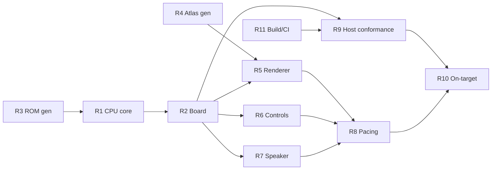

# Jet Fighters Arduboy - Porting the Machine PRD

> **Proposed for the `arduboy` tag.** Eleven items, all of them about running the
> existing reconstruction on an ATmega32u4 handheld. `jet-fighters-v3.md` remains the
> PRD for the emulation as a whole and `jet-fighters-v4.md` for its pace; this one adds
> a second target for the same machine and changes no gameplay rule.
>
> Paths in this file are relative to the repo root (`jet-fighters-main/`).

## Problem Statement

The reconstruction runs in a browser. The owner has an Arduboy on the desk -
an ATmega32u4 handheld with a 128x64 monochrome OLED, six buttons and a piezo -
enumerating as `/dev/cu.usbmodem2101`, USB `2341:8036`. The question is whether the
machine can run on it, and what that costs.

The measurement that decides the shape of the answer is that **the emulated machine
is smaller than the device emulating it**, by more than an order of magnitude on every
axis:

| Resource | TMS1370 / MP2110 | Arduboy (ATmega32u4) | Ratio |
| --- | --- | --- | --- |
| Program store | 2048 words x 8 bits = 2 KB | 32 KB flash, ~28 KB after the bootloader | 14x |
| Data store | 128 nibbles = 64 bytes packed | 2560 bytes SRAM | 40x |
| Instruction rate | 58,333/s (350 kHz / 6) | 16,000,000/s | 274x |
| Display | 9 grids x 12 plates = 108 cells, 94 populated | 128 x 64 = 8192 pixels | 76x |
| Sound | one pin, R15 | one piezo pair | 1x |

`asm/jetfighter.asm` assembles to 1655 of 2048 program words and a RAM high-water mark
of 128 of 128 nibbles. That image plus the 32-entry output PLA is 2080 bytes of PROGMEM.
A baseline build carrying both, plus the Arduino framework, USB CDC and Arduboy2's
display core, measures **5838 of 28,672 bytes of flash and 365 of 2560 bytes of SRAM** -
so the port starts with 22,834 bytes of flash and, after the 1024-byte frame buffer,
about 1170 bytes of SRAM to spend on an interpreter for a machine with 64 bytes of state.
The ATmega has 274 of its own cycles for each emulated instruction.

So the honest port is of the **machine**, not the game. Rewriting the rules in C++
against the PRD would produce a second implementation of behaviour this project spent
four PRDs establishing once, free to drift from the first at every cadence figure. There
is no resource pressure that would justify it.

The problem this PRD solves is therefore narrow and mechanical: reproduce the TMS1370
core, the board's pin wiring, the VFD scan and the speaker bit on an AVR, render 94
segments onto a monochrome panel a quarter of the tube's aspect ratio, map three case
controls onto six momentary buttons, and prove the result runs the same program the
same way.

## Source material, and what it does and does not settle

| Source | What it settles |
| --- | --- |
| `asm/jetfighter.asm` via `tools/tmsasm/cli.ts` | The ROM image, byte for byte. 1655 of 2048 words, highest address $7FF, 31 of 32 O PLA slots declared |
| `src/machine/cpu/tms1370/` | Every instruction semantic, the LFSR program counter, the one-level stack, the 5-bit O index, the K mask. 5043 lines with tests beside each |
| `src/machine/board/ports.ts` and `board.ts` | The pin budget: R0-R8 grids, R9-R10 strobe columns, R11-R14 plates 8-11, R15 speaker, O0-O7 plates 0-7, K1/K2/K4 strobed, K8 fire |
| `src/machine/board/tms1370-cadence.ts` | `SWEEP_INSTRUCTIONS = 889`, so the tube refreshes at 65.6 Hz and a lit segment's duty is 7/889 |
| `src/machine/board/power.ts` | `RAM_POWER_ON_FILL = 0x0a`, and that the power switch is the only reset |
| `src/machine/tube/atlas.json` | 94 segments over a 363x300 viewBox, each with its grid, plate, colour region, outline and bounds; playfield x 101.24-313.99, y 113.48-167.16; score x 55.69-92.45, y 116.28-153.59 |
| `src/machine/board/tms1370-input.ts` | Lever and skill are three-position switches, one-hot on K1/K2/K4 under strobes R9 and R10; fire is momentary on K8 and no column selects it |
| `tools/probe/entropy-nibble.test.ts` | The ROM has no hardware timer and no LFSR. The only variety is when the player presses fire. The machine is deterministic given its inputs |
| `tools/probe/machine-probe.ts` | A trace format that already exists: `litSegments` as `[grid, plate, duty]` triples and `speakerEdges` as `[cycle, level]` pairs, from a run with inputs scripted at named cycles |
| A baseline build on this machine, 2026-09-20 | avr-gcc 7.3.0 under PlatformIO `board = leonardo` with `Arduboy2@^6.0.0`, carrying a 2048-byte ROM array, a 32-byte PLA, a 9x12 duty table and 64 bytes of machine RAM: **5838 of 28672 bytes flash, 365 of 2560 bytes SRAM**. Everything the port cannot avoid is already inside those figures |

**What no source settles**, stated so no task invents it:

- **Which Arduboy this is.** USB `2341:8036` is the stock Leonardo identity that the
  classic Arduboy, the FX and several clones all present while running a sketch. It does
  not matter to this PRD - the ROM fits in PROGMEM and no requirement below wants the
  FX's external flash - but a task must not assume the FX chip is there.
- **Which bootloader is on it.** Caterina is 4 KB and Cathy3K is 3 KB, so usable flash is
  28,672 or 29,696 bytes. Every figure in this PRD uses the smaller, which is what
  PlatformIO's `leonardo` board definition assumes; R10 reads the actual one off the
  device.
- **What the interpreter actually costs per instruction.** The 274-cycle budget is
  arithmetic, not a measurement. R8 measures it, and R8 is the requirement that can fail.
- **Whether the panel is SSD1306 or SH1106.** Both ship in Arduboys. Arduboy2's core
  handles both; nothing below depends on which.

## Decisions taken in this PRD

**1. The Arduboy runs the emulator, not a rewrite of the game.** The C++ build
interprets the same assembled ROM. Gameplay is identical by construction rather than by
review, a ROM fix lands on both targets in one commit, and the rules stay stated once in
`asm/jetfighter.asm`. The cost is an interpreter where a state machine would have done,
and the resource table above is why that cost is affordable.

**2. The ROM and the O PLA are generated build artefacts, never vendored by hand.** A
script runs `tools/tmsasm/` and emits a `PROGMEM` array. A hand-pasted hex table is a
copy of the ROM that can drift from it, which is the failure this repo already refuses
for atlas coordinates, video cadences and console dimensions. The generated header is
committed so a clean checkout builds without Node, and R11 fails the build if it is stale.

**3. The display is a 1-bit sprite atlas generated from `atlas.json`.** A segment is on
when its duty over the last sweep exceeded zero. There is no brightness and no phosphor
decay: the panel has one bit per pixel and a grayscale library that frame-cycles the OLED
would cost frame rate, RAM and the stock display driver to carry a quantity the port
cannot show well anyway. The PWM accumulator is still built and still runs, because the
blanking behaviour `v4` R2 is about - the display going dark while a note plays - comes
from the ROM stopping the sweep and would be lost by a renderer that read cell state
directly.

**4. The layout scales the playfield to the panel's width and gives the score its own
band.** The tube's active area is 258.30 x 53.68 units, an aspect ratio of 4.8:1 against
the panel's 2:1, so a uniform fit of the whole face leaves the rocket 1.8 pixels wide and
unreadable. Scaling the playfield alone to 128 pixels gives a factor of 0.6017: a
128 x 33 playfield band in which a jet is 10 x 7 and a rocket 2 x 7, with the score
rendered beneath it at the same factor as a 22 x 22 block. The spare rows carry the lever
and skill positions, because on the real unit those are visible on the case and the
Arduboy has no case to look at. **That indicator reads the input layer's control state
and never the emulated RAM** - it is the case, not the game.

**5. Colour is lost and not simulated.** 52 of the 94 segments are cyan and 42 red, and
the division is meaningful: cyan is the player's - missile, burst, launcher, score - and
red is the enemy's. On one bit there is no way to carry it. The shapes are already
distinct and that is what the port relies on. A dither pattern standing in for hue would
make small sprites illegible at this scale.

**6. The speaker is R15 written straight to the piezo pin, with no synthesis.** The
emulator runs in real time, so writing the pin whenever R15 changes reproduces the
waveform rather than approximating it. At a 17 µs instruction period against the 600-650
Hz band `docs/evidence/audio-reference.md` measures, edge placement is within about 1% of
a period. This also leaves Timer3 free, which ArduboyTones would have taken.

**7. Three case controls onto six buttons, reusing `src/input/`'s translation.** The
keyboard already faces this problem - momentary keys standing for position switches - and
solved it in `src/input/input.ts`. The C++ input layer reproduces that translation rather
than inventing a second one: UP/DOWN move the lever, A fires, B cycles the skill dial
through 1-2-3. **The Arduboy's own power switch is the machine's power switch**, which
keeps "the power switch is the only reset" true on this target without a soft-reset path.

**8. The port lives in `arduboy/` in this repo.** It shares the ROM, the atlas and the
cadence constants directly; one CI run covers both targets; and the conformance harness
in R9 can import the TypeScript core and the C++ core in one process. A separate repo
would have to vendor the ROM, which decision 2 exists to prevent.

**9. Conformance is a differential trace against the TypeScript core, at two levels.**
The machine is deterministic given its inputs, and a trace format already exists. R9
compiles the C++ core for the host and requires the two traces to be equal cycle for
cycle - that runs in CI with no hardware. R10 runs the shipped AVR binary on the device
and requires the same equality over a shorter drive, which is what proves the thing that
was flashed is the thing that was tested. No AVR instruction-set simulator is in this
plan: `simavr` and `simulavr` are both absent from Homebrew, and a hardware-in-the-loop
check over the CDC port the device already presents is both simpler and more conclusive.

## Requirements

Sizes are Fibonacci story points. R1 and R9 are 8s and decompose further before work
starts.

### R1 - The TMS1370 core in C++ (8 points)

`arduboy/src/tms1370/` reproduces `src/machine/cpu/tms1370/`: the 256-opcode decode, the
4-bit ALU, the LFSR program counter with its `CA:PA:PC` composition, the one-level return
state, the 128x4 RAM, the 2048x8 ROM in PROGMEM, and the 5-bit O index decoded through a
32-entry PLA.

Two properties are structural, not tested:

- **The O register holds an index and nothing else.** The only route from an index to
  eight lines is the PLA table. A core that can express a plate mask absent from the
  table fails, exactly as `v3.contract.md` V4 requires of the TypeScript core.
- **No address-order assumption.** The LFSR map lives in one translation unit and nothing
  else computes a ROM address.

RAM survives `reset()`. The core owns no clock and no timer; it advances only when
stepped.

**Done when** every case in `src/machine/cpu/tms1370/*.test.ts` that describes a core
behaviour has a counterpart in `arduboy/test/`, running on the host, and R9's trace is
equal for a 10-second drive.

### R2 - The board: R latch, display sweep, K matrix, speaker bit (5 points)

`arduboy/src/board/` splits the 16-bit R latch the way `src/machine/board/board.ts` does -
R0-R8 grids, R9-R10 strobe columns, R11-R14 plates 8-11, R15 speaker - and accumulates
per-cell duty over the sweep in a 9x12 table. The K matrix returns one-hot lever and
skill bits under their columns and K8 whenever fire is held.

The PWM accumulator's `exclude` behaviour is carried over: an interval in which the
display was not scanned at all is removed from the frame's denominator, which is what
makes the blanking measurable rather than averaged away.

**Done when** a sweep measured on the host is 889 instructions and a lit segment's duty
is 7/889, and both figures are read from the shared cadence constants rather than typed.

### R3 - ROM and O PLA as generated build artefacts (3 points)

`arduboy/tools/genrom.ts` runs the assembler and writes
`arduboy/src/generated/rom.h`: a 2048-byte `PROGMEM` array, the 32-entry PLA, and the
source ROM's sha256 in a comment. The header is committed.

`arduboy/tools/gencadence.ts` does the same for the cadence constants, emitting
`arduboy/src/generated/cadence.h` from `src/machine/board/tms1370-cadence.ts` and
`src/machine/cpu/tms1370/timing.ts`. Every cadence figure the port uses is a field of
that header or an expression over one; a literal carrying a comment that cites the
TypeScript source is a citation, not a provenance, and does not satisfy this.

**Done when** `npm run arduboy:rom` and `npm run arduboy:cadence` regenerate both headers
byte-identically from a clean checkout, and a CI step fails if either committed header
does not match a fresh run - demonstrated on a commit that changes `asm/jetfighter.asm`
without regenerating, not only on one that perturbs the header, since a gate conditioned
on the generated file's own directory is green on exactly the commit that makes it
stale.

### R4 - The sprite atlas, generated from `atlas.json` (5 points)

`arduboy/tools/genatlas.ts` rasterizes the 94 segment outlines at the layout factor and
writes `arduboy/src/generated/atlas.h`: one bitmap per distinct shape - jet, rocket,
missile, burst, battleship, sea, battleship burst, capture, launcher, explosion, seven
digit segments, the hundreds bar, the score label - plus a 108-entry table mapping
`(grid, plate)` to a shape and a pixel origin.

Shapes repeat across lanes and columns and are stored once. The table is the only place
that knows which cell is which.

Shapes are rasterized from each segment's `path`, never filled from its `bounds`. The
two are not close: a rocket's outline encloses about 7% of its bounding box and a score
segment about 87%, so a generator that fills the box draws convincing digits and turns
every jet, battleship, burst, capture and explosion into a solid block. Blocks in the
right cells at the right instants look like a working game, which is why this is a
generator requirement with a machine check and not something the playfield reveals.

**Done when** the generated atlas is under 2 KB, every one of the 94 populated cells
resolves to a shape and an origin, no cell outside the 94 does, and each bitmap's set
pixels agree with its path's interior everywhere but within a pixel of the boundary -
compared per segment, because an aggregate over all 94 hides the blocks behind the
digits. The tolerance is a pixel of the four-times-oversampled comparison grid, not of
the output bitmap, and no morphological pass runs after rasterization: a one-pixel
dilation adds only pixels adjacent to a boundary pixel, so it satisfies a tolerance
phrased in output pixels while fattening every sprite on the panel.

### R5 - The renderer and the 128x64 layout (5 points)

A sweep boundary triggers a render: cells whose duty exceeded zero blit their shape into
the 1024-byte frame buffer, which then goes out over SPI. Playfield band at the 0.6017
factor, score beneath it, control indicator in the spare rows.

The reference to compare against is `src/machine/tube/`'s own renderer at the layout
factor, thresholded to one bit with the phosphor at full brightness, the ghost layer and
bloom disabled, and the threshold at half the segment fill's own alpha. Those settings
are fixed here rather than left to whoever builds it: bloom on with the threshold dropped
fattens every reference shape by about a pixel, which is exactly enough to agree with a
fattened atlas. It is not a second implementation of the Arduboy blit and it does not
read the generated atlas: a reference built from the same atlas agrees with
the build by construction whatever either of them draws.

**Done when** frames captured from the host build match that reference over a state set
spanning all three skill settings and including the squadron past the ladder's opening
rungs, and the render plus transfer costs less than 15% of a sweep period (R8 measures
it).

### R6 - Controls (3 points)

UP and DOWN move the lever through up/centre/down, A is fire, B cycles skill 1-2-3. The
translation mirrors `src/input/input.ts`, and a control movement reaches the game only by
closing a contact the ROM reads on its next sample.

**Done when** a scripted button sequence produces the same K-line history as the
equivalent `--input` spec on `tools/probe/machine-probe.ts`.

### R7 - The speaker (2 points)

R15's level is written to the Arduboy's piezo pins whenever it changes. No tone library,
no synthesis, Timer3 untouched.

**Done when** a capture of the pin's edges over a drive that plays the win jingle matches
`speakerEdges` from the same drive on the TypeScript core, within one instruction period
per edge.

### R8 - Real-time pacing and the cycle budget (5 points)

The emulator runs at 58,333 instructions per second against wall time, catching up after
a render rather than free-running. The budget to verify:

| Per sweep (889 instructions, 15.24 ms, 243,840 ATmega cycles) | Cycles |
| --- | --- |
| SPI transfer of 1024 bytes at 8 MHz | ~16,400 |
| Blitting up to 94 shapes | to be measured |
| Remaining, divided by 889 | the interpreter's budget |

**This is the requirement that can fail** - and it has to stay able to. The rate is read
from a counter nothing outside `step()` assigns to, and the catch-up figure is the
measured shortfall before any resync or clamp, with the number of resets reported and
zero. A pacer that resyncs the emulated cycle counter whenever it falls behind reports
the rate back to itself and hits `CYCLE_HZ` exactly however slow the interpreter is,
while a clamp becomes the catch-up figure's own ceiling. The breakdown covers the
heaviest sweep observed as well as the median - a full squadron with the battleship up
and an explosion running is the sweep that decides whether the budget closes, and a
median deletes it. The number is measured on the device with a cycle counter, not
estimated.

**Done when** the measured instruction rate over a 60-second run is within 1% of
`CYCLE_HZ`, the worst-case catch-up interval is under one sweep period, and the report of
where the cycles went is committed alongside it. The catch-up bound is not pedantry: it
is the only place in this port where device timing meets wall time, since R7 and R10
compare in emulated-cycle coordinates where jitter is invisible, and tens of milliseconds
of it smears the pitch of every note.

### R9 - Host differential conformance (8 points)

`arduboy/test/conformance/` compiles the C++ core for the host, drives it and the
TypeScript core with the same ROM, the same `RAM_POWER_ON_FILL` and the same scripted
inputs at the same cycles, and requires the traces to be equal: every `[grid, plate,
duty]` triple and every `[cycle, level]` speaker edge.

Drives cover at minimum: power-on through the first sweep, a full game to game over, the
win jingle, a capture, and a fire press at a cycle that exercises the entropy
accumulator. They span all three skill settings, and at least one reaches the highest
kills count a played game at skill 3 reaches, so the march ladder's upper rungs and the
skill-2 and skill-3 step tables are executed rather than merely present. A set run
entirely at skill 1 spans the five categories and exercises none of that; a full-game
drive that presses fire zero times is the cheapest way to reach game over without
exercising anything at all.

**Done when** the traces are equal over every drive, and five corrupted opcode handlers -
picked from the assembler listing's opcode histogram, including its three rarest, rather
than chosen by whoever wrote the core - each make at least one drive fail. One mutant on
a hot opcode fails every drive in the first hundred instructions and shows nothing about
coverage.

### R10 - On-target conformance and the flash budget (5 points)

A build flag adds a trace mode: the firmware dumps its segment and speaker trace over the
CDC port the device already presents. The trace build differs from the shipped build only
by that emission - the flag guards the serialization sites and nothing else, and in
particular does not compile out the renderer, the SPI transfer or the pacer. A trace
build missing any of them verifies a binary nobody plays, which is the opposite of this
requirement's purpose. A host script runs the same drives against the
flashed binary and compares against the TypeScript core.

`avr-size` reports flash and SRAM against the measured bootloader size, and the build
fails if either exceeds its budget. The baseline to grow from is 5838 bytes of flash and
365 of SRAM, measured on 2026-09-20; the frame buffer adds 1024 to the second.

**Done when** every drive matches on the flashed binary, the full game among them driven
at skill 3, `avr-size` is run over that same binary, and the size report is committed.

### R11 - Build, flash and CI (3 points)

`arduboy/platformio.ini` targets `board = leonardo` with `lib_deps = Arduboy2`.
`npm run arduboy:build`, `npm run arduboy:flash`, `npm run arduboy:test`. The `ci`
workflow builds the firmware, checks the generated headers are current and runs R9's
conformance suite; it does not run R10, which needs the device.

**Done when** CI is green on a clean checkout with no AVR toolchain assumptions beyond
what PlatformIO installs.

## Out of scope

- **Grayscale rendering.** Decision 3. The port shows a segment as on or off.
- **Colour.** Decision 5. One bit cannot carry two phosphors.
- **The 3D viewer.** `src/viewer3d/` and its glTF stay on the web target. The Arduboy
  renders the tube face, not the case.
- **The Arduboy FX's external flash.** The ROM fits in PROGMEM. Nothing here wants 16 MB.
- **An AVR instruction-set simulator in CI.** Decision 9. R9 runs on the host and R10 on
  the device.
- **Any gameplay change.** A rule that looks wrong on the Arduboy is wrong on the web
  too, and belongs in a ROM PRD.
- **Saving high scores.** The machine has no non-volatile store and the power switch is
  the only reset. EEPROM would be state outside the emulated RAM.

## Dependencies and order

R3 and R4 are independent of each other and of everything else, and are the two tasks
that can start immediately. R11 comes early because R9 needs somewhere to run. R8 is the
gate: if the budget does not close, decision 1 is the thing that has to be revisited, and
it is better to learn that before R10 than after.

## Success criteria

1. The Arduboy, powered on, plays Jet Fighters from `asm/jetfighter.asm` with no ROM
   modification and no rule stated anywhere but that file.
2. Host traces are equal to the TypeScript core's, cycle for cycle, over every drive in
   R9.
3. The on-target trace is equal over a full game.
4. The measured instruction rate is within 1% of `CYCLE_HZ` over 60 seconds.
5. Flash and SRAM fit with the measured bootloader, reported by `avr-size`.
6. `rom.h` and `atlas.h` regenerate byte-identically, and CI fails if they are stale.
7. `npm test` and the Arduboy conformance suite are green on one clean checkout.
