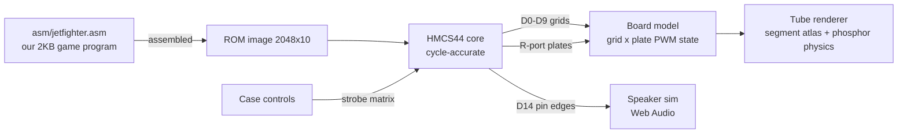

# Jet Fighters v2 - Full-Machine Rebuild PRD

## Problem Statement

v1 recreates the *behaviour* of the 1979 Gakken Jet Fighter with a modern game loop,
canvas sprites at arbitrary coordinates, and event-triggered sound effects. The owner's
verdict after playing it against his real unit: a facade. The rhythm, stepping, sound
timing, and display character of the original are properties of its hardware - a 4-bit
microcontroller scanning a vacuum fluorescent tube - and cannot be convincingly imitated
at the behavioural layer.

v2 rebuilds the game as the machine it was: a cycle-accurate emulation of the MCU family
the real unit uses, running a game program we author in that chip's own instruction set
under its real constraints. Behaviour, timing, and sound then emerge from the machine
instead of being approximated.

## Technical Context (research-verified)

Hardware research findings (docs/research summary; MAME source and Handheld Museum cited
in the research report):

- Gakken standardised on the **Hitachi HMCS40 MCU family** across its VFD line; no Gakken
  game uses NEC uCOM-4. The CGL box's "2K Bytes L.S.I." matches the **HD38800 (HMCS44)**:
  (2048+128) x 10-bit mask ROM, 160 x 4-bit RAM, 4-level stack, PMOS, on-chip ~400 kHz
  oscillator, high-voltage open-drain R/D ports that drive a VFD directly.
- Closest emulated sibling (MAME `ghalien`, Gakken Heiankyo Alien): HD38800 at 400 kHz,
  **10 grids (D0-D9) x ~20 plates (R ports + D10-D13)**, **1-bit speaker on pin D14**,
  inputs strobed on D0-D6 and read on D15. Jet Fighter is modelled as its twin.
- Tube: cyan/red two-phosphor **Futaba DM-series** (DM-11Z class), colour from patterned
  phosphor plus filter overlay. Every sprite is a fixed phosphor anode segment.
- Power: 4 x AA (6 V) with a DC-DC converter for filament and roughly -24 to -30 V
  grid/anode bias. Power switch cuts the battery: RAM contents die - that IS the reset.
- **Jet Fighter's own ROM was never dumped** (absent from MAME). The exact HD38800Axx and
  Futaba serials are unknown without a teardown. Consequence: the 2 KB game program is
  authored by us; the CPU core, board topology, and tube are built from documented
  HMCS40/Futaba facts.

Licensing note: the CPU core is implemented cleanly from Hitachi HMCS40 architecture
documentation (as summarised in the research). MAME source (GPL) may be consulted to
verify factual hardware behaviour but must not be copied - this repo is MIT.

## Architecture

Five layers, mirroring the physical machine. Data flows exactly as electricity did:

### R1. HMCS44 CPU core (`src/machine/cpu/`)

- Full HMCS40-family instruction set, 10-bit opcodes, 4-bit ALU, documented registers
  (A, B, X, SPX, Y, SPY, carry, status), (2048+128) x 10 ROM space, 160 x 4 RAM,
  4-level stack, timer/prescaler, external interrupt line.
- Cycle-accurate at the documented rate (~400 kHz oscillator; divided machine cycles).
  The emulation advances by cycles; nothing in the system has its own clock.
- R/D port model with per-pin read/write, matching PMOS open-drain semantics as observed
  behaviour (pin state matrix, not voltages).
- Every opcode covered by unit tests (semantics per the Hitachi databook as documented in
  the research; cross-checked against MAME's documented behaviour where ambiguous).

### R2. Assembler (`tools/hmasm/`)

- A small HMCS40 assembler in TypeScript: documented mnemonics, labels, ROM banking/paging
  as per the architecture, data tables, and a listing output (address/opcode/source).
- Round-trip tested (assemble -> disassemble -> match); errors on overflow past 2048 words
  so the real ROM constraint is enforced at build time.
- Runs as part of the Vite build: `asm/jetfighter.asm` compiles to the ROM image consumed
  by the core. The assembly source is a first-class artifact of this repo.

### R3. The game ROM (`asm/jetfighter.asm`)

Authored in HMCS44 assembly under the real constraints (2048 words, 160 nibbles, 4-level
stack). Program structure per the device class:

- One master loop: strobe the next grid, output that grid's plate pattern, sample inputs,
  execute one slice of game logic, repeat. The display sweep count is the game's only
  timebase - all cadences (jet steps per skill, battleship crossings, rocket speed) are
  integer sweep counts derived from the reference videos.
- Game state lives substantially in the plate patterns (display RAM = world model), score
  in BCD with ROM segment-lookup tables, capped at 199 by explicit compare.
- Randomness by sampling free-running counters at human input instants.
- Sound emitted by toggling the D14 pin in timed delay loops from within the game routines
  themselves - march beeps issued by the step routine, jingles as ROM note tables walked
  by a note loop. The v1 FFT measurements (frequencies, envelopes, gaps, note sequences,
  documented in PR 14) are the acceptance targets the pin output must reproduce.
- Rules exactly as v1 PRD R2/R6 (owner-verified): 3 lanes, jets advance Invader-style with
  thin-out speed-up, battleship crossings worth 10, scoring 3/2/1 by zone, win at 199 with
  the transcribed jingle, two/three-beep launcher-hit warnings, full loss sound on the
  third hit, capture at the G line, skill 1/2/3, power-cycle restart.

### R4. Board model (`src/machine/board/`)

- Grid x plate PWM display state accumulated from CPU port writes (duty-cycle per segment
  per frame, like MAME's PWM display) - this is what gives authentic brightness shimmer
  and flicker.
- Input strobe matrix wired to the case controls (fire, 3-position lever, skill 1/2/3),
  strobed and read exactly as the sibling hardware (strobe on D0-D6, read on D15).
- Speaker pin edge capture with cycle timestamps, streamed to the audio layer.
- Power switch: on = core reset + RAM undefined-then-cleared per real PMOS behaviour;
  off = everything stops, RAM invalidated. No other reset path exists.

### R5. Tube renderer (`src/machine/tube/`)

- **Segment atlas**: every phosphor segment on the real tube - shape, position, colour
  region - traced from the owner's photos/video and mapped to its (grid, plate) address.
  The atlas is data (SVG paths + JSON mapping), independent of rendering code.
- Renders the board's PWM state: phosphor rise/decay curves, per-segment brightness from
  duty cycle, cyan/red phosphor regions with the filter overlay tint, faintly visible
  unlit segments, glass reflection and the silkscreen overlay from v1's case work.
- The v1 case shell (SVG unit, controls, clip geometry) is retained and rewired; the v1
  `src/game/`, `src/render/`, `src/audio/` modules are deleted when v2 reaches parity -
  no legacy path ships.

### R6. Speaker simulation (`src/machine/audio/`)

- Converts the D14 edge stream (cycle-timestamped) into audio: band-limited square
  reconstruction through Web Audio at the emulated rate. No effect library, no event API -
  if the ROM doesn't toggle the pin, there is no sound.
- Spectral tests: run the ROM headless, capture pin edges for each game sound, FFT the
  reconstruction, assert against the v1 measured reference values.

### R7. Evidence pipeline (`docs/evidence/`)

Ground-truth inputs, catalogued with provenance:

- Owner-supplied (pending): angled-light photo of the dark tube (complete segment atlas in
  one shot), PCB photo with chip markings (confirms HD38800Axx), 15-20 s gameplay video per
  skill level (timing tables by sweep count).
- Existing: the two audio recordings and their FFT measurements; gameplay frames from the
  first video.
- Each timing/segment/sound constant in the ROM source cites its evidence item in a
  comment.

## Success Criteria

- CPU core passes a full opcode test suite; assembler round-trips; ROM assembles within
  2048 words and 160 nibbles of RAM.
- Headless machine run reproduces: measured sound spectra (fire, march, battleship,
  warnings, loss, win) from pin edges alone; jet step cadences matching the reference
  videos per skill level; all v1 PRD rules.
- Visual: tube render at skill 1 is frame-comparable to the reference video - stepping,
  flicker character, phosphor colours, segment shapes.
- The deployed site runs the machine (emulator + our ROM); v1 game/render/audio modules
  are removed. Zero runtime dependencies preserved.
- The assembly source, assembler, and segment atlas are documented well enough that a
  future contributor could fix a game bug by editing the ROM source.

## Out of Scope

- Obtaining or distributing a dump of the original mask ROM.
- Emulating other HMCS40 games or building a general-purpose MAME-style frontend.
- Battery/DC-DC electrical simulation beyond the power-switch reset semantics.
