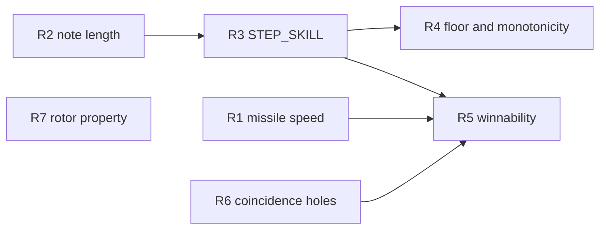

# Jet Fighters v4 - The Pace of the Machine PRD

> **Current for the `v4` tag.** Five items, all of them about what the machine does in
> wall-clock time and what it does when two things stand on one cell.
> `jet-fighters-v3.md` remains the PRD for the emulation as a whole; this one changes
> five things inside it and claims nothing else. `docs/contract/v4.contract.md` is what
> the work is graded against.
>
> Paths in this file are relative to the repo root (`jet-fighters-main/`).

## Problem Statement

The owner's complaint on 2026-07-30 was that the game is slow: "the speed of the bullets
that I fire is currently slow", and the jets crawl. The v3-entities run answered the
first half of that structurally rather than temporally - a per-lane missile rank fixed
the 82% of fire presses that were refused - and froze the per-column travel time at 500
ms on the survey's reasoning that shortening it would make the game unwinnable.

Since that freeze the unit has been measured rather than surveyed, twice, on a clip whose
skill setting is known:

| Quantity | The ROM | The owner's skill-3 clip |
| --- | --- | --- |
| Missile, per column | 500 ms (32 sweeps) | 139-144 ms as traverses, 133 ms as single steps |
| Squadron, per column at skill 3, fresh | 1289-1364 ms measured | 267 / 300 / 467 ms, median 300 |

Two independent quantities, two independent pipelines, one ratio: about 3.6x on the
missile and about 4.5x on the squadron. The owner is right and the size of it is roughly
four.

Three further defects sit on the same ground.

`step_reload` reaches a rung its own constants forbid. At skill 3 with four kills the
subtraction lands on zero, zero does not borrow, and `STEP_HI` is written as 0 - sixteen
sweeps, 325 ms, half the 488 ms floor the source documents and reasons from. A fifth kill
floors it back to 32, so the descent is not monotonic (`docs/evidence/open-questions.md`
section 18).

The march note is 71.8 ms and the notes that darken the real unit's display are 61-209
ms. The emulator blanks 1.55% of frames against a machine measured at 14-17%
(`docs/evidence/vfd-appearance.md` section 5).

And a shot fired onto a jet already standing at grid 5 in that lane is not hit-tested at
all: `fire_missile` tests nothing, the jet captures before the missile walk next runs.
That is the sibling of the spawn hole `open-questions.md` section 14 records, in a
different dress, and PR #191's census is what turned it up.

## Source material, and what it does and does not settle

| Source | What it settles |
| --- | --- |
| `docs/evidence/timing-analysis.md`, "The skill-3 clip" | The squadron at 267/300/467 ms a column and the missile at 139-144 ms, both at a **stated** skill of 3, on the owner's own recording |
| `tools/probe/drives/missile-transit.ts` + `assets/reference/skill3-video-cells.csv` | The same missile figure by a second pipeline that shares no code: 133 ms over 21 shots, with a shuffled negative control |
| `docs/evidence/open-questions.md` section 16 | The blanking is the speaker; the sounds that blank are 61-209 ms notes in the 600-650 Hz band, 44 of 44 across four windows; a 71.8 ms note blanks nothing measurable |
| `docs/evidence/vfd-appearance.md` section 5 | 14-17% of frames fully dark during play, in runs of 133-167 ms, about one per 1.1 s |
| `docs/evidence/open-questions.md` section 18 | The sub-floor rung, measured at 325 ms by `tools/probe/drives/march-wall-clock.ts`, and the non-monotonic descent |
| `docs/evidence/open-questions.md` section 14 | A plane that spawns onto a live shot is not hit; one that marches onto a shot is hit every time; 88 coincidences censused |
| PR #191's census | The second hole: a shot fired onto a jet already at grid 5, which `main` does not produce and a phase change would |
| `docs/evidence/owner-entity-model.md` | The owner's testimony, including the 60-107 s winnability measurement this PRD does not transfer forward |
| `docs/evidence/audio-reference.md`, `jetMarch` | The owner's "no marching sound", verbatim, 2026-08-26 |

**What no source settles**, stated so no task invents it:

- **Whether the missile's speed varies with the skill dial.** `IMG_6113.mov` gives 500 ms
  a column over 744 steps and survives re-measurement as traverses at 567 ms, so it is
  not an estimator artefact. Its skill setting is recorded as unknown in every row and no
  analysis of the footage can recover it. Only the owner can. The two recordings are two
  rungs of something, or two settings of a dial the ROM does not have.
- **Which march steps a plane changes row on**, and which pair of rows it changes
  between. PR #191 states this at the site in the ROM rather than burying it.
- **Whether the 600-650 Hz notes that darken the owner's display are the squadron's
  step.** The intervals run 0.15-3.17 s against a per-aircraft step of 1.2-1.9 s. The
  band is occupied at the blanking rate by a sound long enough to blank; that it is
  *tied* to the march is not established.
- **What suppresses blanking in the `IMG_6113` t=120 window** for sounds that blank
  elsewhere. Section 16 records this as open and this PRD does not close it.

## Decisions taken in this PRD

Settled here so that no task re-opens them.

1. **The skill-3 clip is the anchor for pace, because it is the only recording whose
   skill setting is known.** The missile's per-column time and the squadron's are both
   set against it. `IMG_6113.mov`'s 500 ms missile is not discarded and not contradicted;
   it is left as the unresolved question above, and `MISSILE_LO`/`MISSILE_HI` stay flat
   constants rather than growing a skill dependency this run.
2. **v3-entities criterion E1's freeze on `MISSILE_LO`/`MISSILE_HI` is superseded, and
   its reasoning is re-tested rather than reversed by assertion.** E1 froze the speed
   because the survey measured that "at 125 ms a column or faster a defending player wins
   in 60-107 seconds at every skill". That measurement was taken on a build with one
   shared missile and with `jm_capture`'s lane condition still in it, and
   `open-questions.md` section 6 records the removal of that condition turning every
   policy in `playability-audit.md` from WIN to OVER. The figure cannot be carried across
   two changes of that size, so R5 re-measures it. This PRD does not assume the answer in
   either direction.
3. **The march note is lengthened, not removed, and this sits against the owner's
   testimony.** He said "no marching sound". His own recording carries 25 runs of a
   600-650 Hz tone in 40 s, tonality 0.57-0.80, and it is what darkens his display. One
   of those two things is wrong and no instrument here can say which. **The recording
   wins unless the owner overrides it**, because the recording is a measurement of the
   unit and the testimony is a report of it, and the tier-3 criterion puts the question
   to him directly (section 16's own queued question: whether he hears anything at all in
   step with the jets advancing). Task 26's "remove `jm_beep`" is therefore closed as
   refuted, by PRs #157, #160, #161 and #163.
4. **The march note's length is an input to the cadence, so it is fixed before
   `STEP_SKILL` is re-derived.** The core does not strobe the tube while it bit-bangs the
   speaker, so a longer note parks more sweeps and slows the played march. Doubling the
   note after re-deriving the constant would mean deriving it twice. The order in the
   dependency graph below is not a preference.
5. **The cadence floor's *value* is part of the re-derivation, not a fixed point the
   repair restores.** `STEP_HI_MIN` = 1 is 32 sweeps, 488 ms nominal and 689 ms measured
   at skill 3, which is outside the 267-467 ms the video shows. Repairing the borrow
   while leaving the floor where it is would forbid the pace the same evidence requires.
   What is defective in `step_reload` is that the descent is not monotonic and that the
   floor branch writes a literal `1` instead of `STEP_HI_MIN`; that is what R4 fixes, and
   R3 sets the floor's value.
6. **The missile walk owns the coincidence, not the spawn path and not the fire path.**
   Two cells can come to hold a shot and a jet at once by four routes, and the walk
   already tests two of them (`mw_live` before its step, `mw_arrive` after). Putting the
   test at the creation sites does not fit: `P_SPAWN` is at 63 of 64 words and `P_STROBE`
   at 64 of 64 on the current listing, which is what `open-questions.md` section 14
   already says about the spawn half. One site in the walk closes both holes, and the
   walk's pages have room.
7. **Both holes are decided the same way, because they are one class.** A shot and a jet
   on one cell is a hit, whichever of them arrived last and whichever path put it there.
   The alternative reading - that a missile fired before a plane existed has nothing to
   hit - is defensible and is rejected here for one reason: it makes the outcome depend
   on which of two writes happened first inside one sweep, which is the machine state
   `jet_enter`'s header already calls "a trap for every probe written afterwards".
8. **A band this run moves is moved with a measurement, or it is not moved.** Three
   requirements here rewrite sections of `docs/evidence/` that hold the figures other
   requirements are checked against, and only the contract's own bytes are frozen. So the
   rule is stated once and applies to all of them: any band that differs from the figure
   the contract records as current is accompanied, in the same document, by the
   re-measurement and the command that produced it, visible in `git diff BASE HEAD`.
   Widening a bound in the commit that failed to hit it is the failure this closes. The
   rule covers `owner-entity-model.md`'s 60-107 s regime and `playability-audit.md`'s
   policy set as well, which R5 is checked against.

## Requirements

Sizing is by complexity in story points, per the Fibonacci scale.

### R1 - The missile crosses a column in 137 ms (5 points)

`MISSILE_LO` 15 to 8 and `MISSILE_HI` 1 to 0 in `asm/jetfighter.asm`, giving
`0 * 16 + 8 + 1` = 9 sweeps, and 9 x 15.24 ms = 137 ms against a measured 139-144 ms.

Acceptance:

- All three load sites (`fire_missile`'s rank-empty arm, the reload in the missile walk,
  and the reset routine) use the equates and not literals.
- `tools/probe/drives/missile-transit.ts` reports the ROM and the recording agreeing
  rather than "Nx faster than the ROM", and its `ROM_SECONDS_PER_COLUMN` is derived - read
  from the assembled symbols or computed from the equates and the sweep length. A typed
  0.137 does not satisfy this.
- `tools/probe/missile-rank.test.ts` is green with its six per-lane pass-through
  assertions intact and its LEAVE and ARRIVE non-vacuity floors still met. The phase
  relationship between a 9-sweep shot step and a march step is not the one the BLOCKS
  cadences were tuned against; where a BLOCKS cadence moves, the change is documented at
  the site with what it was tuned to produce, and a cadence changed with no such comment
  is not acceptable however green the test is.
- `GAP_UNITS_HELD_FIRE` in `tools/probe/battleship-arrival.test.ts` is still derived from
  `MISSILE_FLIGHT_SWEEPS` and `GAP_PRESCALE_SWEEPS` and still outlasts a flight: the
  flight falls from 160 sweeps to 45 and the hold from 12 units to about 5, and the
  comment recording why the literal that stood there went stale is re-read rather than
  re-derived from scratch.
- Every drive whose horizon is sized in emulated cycles while its assertion counts game
  events is re-checked against the new step. `docs/evidence/open-questions.md` section
  11a names that class. The audit lives at `docs/evidence/timing-audit.md` and its
  membership is a grep, not a judgement: one row per file that
  `rg -lF '.step(' tools/probe --glob '*.ts'` returns, `step` being the cycle-budget
  method both `Tms1370Machine` and `Board` expose. That is 22 files today. Every one is a
  row, each recording whether its assertions count a game event - kills, score, launches,
  march steps or game length - and where they do, whether it was checked or moved and
  against what. R1 and R6 share the table; there is one, not two, and R6's half is the
  rows whose assertions count kills, score or game length, re-checked against the moved
  kill count.
- The whole tree stays green, not the files this requirement names: `npm run lint`,
  `npm test` and `npm run build` all exit 0, with no test newly skipped and none newly
  marked `it.fails` against BASE.
- The two floors this run inherits are driven rather than assumed. V7 is
  `tools/probe/tms1370-rom.test.ts`'s "flies a rocket down every one of the three lanes".
  V8 is `tools/probe/machine-probe.test.ts`'s "holds a period inside the 1480-1632 Hz band
  measured from the real unit" and "keeps the burst shorter than 150 ms", and
  `src/machine/audio/spectral.test.ts`'s "lands inside the 1480-1632 Hz band that criterion
  V8 asserts" - the duration half as well as the band, because both this requirement and R2
  move sounds within a sweep of that burst.
- Scope containment: `git diff BASE HEAD` is empty under
  `src/viewer3d/`, `public/models/`, `tools/model/`, `tools/trace/`,
  `src/machine/tube/atlas.json` and `tools/tmsasm/`. Those are cut below, and the atlas and
  the model have regeneration rules a run under pace pressure could bypass quietly. BASE is
  the merge commit of the PR that lands this PRD, resolved at verification time rather than
  written down as a sha here, so a commit landing on `main` in between moves it too.

### R2 - The march note lasts as long as the notes that blank the real display (5 points)

`SND_MARCH_P` and the `SND_MARCH_*` group produce a note inside the 130-210 ms the
`IMG_6113` windows measure, against the current 71.8 ms.

Acceptance:

- A new drive and test, `tools/probe/drives/march-note-length.ts` and its `.test.ts`,
  reduce the note's emitted duration from R15 speaker edges rather than computing it from
  the constants, print that duration and the number of notes observed, and assert a
  non-vacuity floor on the count, in the shape `tools/probe/drives/README.md` describes.
  A run that observed no note fails rather than passing over an empty set.
- The duration it reports is inside the band `docs/evidence/open-questions.md` section 16
  holds current at verification time. The band is read from the document, not copied into
  a test as a literal.
- Three blanking floors **at least double** from the values they carry on the run's base
  commit, and their tests are green at the raised values:
  `tools/probe/sweep-timing.test.ts`'s sound-attributable blank fraction (0.03) and its
  dark-read fraction (0.02), and `tools/probe/blank-to-glass.test.ts`'s dark-frame
  fraction (0.02), so at least 0.06, 0.04 and 0.04. Doubling is the floor rather than the
  target because the blank is the sound and the note's own duration roughly doubles, which
  reaches it without leaning on R3's cadence change. The remaining gap to the 14-17%
  `vfd-appearance.md` section 5 measures is stated in the document with what still accounts
  for it. A floor that falls fails this requirement whatever the measured fraction does.
- Each floor's new value carries the measurement that justifies it and the run that
  produced it, in the shape `docs/evidence/cadence-rederivation.md` uses.
- `tools/probe/drives/march-tone-identity.ts` still separates section 16's short
  population from section 15's 625 Hz tone by harmonic comb. Lengthening the note must
  not move the ROM's note into the comb range that identifies the device tone: the two
  populations score 1.0-8.2 dB and 23.7-23.9 dB respectively, and the ROM's note belongs
  in the first.
- `docs/evidence/audio-reference.md`'s `jetMarch` section is rewritten from withdrawn to
  what the ROM now emits and why, including the sentence that it stands against the
  owner's testimony.

### R3 - `STEP_SKILL` re-derived by measurement (5 points)

The dial's worth per notch is what fails against the skill-3 clip, not `STEP_HI_MAX`.
`STEP_SKILL` is re-derived so that skill 3 with a fresh squadron lands inside the clip's
267-467 ms, while skill 1 stays at the slow march the owner accepted.

**Measured, not extrapolated**, for the reason the cadence header already gives: a faster
march sounds its beep more often, each beep suspends the sweep, and the ladder partly
resists being sped up. Rungs 8 and 7 are 244 ms apart nominally and 83 ms apart measured.
Every figure comes from `tools/probe/drives/march-wall-clock.ts` re-run after R2.

A worked candidate, to show the requirement is satisfiable rather than to fix the answer:

| | `STEP_HI` at skill 3, 0 kills | sweeps | nominal | note |
| --- | --- | --- | --- | --- |
| now (`STEP_SKILL` 2) | 4 | 80 | 1219 ms | 1289-1364 ms measured, 2.8x the clip's median |
| `STEP_SKILL` 4, `STEP_HI_MIN` 0 | 0 | 16 | 244 ms | 325 ms measured at a 71.8 ms note, and inside the band at a longer one |

Acceptance:

- Skill 3, fresh squadron, measured wall clock between column changes is inside the band
  `docs/evidence/timing-analysis.md` holds current for the skill-3 clip.
- `tools/probe/drives/march-wall-clock.ts` reports a fresh-squadron row at each of skills
  1, 2 and 3; that is where the next figure is read from.
- Skill 2, fresh squadron, is strictly between skill 1's interval and skill 3's, so the
  dial is monotone across its own notches and not only in kills.
- Skill 1, fresh squadron, is within 20% of the 2033/2050 ms slow march the same document
  anchors `STEP_HI_MAX` on. Whichever constants move to hold both ends is the work's
  business; `STEP_HI_MAX` is not frozen here, only the pace it produces.
- `STEP_HI_MIN`'s new value is stated with the rung it corresponds to in sweeps and in
  measured milliseconds, and the floor branch in `step_reload` writes `STEP_HI_MIN` and
  not a literal.
- The three withdrawn 205 ms audio citations in `asm/jetfighter.asm` (the `FILE_JETS`
  header, the cadence-block header, the `jet_march` comment) and the one in
  `docs/design/jet-model.md` now cite the video measurement. `rg '205 ms' asm/jetfighter.asm docs/design/jet-model.md`
  returns nothing. `docs/contract/v3-entities.contract.md` is **not** edited: it is
  frozen, its sha256 is re-hashed by the exit verifier, and E3 stands as written for that
  run.
- `docs/evidence/timing-analysis.md` gains the re-derivation with its run command, in the
  shape its own "The cadence against progress, measured" section uses.

### R4 - The ladder descends monotonically and never bypasses its floor (3 points)

`step_reload`'s `SAMAN` takes the floor branch only when the subtraction borrows, and
zero does not borrow. The repair is one instruction; the ordering is the requirement.

Acceptance:

- A new test, `tools/probe/march-ladder.test.ts`, plays games at all three skills with
  nothing poked, reads `STEP_HI` out of RAM at every reload across every kills count those
  games reach, and times the wall clock between column changes at each. It states, per
  skill, the highest kills count it reached, and the floors are numbers rather than its own
  choice: kills 0 through at least 5 at skill 3, because the defect sits at 4 and the step
  back up sits at 5, and 0 through at least 3 at skills 1 and 2.
- `STEP_HI` is never written below `STEP_HI_MIN` at any (skill, kills) the game reaches,
  read out of RAM rather than computed.
- The measured wall-clock step interval is non-increasing as kills rise, at every skill.
  On `main` a fifth kill at skill 3 makes the squadron slower than a fourth; after this it
  does not.
- `tools/probe/march-cadence.test.ts`'s `it.fails('floors STEP_HI at STEP_HI_MIN when the
  rung lands on zero')` becomes an ordinary passing test, and its companion vacuity guard
  ("reaches the rung whose arithmetic lands on zero") is still green, so the assertion is
  still measuring a rung the machine reaches by its own rules with nothing poked.
- `tools/probe/drives/march-wall-clock.test.ts`'s paired assertion, that the sub-floor
  rung is still reachable, is inverted rather than deleted, so the pair keeps its opposite
  polarity.
- The file's own header sentence calling sixteen sweeps "a cadence no skill setting and no
  score can produce" is corrected to whatever the ladder can now produce.
- R3 lands first. This requirement raises the game's slowest rung, and doing it before the
  dial is re-derived would slow the game at exactly the point the owner says it is already
  too slow.

### R5 - Winnability, re-surveyed against both pace changes (3 points)

The survey's reason for freezing the missile speed was a measurement, so it is answered
with a measurement and not with an argument.

Acceptance:

- `tools/probe/drives/playability-audit.ts` and its `.test.ts` are **extended, not
  replaced**, to play at least ten complete games per (policy, skill) pair over the policy
  set `docs/evidence/playability-audit.md` already names - greedy, dodge, defensive,
  dodgeOnly - at skills 1, 2 and 3, recording outcome and time to that outcome. Inputs
  reach the machine only by closing contacts on the K matrix.
- The result is a section in `docs/evidence/playability-audit.md`, pinned to the commit it
  was measured on. The comparison against the slower ROM is **cited from that document's
  existing f3e0769 baseline**, not retyped, so no column of the table is a number nobody
  can reproduce. That document's own rule applies: a claim states the states it was
  quantified across.
- **Not unwinnable**: at least one policy wins at least once at skill 3.
- **Not trivially winnable**: no policy wins every one of its ten games at any skill, and
  at least one (policy, skill) pair reaches a game over.
- The drive is deterministic given its input schedule - this machine has no random source
  outside `NIB_ENT`, which is stirred by the fire presses the schedule itself dictates - so
  the schedule is committed with the drive and every recorded figure is reproducible by
  re-running it. The recorded section is the authority only while a cold re-run agrees with
  it.
- **Not trivially fast**: at skill 3, the median time to win across every winning game is
  strictly greater than the upper end of the regime `docs/evidence/owner-entity-model.md`
  names as the trivial one - 107 s at the time of writing, read from the document at
  verification time.
- A build that meets the first two bounds and misses the third has reproduced exactly the
  failure the survey predicted of a faster missile. **The repair is not reverting R1.** The
  survey's own sentence is that responsiveness and difficulty are controlled by different
  things; the difficulty knobs this run has are R3's ladder and the rocket cadence, and the
  fix goes there. The two changes since the survey - the per-lane rank and `jm_capture`'s
  settled any-lane capture - are what make its 60-107 s figure untransferable, and they are
  named in the section.

### R6 - A shot and a jet on one cell is a hit, whichever arrived last (8 points)

Two coincidence classes escape the collision test. A plane that spawns onto a live shot is
not hit (`open-questions.md` section 14, 30 spawn coincidences and 6 escapes measured). A
shot fired onto a jet already standing at grid 5 in that lane is not hit either, and the
jet captures the launcher before the missile walk next runs (PR #191's census). Both are
closed at one site in the missile walk, per decision 6.

Acceptance:

- A new test, `tools/probe/onto-occupied-cell.test.ts`, constructs **each** case through
  the K matrix with no `pokeRam`: a fire press timed onto a jet standing at grid 5 in the
  lever's lane, and a wave release timed onto a live shot's cell. It states its floors and
  the counts it met, in the shape `tools/probe/mid-march-row.test.ts` states its own: at
  least 12 fired-onto-grid-5 cases, and at least 30 spawn arrivals - the count
  `entry-onto-missile.ts`'s census measured at BASE.
- In both cases the coincidence resolves as a kill, and the two resolve the same way as
  each other.
- `tools/probe/missile-rank.test.ts`'s "excludes spawn coincidences without excluding most
  of the evidence" ends in one of two observable states, because revisiting is a mental act
  and leaves no trace: either the exclusion is removed and the file records why, or it is
  kept and the test prints the count of coincidences it excluded and asserts it against a
  stated floor. The exclusion exists because spawns escaped; if they no longer do, it is
  what has to justify itself.
- `tools/probe/drives/entry-onto-missile.ts` is re-run and its census in
  `open-questions.md` section 14 replaced with the new figures. The section is rewritten
  from open to settled, naming the decision and its cost.
- The page budget is stated before and after - the word total and the fullest pages at
  BASE beside the same figures at HEAD - so a collision test that fitted by a single word is
  visible rather than inferred. `P_SPAWN` is at 63 of 64 words and
  `P_STROBE` at 64 of 64 on the current listing; the program is at 1655 of 2048 words with
  32 of 32 pages used, so the site the check lands on has to be chosen against the listing
  rather than found by trying.
- The kill count per game moves, and every drive whose assertion is a count of kills, a
  score, or a game length is re-checked against that. This is the same class R1's audit
  covers and the two are one audit.

### R7 - The rocket's lane property, restated and machine-checked (1 point)

v3-entities criterion E4's third conjunct required the rocket's lane sequence to be
unchanged under varying fire-press timing. That contradicts E4's own first conjunct: press
timing feeds `NIB_ENT`, `NIB_ENT` feeds the entry position, entry position feeds
occupancy, and `rf_look` stops the rotor only on an occupied lane. The lever moves
occupancy for the same reason. The property E4 was reaching for is the one
`tools/probe/tms1370-rom.test.ts` already asserts on every launch: every rocket flies down
a lane holding an airborne jet at that instant, which a lane drawn from a keypress nibble
cannot produce.

Acceptance:

- `docs/contract/v4.contract.md` states the property as the per-launch occupancy
  falsifier plus a read-site closure, and says in prose why the sequence-equality version
  was wrong. `docs/contract/v3-entities.contract.md` is not edited.
- A structural assertion added to `tools/probe/entropy-nibble.test.ts` - the file that
  already owns nibble-site closure - counts `NIB_ROTOR`'s instruction sites in
  `asm/jetfighter.asm` and asserts every one of them is inside `rocket_fire`, in the shape
  that file uses for `NIB_ENT`: word-boundary matched, comment and `.EQU` lines dropped,
  and the nearest label above each site named. There are four on
  `main`, in `rf_try`, `rf_wrap`, `rf_look` and `rf_fire`, and nothing asserts it today.
- `tools/probe/tms1370-rom.test.ts`'s occupancy assertion and its `requireNonVacuous`
  guard are unchanged.

## Out of scope

Cut, not deferred:

- **Making the missile's speed depend on the skill dial.** The two recordings suggest the
  real unit does; only the owner can say what skill `IMG_6113.mov` was at, and until he
  does the change would be built on an unknown.
- **Identifying what suppresses blanking in the `IMG_6113` t=120 window.** Section 16
  records it as open and it stays open. R2 is bounded by the dark-frame fraction, not by
  explaining the control window.
- **Re-deriving `BSHIP_STEP`, `BSHIP_GAP` and `BSHIP_OPEN`.** Task 26 scoped these against
  the removal of `jm_beep`, which is now refuted. A longer note moves sweep-counted
  durations the other way, and R2's acceptance covers the battleship only through
  `battleship-arrival.test.ts` staying green. If it goes red, that is R2's problem and
  fixing it is R2's work, not a separate constant re-derivation.
- **Settling which march steps a plane changes row on.** PR #191 states this as open at
  the site and it stays there.
- **Any change to the 3D page, the model, the atlas or the assembler.**

## Dependencies and order

R1, R2, R6 and R7 can start together. R5 is last because it measures the machine every
other requirement changes. The critical path is R2 - R3 - R4, with R5 gating the run.

Total: 30 points.

## Success criteria

The owner plays the deployed build beside the unit. The shot he fires crosses the board
visibly faster than the squadron marches, instead of racing it to a dead heat. The
squadron at skill 3 moves at the pace his own recording shows. The display blinks in time
with the march the way the real tube does, and he says whether that is the sound he told
us was not there. A shot fired at a jet on the capture line kills it instead of passing
through, and so does a plane that appears on a shot. No rung of the ladder is faster than
its own floor, and no kill makes the squadron slower.
