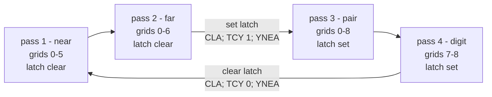

# The O output PLA: the 32 masks this machine has

Paths in this document are relative to the repository root.

This is the design record for `asm/opla.inc.asm` - the 32-entry output PLA the
TMS1370 decodes its five-bit O index through - and for the sweep that spends it.
It states the table, the arithmetic that forces its shape, and the instruction
cost of selecting an entry at `TDO` time with its bound.

Task 8 rewrites `asm/jetfighter.asm` against this table. It is written to be
programmed against, not admired: every rule here is also a named export of
`src/machine/board/o-pla.ts` and a named `.EQU` in `asm/opla.inc.asm`.

## Provenance, and what this table is not

The TMS1370's eight O pins are not a latch a program writes. They are the output
of a five-bit-to-eight-bit code converter indexed by `status_latch:accumulator`,
whose decoding the customer defines - TI Data Manual Dec 1976 §2.6, quoted in
full in `docs/research/tms1370-io.md`. Thirty-two masks exist for a given chip,
ever, and choosing them is a design job.

**These thirty-two are this project's own.** MAME carries Gakken's table for our
mask ROM as `tms1100_ginv_output.pla`. That artifact has not been obtained here,
nothing below is derived from it, and reproducing it is an explicit non-goal of
`docs/contract/v3.contract.md`. Likewise `ginv.svg` is absent, so the (grid,
plate) addressing in `src/machine/tube/atlas.json` that this table is designed
against is the project's own reading of the teardown photograph and not a
ginv-derived decode. Contract criterion V6 is recorded `undriven` for that
reason. Nothing here claims otherwise.

The one hardware fact that shapes everything below and is *not* ours: on this
core the status latch is loaded by exactly one instruction, `YNEA`. There is no
set and no clear, and `CLO` does not exist on the TMS1100 core either
(`docs/research/tms1370-architecture.md` §5). Both facts are standard-set
semantics; MP2110's own microinstruction PLA has not been decoded, which is why
contract criterion V13 is `undriven`.

## What the table has to cover

Twelve plates reach the tube. Plates 8-11 come from R11-R14, which `SETR`/`RSTR`
drive one line at a time in any combination, so they are outside this table.
Plates 0-7 come through it.

`src/machine/tube/atlas.json` puts three **lane families** on those eight plates,
and the same three on every playfield grid:

| Plates | Family | Grid 0 | Grids 1-5 | Grid 6 | Grids 7-8 |
| --- | --- | --- | --- | --- | --- |
| 0-2 | near | battleship | jet | - | (digit segments a, b, c) |
| 3-5 | far | sea | attacker colon | capture burst | (digit segments d, e, f) |
| 6-7 | pair | battleship burst | player missile | player's ship | (segment g); hundreds / SCORE |

The parenthesised entries are the score digit lying across the same plates. The
digit is drawn by its own pass and is not a member of any lane family - the
column is there so the plate map reads completely, not because the near pass ever
strobes grid 7.

Every family has three lanes on the tube. `near` and `far` carry all three on the
O port; `pair` carries lanes 0 and 1 on plates 6-7 and its third lane on plate 8,
which is R11. That asymmetry is the atlas's, not this table's.

Grids 7 and 8 additionally carry a seven-segment digit across plates 0-6:
`score_tens_sega` is plate 0 through `score_tens_segg` at plate 6, repeated on
grid 8 for the units.

## One `TDO` per grid is impossible, and the arithmetic says so

A jet column's O-visible state space, read off the v2 ROM's own model in
`asm/jetfighter.asm`:

| Actor | States | Source |
| --- | --- | --- |
| jets, plates 0-2 | 8 | `FILE_JETS`: "one jet per lane, each flying its own step" - three can share a column, so any of the 8 subsets |
| attacker colon, plates 3-5 | 4 | `NIB_RCOL` is a single column nibble: one colon in flight, or none |
| player missile, plates 6-7 | 3 | `NIB_MLANE` is a single lane: none, lane 0, lane 1 (lane 2 is plate 8, on R12) |

8 x 4 x 3 = **96 distinct low-8 masks for one grid**, before a single score digit
is spent. No 32-slot table covers 96 under any allocation whatsoever.

So the sweep strobes **one family per pass**. That is the strobe-doubling escape
hatch the brief anticipated, adopted because the arithmetic leaves nothing else,
not because the table ran short: it closes with a slot to spare. Its cost is
priced in "What it costs" below.

## The table

Two banks of sixteen, because the fifth index bit is the status latch.

| Index | A | Latch | Rule | Contents |
| --- | --- | --- | --- | --- |
| 0-7 | 0-7 | 0 | `mask = A` | near family, every subset of plates 0-2 |
| 8-15 | 8-15 | 0 | `mask = (A - 8) << 3` | far family, every subset of plates 3-5 |
| 16-25 | 0-9 | 1 | seven-segment shape | the decoded decimal digit `A`, plates 0-6 |
| 26 | 10 | 1 | dark | the blank tens digit |
| 27 | 11 | 1 | - | reserved, undeclared, assembles to 0 |
| 28-31 | 12-15 | 1 | `mask = (A - 12) << 6` | pair family, every subset of plates 6-7 |

31 of 32 slots declared; the listing reports exactly that. Slot 0 is all plates
dark, which is what reset writes and also the program's only way to blank a
grid - there is no `CLO`, so blanking is `TDO` with A = 0 and the latch clear.
`tools/tmsasm` rejects a `.OPLA 0` declaration with a lit mask, so that is
enforced at assembly time rather than only asserted in a test.

Three properties are worth naming because task 8 depends on them:

**The low bits of a low-bank index are the lane bitmap itself.** A routine
holding "which lanes of this family are lit" already holds the index. Reaching
the far family is one `A8AAC` on top of it. There is no ROM lookup table anywhere
in the display path.

**A BCD digit passes through untouched.** `TDO` on a score nibble draws it; the
seven-segment decode lives in the mask. That is the use TI's own manual gives as
the example ("can encode any 16 characters of eight-segment display
information"), and it is worth about a page of ROM against a software decoder.

**The blank digit has its own slot rather than reusing slot 0.** Same pattern,
different price: slot 0 is only reachable with the latch clear, and moving the
latch costs three instructions. Leading-zero suppression on the tens column would
otherwise pay that twice a sweep.

## The sweep

Four passes, 24 strobes. A pass skips a grid whose family has no segment there,
which is what makes it 24 and not 36.

| Pass | Family | Grids | Strobes | Latch |
| --- | --- | --- | --- | --- |
| 1 | near, plates 0-2 | 0-5 | 6 | clear |
| 2 | far, plates 3-5 | 0-6 | 7 | clear |
| 3 | pair, plates 6-7 | 0-8 | 9 | set |
| 4 | digit, plates 0-6 | 7-8 | 2 | set |
| | | | **24** | **2 crossings** |

The pass order is not cosmetic. `YNEA` is the only route to the status latch, so
grouping the two low-bank passes and the two high-bank passes puts **two** bank
crossings in a sweep instead of one per grid.

**One exception, and it is a rule with a name.** On grids 7 and 8 the pair pass
may light lane 1 (plate 7 - `score_hundreds`, `score_label`) and must never light
lane 0, because plate 6 there is segment g of the digit. A pair strobe with lane 0
set would put a stray bar through the numeral at half brightness, and it would
read as a renderer fault rather than a ROM one. `liveSubsetMask()` in
`src/machine/board/o-pla.ts` states it, and a test asserts the sweep plan claims
every atlas segment on plates 0-7 exactly once - which is the assertion that
catches it if the exception is forgotten.

## Instruction cost of selecting an index at `TDO` time

This is the section contract criterion V4 requires, and the bound it asks for.

| Term | Instructions | What they are |
| --- | --- | --- |
| Per strobe | 2 | `TMA` from the nibble the game logic maintains for this grid and pass, then `TDO` |
| Per bank crossing | 3 | `CLA`; `TCY k`; `YNEA` - the only route to the status latch |
| Per sweep | 24 x 2 + 2 x 3 = **54** | |

**The bound is 54 instructions per sweep, and it is a constant.** No term depends
on the game state, on how much is on the tube, or on which skill is selected;
there is no branch and no table walk in the selection path. The bound is the
value, which is the strongest form the criterion admits.

Against the budget V4 measures it by - ~91 instructions per grid dwell over 9
grids, so ~819 per sweep - selection is **6.6%**. The figure that would fail the
criterion is an unbounded one: a per-`TDO` search, a decode loop, or a latch flip
whose count depends on what is lit. None of those is here. A test in
`src/machine/board/o-pla.test.ts` asserts the ratio rather than the rate, so it
survives task 9's provisional instruction rate firming up.

Two costs this figure deliberately excludes, so it is not read as more than it
is. **Grid selection** - the `TCY` that addresses the R line and the `SETR`/`RSTR`
pair - is excluded because it exists whatever the O PLA looks like; charging it
here would flatter the table. **Maintaining the per-grid nibbles** is the game
logic's, not the display's: the display path reads them, and what it costs to
keep them current is a property of the ROM task 8 writes.

## What it costs: brightness

24 strobes a sweep instead of 9 means each lit segment is on for **1/24 of a
sweep rather than 1/9** - a factor of 2.67. The refresh rate does not change; a
sweep is still a sweep.

`REFERENCE_DUTY = 1/9` in the renderer stays correct as written: it is the *grid*
duty, and each grid is still strobed once per pass it appears in. The pass count
is a **second** multiplier on top of it, and it is not currently modelled.

> **Handoff, task 11.** `LIT_BRIGHTNESS` is re-derived from `REFERENCE_DUTY`
> (contract V14). With a four-pass sweep the observed duty of a lit segment is
> 1/24, so a renderer normalising against 1/9 alone will draw the tube at 37% of
> the intended brightness. The factor is 24/9; where it is applied - a second
> named constant beside `REFERENCE_DUTY`, or a re-derivation of `LIT_BRIGHTNESS`
> - is task 11's call, not this document's. This is flagged rather than fixed
> because `REFERENCE_DUTY`'s value is pinned by V14 and moving it here would fail
> a criterion to fix a different one.

**The alternative, and why it is not the default.** A grid's dwell could be split
only among the passes whose family is non-empty *on that grid this sweep* - a
column holding one jet and nothing else would then get the whole dwell and burn
at 1/9. It is a strictly better average. It is also content-dependent: a jet
would visibly dim the instant a colon appeared in its column and brighten when
the colon left, and that is a shimmer the real unit does not have. Uniform 1/24 is
the recommended default; the adaptive scheme is available to task 8 if the fixed
one reads too dim beside the reference video, and it needs no change to this
table.

## Closure, and which half of V4 waits on task 8

V4 asks that every low-8 plate mask the ROM drives appear in the table, with a
mutation case present that alters one slot and expects conformance to fail.

`asm/jetfighter.asm` is still HMCS44 source until task 8 rewrites it, so "every
mask the ROM drives" currently has no ROM to quantify over. Closure is therefore
asserted over the **sweep plan** - the set of masks a ROM written against this
design is able to ask for - and the check itself,
`unreachablePlateMasks(table, required)`, is exported so task 8's conformance
suite runs the identical function over the masks its ROM actually drives. There
is no second implementation to diverge, and no green test standing in for one
that cannot run yet.

The mutation case is present and passing today: it picks a slot whose mask
nothing else in the table produces - several are reachable twice over, since
digit 7 and the full near triple are both `%00000111` - zeroes it, and requires
exactly that mask to come back unreachable. Mutating a duplicated slot would
leave closure green and prove nothing, so the test proves the slot it picks is
unique before it picks it.

The structural conjunct of V4 - that the core's O write path is indexed by five
bits and cannot express a mask absent from the table - is
`src/machine/cpu/tms1370/opla.ts`'s, arriving with task 3, and is untouched here.
This table works through that path and does not widen it: every entry is
addressed by a five-bit `status_latch:accumulator` index, and nothing in this
task's files offers an eight-bit O write. The two tasks land in either order,
because nothing here imports that file - the constants this table is built on
(`O_PLA_INDEX_COUNT`, `O_MASK`, `O_PLATE_COUNT`) are `ports.ts`'s and are already
on `main`.

## Files

| File | What it is |
| --- | --- |
| `asm/opla.inc.asm` | The table, in the source the machine image is assembled from. Include it; do not copy it. |
| `src/machine/board/o-pla.ts` | The same table as rules, plus the sweep plan, the cost constants and the closure check. |
| `tools/tmsasm/opla-table.test.ts` | Asserts the two agree slot for slot, with its own mutation case. |
| `src/machine/board/o-pla.test.ts` | Shape, layout, sweep-plan coverage against the atlas, closure and its mutation case, cost bound. |
| `src/machine/cpu/tms1370/opla.ts` | The core-side decode - `Tms1370OutputPla`, arriving with task 3 (PR #107). Not this document's; do not weaken it. Nothing in this task's files imports it, so the two land in either order. |
